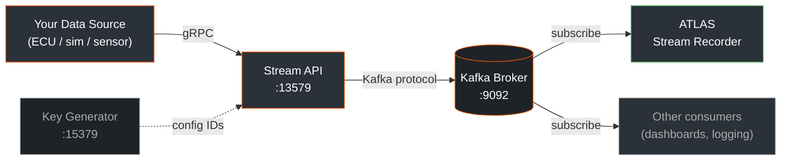
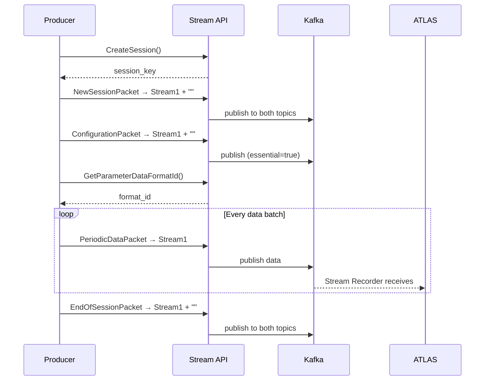
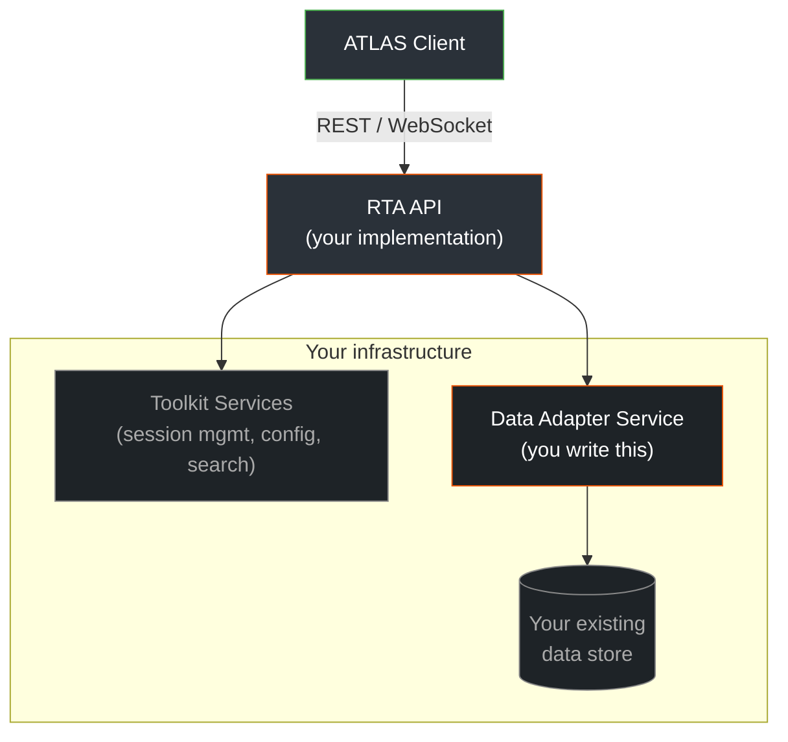
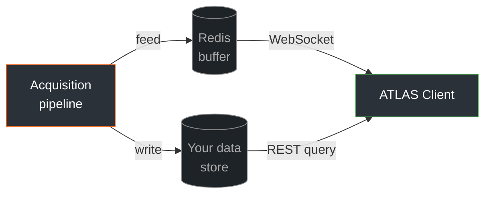
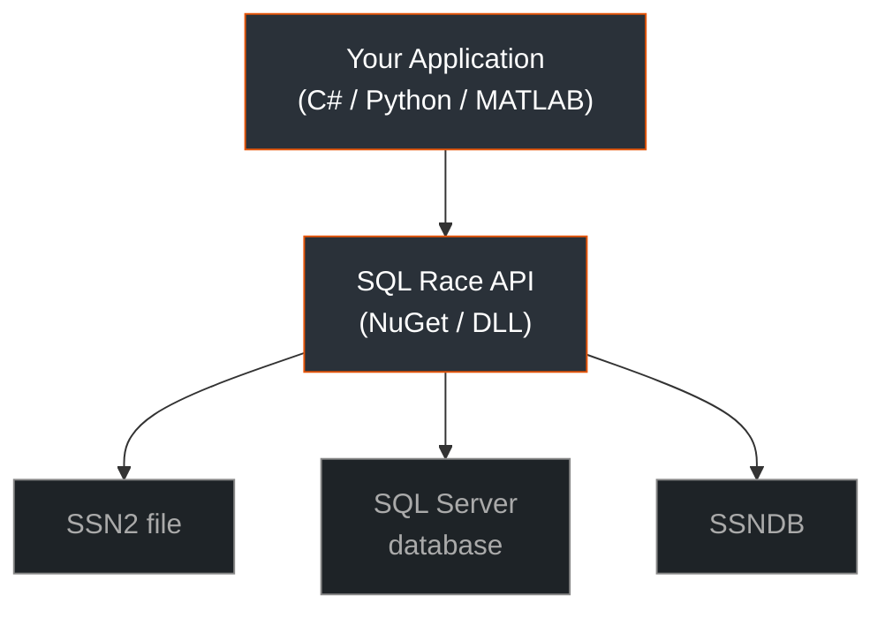
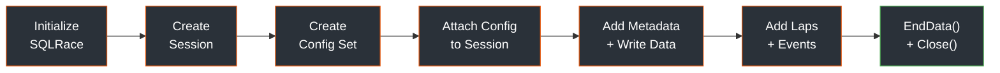
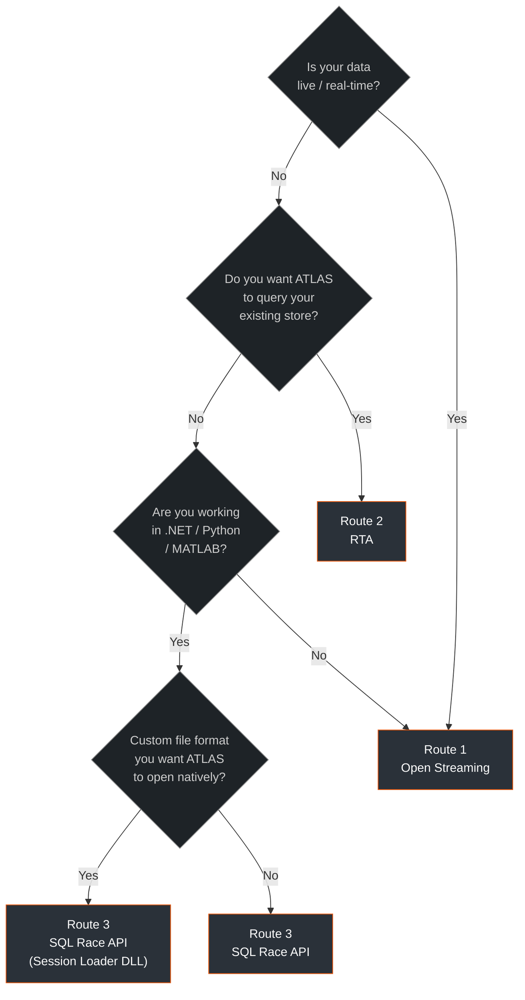

---
date:
  created: 2026-06-29
categories:
  - Blog
---

# Getting Third-Party Data into ATLAS

There are three supported routes for bringing external data into ATLAS. Which one you pick depends on whether your data is live or historical, where it currently lives, and what language and tooling you're working with.

<!-- more -->

## The three routes

<div class="route-grid">
  <div class="route-card">
    <div class="route-label">Route 1</div>
    <h3>Open Streaming</h3>
    <p>Live or near-real-time data. Publish into Kafka via the Stream API; ATLAS subscribes via Stream Recorder.</p>
  </div>
  <div class="route-card">
    <div class="route-label">Route 2</div>
    <h3>RTA</h3>
    <p>Data already in your own infrastructure. Expose an API layer; ATLAS queries your store without copying data.</p>
  </div>
  <div class="route-card">
    <div class="route-label">Route 3</div>
    <h3>SQL Race API</h3>
    <p>Write directly into ATLAS storage from .NET, Python, or MATLAB. Also the path for custom file format loaders.</p>
  </div>
</div>

## Route 1: Open Streaming

!!! abstract "Best for"
    Live or near-real-time data sources — ECUs, sim rigs, test benches, custom hardware, kart loggers, anything producing time-series data you want to appear as a streaming session in ATLAS.

### How it works

Open Streaming is a Kafka-based architecture. Your producer publishes data into a Kafka broker via the Stream API (a gRPC service). ATLAS connects to that broker via its Stream Recorder and displays data as it arrives.



The architecture is data-source agnostic and language-agnostic. Any language with gRPC support — Python, Go, Java, C++, C# — can produce into the pipeline using the published [proto definitions](https://github.com/Software-Products/MA.DataPlatforms.Protocol).

### Infrastructure

Three Docker containers handle everything. No local installs required:

| Container | Port | Purpose |
|---|---|---|
| Kafka | 9092 | Message broker (KRaft mode, no Zookeeper) |
| Stream API | 13579 | gRPC server your producer talks to |
| Key Generator | 15379 | Generates unique IDs required by configuration packets |

All three are bundled in the example repositories. One command starts the stack:

```bash
docker compose up -d
```

Kafka UI is included at `localhost:8080` for inspecting topics and watching messages flow — the fastest debugging tool when integrations go wrong.

### Stream API vs Support Library

There are two ways to talk to the Stream API:

=== "Stream API (raw gRPC)"

    Language-agnostic. Uses the proto definitions directly. Fine-grained protocol control. This is what all the example repositories use.

    **Use this when:**

    - You're working in Python, Go, Java, C++, or any language other than C#
    - You want explicit control over each packet and lifecycle step
    - You're building a bridge service from a custom data source

=== "Support Library (.NET / Python)"

    Available as a .NET NuGet package and a Python package via FFI. Wraps the Stream API into higher-level abstractions with automatic buffering, interpolation, and session lifecycle management.

    **Use this when:**

    - You're building a .NET application
    - You want managed pipelines without handling gRPC directly
    - You need built-in interpolation for non-uniform sample rates

!!! warning "API surfaces differ"
    The Stream API and Support Library speak the same underlying protocol but expose different interfaces. If translating between existing code and the examples, be aware they are not 1:1.

### Session lifecycle

The protocol has a strict sequence. Getting the order wrong is the most common source of integration failures:



!!! danger "The 'both streams' rule"
    `NewSessionPacket`, `ConfigurationPacket`, `MarkerPacket`, and `EndOfSessionPacket` must be sent to **both** your data stream (e.g. `Stream1`) **and** the main stream (`""`). SQLRace processes each Kafka topic independently — missing config on the data stream causes markers on that stream to be silently dropped.

### Packet routing reference

| Packet | Stream | Essential |
|---|---|---|
| `NewSessionPacket` | Both (`Stream1` + `""`) | No |
| `ConfigurationPacket` | Both (`Stream1` + `""`) | Yes |
| `PeriodicDataPacket` | Data stream only | No |
| `RowDataPacket` | Data stream only | No |
| `EventPacket` | Data stream only | No |
| `MarkerPacket` | Both | Yes |
| `EndOfSessionPacket` | Both | No |

### ConfigurationPacket rules

!!! failure "Most common integration failure"
    The `ConfigurationPacket` declares every parameter you will stream. **ATLAS will not interpret any data without it.** Send it after session creation, before any data, to both streams.

The three rules that catch most people:

!!! warning "Exactly one `GroupDefinition`"
    Multiple `GroupDefinition` entries per `ConfigurationPacket` silently produce zero parameters. You'll see `FlushSlotsAsRequired - slots flushed 0` in the Stream API logs. Use exactly one group; organise parameters via naming and `application_name`.

!!! warning "Use the Key Generator for `config_id`"
    A hardcoded string works for single-session local testing but causes collisions in production across multiple sessions. Call the Key Generator service at `localhost:15379`.

!!! warning "Send to both streams"
    Config missing from the data stream (`Stream1`) causes markers on that stream to be silently dropped by SQLRace.

### Timestamp rules

Every timestamp field — `StartTime`, `Interval`, `Timestamp` — is in **nanoseconds since UNIX epoch**.

| Frequency | Interval (ns) |
|---|---|
| 60 Hz | 16,666,666 |
| 100 Hz | 10,000,000 |
| 1 kHz | 1,000,000 |

!!! tip "Batch timestamps arithmetically"
    Advance `start_time` as `start_time += interval * sample_count` rather than reading wall-clock time per batch. OS scheduling jitter from wall-clock reads causes visible gaps in traces.

### Prerequisites

- Docker Desktop (Engine 20+)
- ATLAS 10 with a Stream Recorder configured

No .NET SDK, Python, or protoc required for the C# example — everything runs in containers.

### Example repositories

<div class="repo-grid">
  <div class="repo-card">
    <span class="lang-badge">Python · Jupyter</span>
    <p><a href="https://github.com/atlas-dev-hub/example-stream-api-kafka-setup">example-stream-api-kafka-setup</a></p>
    <p>Docker stack + interactive notebook. Walks through each protocol step you can run individually.</p>
  </div>
  <div class="repo-card">
    <span class="lang-badge">C#</span>
    <p><a href="https://github.com/atlas-dev-hub/example-stream-api-kafka-setup-csharp">example-stream-api-kafka-setup-csharp</a></p>
    <p>Same stack, one-command trigger. Streams 60 s of sine/cosine data. No .NET SDK needed locally.</p>
  </div>
  <div class="repo-card">
    <span class="lang-badge">Python</span>
    <p><a href="https://github.com/atlas-dev-hub/example-bridge-service-iracing">example-bridge-service-iracing</a></p>
    <p>Complete real-world bridge: iRacing shared memory → Stream API → Kafka → ATLAS. Good template for custom sources.</p>
  </div>
</div>

:material-book-open-variant: [Open Streaming Getting Started](https://atlas.motionapplied.com/developer-resources/secu4/getting-started/) · [Stream API Reference](https://atlas.motionapplied.com/developer-resources/secu4/stream_api/)

## Route 2: RTA

!!! abstract "Best for"
    Data that already lives in your own infrastructure — a time-series database, document store, Parquet files, SQL Server — and you want ATLAS to query it directly without copying or migrating data.

<div class="prototype-badge">⚠ Prototype functionality — subject to change</div>

### How it works

RTA defines web services that sit in front of your existing data store. ATLAS talks to those services as if they were a native data source — browsing sessions, loading parameters, running comparisons — while your data stays wherever it already is.



The RTA API specification covers an OpenAPI REST interface consumed by ATLAS, JSON schemas for the data model and query dialect, and Protobuf schemas for low-level data transport. You can implement this yourself against any stack, or use the Toolkit Services to handle session browsing, search, and configuration management — leaving only a Data Adapter Service for you to write.

### Supported store types

=== "Time-series"
    - InfluxDB
    - TimescaleDB

=== "Document"
    - MongoDB
    - Couchbase

=== "File formats"
    - Parquet
    - HDF5

=== "Relational"
    - SQL Server
    - PostgreSQL
    - MySQL

### Live monitoring

RTA includes WebSocket streaming for live telemetry display. The reference architecture buffers a feed from your acquisition pipeline through Redis, decoupling client activity from write availability.



This means ATLAS can display live data even when your storage cannot accept writes in real time — common with file-based formats. Users joining mid-session get catchup from the Redis buffer.

### Deployment

The Toolkit Services are available as Windows binaries, Linux binaries, and Docker images. They are designed to run on-premises or in the cloud, and work well with Kubernetes and AWS.

!!! info "When RTA is not the right choice"
    RTA assumes a central data store. If your workflow involves local files and in-field laptops, or you're recording directly from hardware to the local network, the SQL Race API or native ATLAS capabilities may be a better fit.

:material-book-open-variant: [RTA Introduction](https://atlas.motionapplied.com/key-functionality/integrate/rta/) · [Developer Worked Guide](https://atlas.motionapplied.com/developer-resources/rta/worked-guide/)

## Route 3: SQL Race API

!!! abstract "Best for"
    .NET, Python, or MATLAB applications that need to write data directly into ATLAS storage (SSN2 files or a shared SQL Server database), or custom file formats you want ATLAS to open natively via a Session Loader DLL.

### How it works

The SQL Race API is the ATLAS data layer. It gives direct access to session creation, parameter configuration, writing time-series samples, events, lap markers, and constants — all in the same format ATLAS uses internally.



### Language support

=== "C#"

    Via the `MAT.OCS.SQLRace.Domain` NuGet package from the [Motion Applied NuGet feed](https://github.com/mat-docs/packages).

    Requires Visual Studio 2022 or later, .NET 8 or later.

=== "Python"

    Via `pythonnet`, loading DLLs from your ATLAS 10 installation:

    ```python
    from pythonnet import load
    load("coreclr", runtime_config=r"C:\Program Files\McLaren Applied Technologies\ATLAS 10\MAT.Atlas.Host.runtimeconfig.json")
    import clr
    clr.AddReference(r"C:\Program Files\McLaren Applied Technologies\ATLAS 10\MESL.SqlRace.Domain.dll")
    ```

    Requires Python 3.7+, ATLAS 10 installed locally.

=== "MATLAB"

    Via `NET.addAssembly` from the same installation path:

    ```matlab
    NET.addAssembly('C:\Program Files\McLaren Applied Technologies\ATLAS 10\MAT.OCS.Core.dll');
    NET.addAssembly('C:\Program Files\McLaren Applied Technologies\ATLAS 10\MESL.SqlRace.Domain.dll');
    ```

    Requires MATLAB 2020b+, ATLAS 10 installed locally.

### Prerequisites

- .NET 8 or later
- ATLAS 10 installed on the machine running the code
- A valid ATLAS and SQLRace licence

### Session creation workflow



=== "Step 1 — Initialise"

    ```csharp
    Core.LicenceProgramName = "SQLRace";
    Core.Initialize();
    ```

=== "Step 2 — Create session"

    The connection string determines the output format:

    ```
    # SSN2 file
    "DbEngine=SQLite;Data Source=C:\Path\To\session.ssn2;"

    # SSNDB
    "DbEngine=SQLite;Data Source=C:\Path\To\local_db.ssndb;PRAGMA journal_mode=WAL;"

    # SQL Server
    "Data Source=SERVER\INSTANCE;Initial Catalog=SQLRACE01;Integrated Security=True;"
    ```

    ```csharp
    var sessionKey = SessionKey.NewKey();
    var clientSession = SessionManager.CreateSessionManager()
        .CreateSession(connectionString, sessionKey, sessionDescription, DateTime.Now, "TAG-310");
    ```

=== "Step 3 — Configuration set"

    A configuration set defines the parameter hierarchy: channels, parameters, conversions, application groups, parameter groups, and event definitions. It can be shared across multiple sessions to improve load time.

    ```csharp
    var configSet = configurationSetManager.Create(
        connectionString, "My Config", "Description");

    // Add groups, conversions, channels, parameters...
    configSet.Commit();

    // Attach to session
    var metadata = session.UseConfigurationSets(
        new List<KeyValuePair<string, uint>> {
            new("My Config", configSetOffset)
        });
    ```

=== "Step 4 — Write data"

    ```csharp
    // Session metadata
    session.Items.Add(new SessionDataItem("Driver Name", "Driver xxxxx"));
    session.Items.Add(new SessionDataItem("Race", "Silverstone GP"));

    // Time-series channel data (timestamps in nanoseconds)
    session.AddChannelData(channel.Id, timestamp, sampleCount, dataBytes);

    // Events
    session.Events.AddEventData(1, "Group1", timestamp, values, true, "Status Text");

    // Laps
    session.LapCollection.Add(new Lap(lapTimestamp, 1, 0, "Lap1", true));
    ```

=== "Step 5 — Finalise"

    ```csharp
    session.EndData();     // marks session state as Historical
    clientSession.Close(); // releases resources
    ```

    !!! danger "`EndData()` is required"
        Without it, session state stays as `LiveNotInServer` or `Live` and behaves unexpectedly when loaded in ATLAS.

### Available data types

| Data Type | Description |
|---|---|
| `Double64Bit` | 64-bit double |
| `FloatingPoint32Bit` | 32-bit float |
| `Signed16Bit` / `Signed32Bit` / `Signed8Bit` | Signed integers |
| `Unsigned16Bit` / `Unsigned32Bit` / `Unsigned8Bit` | Unsigned integers |
| `TripleFloatingPoint32Bit` | Three 32-bit floats |

### Session Loader DLL

If you have a custom file format you want ATLAS to open directly, write a Session Loader DLL using the SQL Race API. [MAT.SQLRace.FileLoaderSample](https://github.com/mat-docs/MAT.OCS.SQLRace.Examples/tree/master/MAT.SQLRace.FileLoaderSample) demonstrates this with a CSV loader.

### Code samples

All worked examples are in [MAT.OCS.SQLRace.Examples](https://github.com/mat-docs/MAT.OCS.SQLRace.Examples):

| Example | What it covers |
|---|---|
| `MAT.SQLRace.HelloData` | Session loading, data read/write, events, laps, composite sessions |
| `MAT.SqlRace.StandaloneRecorder` | Embedding the DST recorder, monitoring live data, writing augmented data back |
| `MAT.SQLRace.FileLoaderSample` | Session Loader DLL for a custom file format (CSV) |
| `Python/` | Session loading, events, and data reading in Python |

:material-book-open-variant: [SQL Race API](https://atlas.motionapplied.com/developer-resources/atlas/sql-race/) · [API Reference](https://mat-docs.github.io/Atlas.SQLRaceAPI.Documentation/)

## Choosing between the three



A few common scenarios:

!!! example "Live sensor / acquisition system"
    Open Streaming. Build a bridge service that reads your source and publishes via the Stream API. The iRacing example is a solid template for this pattern regardless of the actual data source.

!!! example "Years of telemetry in an existing database"
    RTA. You don't move the data — you wrap it with an API layer that ATLAS can query. Analysts get full ATLAS tooling without a migration project.

!!! example ".NET tool generating sessions programmatically"
    SQL Race API. Direct write into SSN2 or SQL Server, full parameter hierarchy control, works in Python and MATLAB too.

!!! example "Custom binary format from a test rig"
    SQL Race API, Session Loader DLL pattern. Engineers open it in ATLAS like any native session.

!!! example "Live data that also needs post-session analysis"
    Open Streaming handles both. The Stream Recorder persists sessions into SQLRace storage automatically as they are recorded.


## Further reading

- :material-lightning-bolt: [Open Streaming Getting Started](https://atlas.motionapplied.com/developer-resources/secu4/getting-started/)
- :material-api: [Stream API Reference](https://atlas.motionapplied.com/developer-resources/secu4/stream_api/)
- :material-database: [RTA Introduction](https://atlas.motionapplied.com/key-functionality/integrate/rta/)
- :material-book-open-variant: [RTA Developer Worked Guide](https://atlas.motionapplied.com/developer-resources/rta/worked-guide/)
- :material-code-braces: [SQL Race API](https://atlas.motionapplied.com/developer-resources/atlas/sql-race/)
- :material-file-document-outline: [SQL Race API Reference](https://mat-docs.github.io/Atlas.SQLRaceAPI.Documentation/)
- :material-github: [ATLAS Developer Community](https://github.com/atlas-dev-hub)