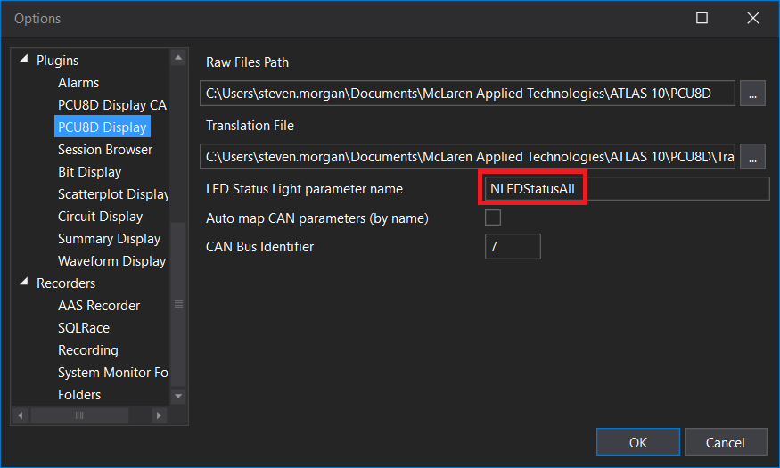
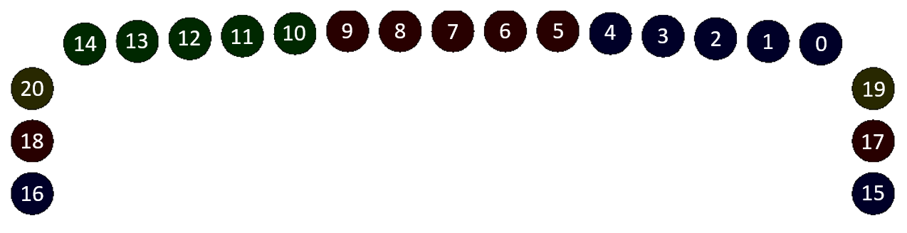

# Graphical display

This tutorial demonstrates how to create a display with interactive graphics, as the saying goes _"a picture is worth a thousand words"_.

WPF is a graphics rich user interface technology with sophisticated support for high resolution bitmap and vector graphics with complex animations, transitions and effects.

WPF provides a multitude of ways to display graphics with competing programming complexity and performance characteristics.

This tutorial demonstrates a couple of approaches at each end of the complexity/performance spectrum

- Use of [Shapes](https://docs.microsoft.com/en-us/dotnet/desktop/wpf/graphics-multimedia/shapes-and-basic-drawing-in-wpf-overview) that are easy to program but performance will suffer if over used
- Use of [DrawingContext](https://docs.microsoft.com/en-us/dotnet/api/system.windows.media.drawingcontext) that is harder to program but more suitable for highly interactive complex vector graphics


!!! note

    The code for this tutorial can be reviewed at [Tutorials/DriverDisplayPlugin](https://github.com/mat-docs/Atlas.DisplayAPI.Examples/tree/master/DriverDisplayPlugin)

## Common setup

Start the tutorial by [creating a new display from scratch](createfromscratch.md) named `DriverDisplayPlugin`.

### Update the _View Model_ class

Derive from [TemplateDisplayViewModelBase](displaypluginlibrary.md#templatedisplayviewmodelbase-view-model-base-class) and allow parameters by specifying the [`DisplayPluginSettings`](../detailed/parameters.md) attribute

```c#
    [DisplayPluginSettings(ParametersMaxCount = 2)]
    public sealed class SampleDisplayViewModel : TemplateDisplayViewModelBase
```

Inject the `ISignalBus`, `IDataRequestSignalFactory` and `ILogger` services into the _View Model_ constructor and pass to the base constructor

```c#
public SampleDisplayViewModel(
    ISignalBus signalBus,
    IDataRequestSignalFactory dataRequestSignalFactory,
    ILogger logger) :
        base(signalBus, dataRequestSignalFactory, logger)
```

## Using Shapes

For the majority of use cases, WPF shapes provides an ideal compromise between programming simplicity and performance.

The shape elements can be added to the _View XAML_ as per standard User Interface elements such as `TextBlock`, and standard binding to _View Model_ properties can be used to change attributes such as colour, position or size. WPF animations can also be used to add additional flare as required.

A perfect example of using WPF shapes is to represent bit field parameters with appropriate graphics.

This example shows how to display a dynamic representation of the PCU8D shift light LEDs. 

The LEDs are represented by a single parameter (e.g. `NLEDStatusAll`, verify from ATLAS settings or ask your System Administrator)



Bit positions are mapped to the following LEDs



### Add _LED View Model_ class

Add a simple _View Model_ class to represent an LED

- `Color` field named `offColor` that is the colour displayed when the LED is off (passed to constructor)
- `Color` field named `onColor` that is the colour displayed when the LED is on (passed to constructor)
- `int` field named `bitIndex` that is bit position of the LED (passed to constructor)
- `Color` field named `color` as backer for the `Color` property
- `double` field named `shiftY` as backer for the `ShiftY` property (passed to constructor)
- `Color` property named `Color` that is the current color of the LED
- `double` property named `ShiftY` that is the optional distance to shift LED in the Y direction
- `UpdateColor()` method that takes a `BitArray` and sets the LED color based on the state of the bit at `bitIndex` 

```c#
public sealed class LedViewModel : BindableBase
{
    private readonly Color offColor;
    private readonly Color onColor;
    private readonly int bitIndex;
    private Color color;
    private double shiftY;

    public LedViewModel(Color offColor, Color onColor, int bitIndex, double shiftY)
    {
        this.offColor = offColor;
        this.onColor = onColor;
        this.bitIndex = bitIndex;
        this.shiftY = shiftY;

        this.color = offColor;
    }

    public Color Color
    {
        get => this.color;
        set => SetProperty(ref this.color, value);
    }

    public double ShiftY
    {
        get => this.shiftY;
        set => SetProperty(ref this.shiftY, value);
    }

    public void UpdateColor(BitArray bits) => this.Color = bits[bitIndex] ? this.onColor : this.offColor;
}
```

### Update the _View_ class

Configure the user interface as follows

- Add [`ColorToSolidColorBrushValueConverter`](displaypluginlibrary.md#converters) to the `Resources`
- Wrap a fixed size `Grid` of `Height=1000` within a `ViewBox` and `DockPanel`
    - Configure two rows of `Height=100` and `Height=*`
    - Configure three columns of `Width=100`, `Width=*` and `Width=100`
- Use an `ItemsControl` to display the top shift lights at `Row=0` and `Column=1`
    - Bind `ItemsSource` attribute to the _View Model_ `TopShiftLights` property
    - Set the `ItemsPanel` element to a `UniformGrid` with `Rows=1` and `Columns=15`
    - Set the `ItemTemplate` element to a `DataTemplate` containing a uniform `ViewBox`
        - Set the `RenderTransform` element to a `TranslateTransform`
            - Set `X=0`
            - Bind the `Y` attribute to the  _LED View Model_ `ShiftY` property
        - Set the `ViewBox` contents to an `Ellipse` shape of `Width=100` and `Height=100`
            - Bind the `Fill` attribute to the  _LED View Model_ `Color` property with `Converter=ColorToSolidColorBrushValueConverter`
- Use an `ItemsControl` to display the left shift lights at `Row=1` and `Column=0`
    - Bind `ItemsSource` attribute to the _View Model_ `LeftShiftLights` property
    - Set the `ItemsPanel` element to a `StackPanel` with `Orientation=Vertical`
    - Set the `ItemTemplate` element to a `DataTemplate` containing a uniform `ViewBox` containing an `Ellipse` shape of `Width=100` and `Height=100`
        - Bind the `Fill` attribute to the  _LED View Model_ `Color` property with `Converter=ColorToSolidColorBrushValueConverter`
- Use an `ItemsControl` to display the right shift lights at `Row=1` and `Column=2`
    - Bind `ItemsSource` attribute to the _View Model_ `RightShiftLights` property
    - Set the `ItemsPanel` element to a `StackPanel` with `Orientation=Vertical`
    - Set the `ItemTemplate` element to a `DataTemplate` containing a uniform `ViewBox` containing `Ellipse` shape of `Width=100` and `Height=100`
        - Bind the `Fill` attribute to the  _LED View Model_ `Color` property with `Converter=ColorToSolidColorBrushValueConverter`

```xml
<UserControl.Resources>
    <converters:ColorToSolidColorBrushValueConverter x:Key="ColorToSolidColorBrushValueConverter" />
</UserControl.Resources>

<DockPanel>
    <Viewbox>
        <Grid Height="1000">
            <Grid.RowDefinitions>
                <RowDefinition Height="100" />
                <RowDefinition Height="*" />
            </Grid.RowDefinitions>
            <Grid.ColumnDefinitions>
                <ColumnDefinition Width="100" />
                <ColumnDefinition Width="*" />
                <ColumnDefinition Width="100" />
            </Grid.ColumnDefinitions>

            <ItemsControl Grid.Row="0"
                          Grid.Column="1"
                          ItemsSource="{Binding TopShiftLights}">
                <ItemsControl.ItemsPanel>
                    <ItemsPanelTemplate>
                        <UniformGrid Rows="1" Columns="15" />
                    </ItemsPanelTemplate>
                </ItemsControl.ItemsPanel>
                <ItemsControl.ItemTemplate>
                    <DataTemplate>
                        <Viewbox Stretch="Uniform" Margin="10">
                            <Viewbox.RenderTransform>
                                <TranslateTransform X="0" Y="{Binding ShiftY}" />
                            </Viewbox.RenderTransform>
                            <Ellipse Width="100" Height="100"
                                     Fill="{Binding Color, Converter={StaticResource ColorToSolidColorBrushValueConverter}}" />
                        </Viewbox>
                    </DataTemplate>
                </ItemsControl.ItemTemplate>
            </ItemsControl>

            <ItemsControl Grid.Row="1"
                          Grid.Column="0"
                          ItemsSource="{Binding LeftShiftLights}">
                <ItemsControl.ItemsPanel>
                    <ItemsPanelTemplate>
                        <StackPanel Orientation="Vertical" />
                    </ItemsPanelTemplate>
                    </ItemsControl.ItemsPanel>
                <ItemsControl.ItemTemplate>
                    <DataTemplate>
                        <Viewbox Stretch="Uniform" Margin="10">
                            <Ellipse Width="100" Height="100"
                                     Fill="{Binding Color, Converter={StaticResource ColorToSolidColorBrushValueConverter}}" />
                        </Viewbox>
                    </DataTemplate>
                </ItemsControl.ItemTemplate>
            </ItemsControl>

            <ItemsControl Grid.Row="1"
                          Grid.Column="2"
                          ItemsSource="{Binding RightShiftLights}">
                <ItemsControl.ItemsPanel>
                    <ItemsPanelTemplate>
                        <StackPanel Orientation="Vertical" />
                    </ItemsPanelTemplate>
                </ItemsControl.ItemsPanel>
                <ItemsControl.ItemTemplate>
                    <DataTemplate>
                        <Viewbox Stretch="Uniform" Margin="10">
                            <Ellipse Width="100" Height="100"
                                     Fill="{Binding Color, Converter={StaticResource ColorToSolidColorBrushValueConverter}}" />
                        </Viewbox>
                    </DataTemplate>
                </ItemsControl.ItemTemplate>
            </ItemsControl>

            <Grid Grid.Row="1"
                  Grid.Column="1"
                  Margin="20">
                  <!-- added later -->
            </Grid>
        </Grid>
    </Viewbox>
</DockPanel>
```

### Update the _View Model_ class

Subscribe to `SampleResultSignal` in the _View Model_ constructor to handle the result of a _sample data request_

```c#
this.Disposables.Add(
    this.SignalBus.Subscribe<SampleResultSignal>
        this.HandleSampleResultSignal,
        r => r.SourceId == this.ScopeIdentity.Guid));
```

Add an [OperationTracker&lt;SampleRequestSignal&gt;](displaypluginlibrary.md#tracking-operations) field named `sampleRequestTracker` to throttle sample data requests

```c#
private readonly OperationTracker<SampleRequestSignal> sampleRequestTracker;
```

Instantiate `sampleRequestTracker` in the _View Model_ constructor

```c#
this.sampleRequestTracker = new OperationTracker<SampleRequestSignal>(ThrottleInterval, signalBus.Send);
```

Add static fields for the various LED on and off colors

```c#
private static readonly Color BlueOff = Color.FromArgb(255, 0, 0, 40);
private static readonly Color BlueOn = Color.FromArgb(255, 0, 0, 255);
private static readonly Color GreenOff = Color.FromArgb(255, 0, 40, 0);
private static readonly Color GreenOn = Color.FromArgb(255, 0, 255, 0);
private static readonly Color RedOff = Color.FromArgb(255, 40, 0, 0);
private static readonly Color RedOn = Color.FromArgb(255, 255, 0, 0);
private static readonly Color YellowOff = Color.FromArgb(255, 40, 40, 0);
private static readonly Color YellowOn = Color.FromArgb(255, 255, 255, 0);
```

Add properties that represent the left, top and right LED strips

```c#
[Browsable(false)]
public List<LedViewModel> TopShiftLights { get; } = new List<LedViewModel>()
{
    new LedViewModel(GreenOff, GreenOn, 14, 15),
    new LedViewModel(GreenOff, GreenOn, 13, 10),
    new LedViewModel(GreenOff, GreenOn, 12, 5),
    new LedViewModel(GreenOff, GreenOn, 11, 0),
    new LedViewModel(GreenOff, GreenOn, 10, -5),
    new LedViewModel(RedOff, RedOn, 9, -10),
    new LedViewModel(RedOff, RedOn, 8, -10),
    new LedViewModel(RedOff, RedOn, 7, -10),
    new LedViewModel(RedOff, RedOn, 6, -10),
    new LedViewModel(RedOff, RedOn, 5, -10),
    new LedViewModel(BlueOff, BlueOn, 4, -5),
    new LedViewModel(BlueOff, BlueOn, 3, 0),
    new LedViewModel(BlueOff, BlueOn, 2, 5),
    new LedViewModel(BlueOff, BlueOn, 1, 10),
    new LedViewModel(BlueOff, BlueOn, 0, 15)
};

[Browsable(false)]
public List<LedViewModel> LeftShiftLights { get; } = new List<LedViewModel>()
{
    new LedViewModel(YellowOff, YellowOn, 20, 0),
    new LedViewModel(RedOff, RedOn, 18, 0),
    new LedViewModel(BlueOff, BlueOn, 16, 0)
};

[Browsable(false)]
public List<LedViewModel> RightShiftLights { get; } = new List<LedViewModel>()
{
    new LedViewModel(YellowOff, YellowOn, 19, 0),
    new LedViewModel(RedOff, RedOn, 17, 0),
    new LedViewModel(BlueOff, BlueOn, 15, 0)
};
```

Override the `OnMakeCursorDataRequestsAsync()` method to issue a _sample data request_ for the first display parameter when the cursor timestamp changes

```c#
protected override Task OnMakeCursorDataRequestsAsync(ICompositeSession compositeSession)
{
    if (this.DisplayParameterService.PrimaryParameters.Count < 1)
    {
        return Task.CompletedTask;
    }

    var signal = this.DataRequestSignalFactory.CreateSampleRequestSignal(
        this.ScopeIdentity.Guid,
        compositeSession.Key,
        this.DisplayParameterService.PrimaryParameters.FirstOrDefault(),
        compositeSession.CursorPoint + 1,
        1,
        SampleDirection.Previous);

    this.sampleRequestTracker.Add(signal);

    return Task.CompletedTask;
}
```

!!! note

    Rather than send the signal directly to the `SignalBus`, add it to `sampleRequestTracker`

Add the `HandleSampleResultSignal()` method to update the LED colours

```c#
private void HandleSampleResultSignal(SampleResultSignal signal)
{
    var result = signal.Data;

    var parameterValues = result.ParameterValues;
    parameterValues.Lock();

    try
    {
        if (parameterValues.SampleCount == 1)
        {
            var shiftLightsValue = (uint) parameterValues.Data[0];
            var bits = new BitArray(BitConverter.GetBytes(shiftLightsValue));
            this.TopShiftLights.ForEach(sl => sl.UpdateColor(bits));
            this.LeftShiftLights.ForEach(sl => sl.UpdateColor(bits));
            this.RightShiftLights.ForEach(sl => sl.UpdateColor(bits));
        }
    }
    finally
    {
        parameterValues.Unlock();
        this.sampleRequestTracker.Complete();
    }
}
```

!!! note

    In this instance the _View Model_ properties are being modified on the Task Pool.

    WPF will handle this special case, more sophisticated updates need to be done by calling the `ExecuteOnUiAsync` method.

!!! attention

    It is important to call `Complete()` on `OperationTracker<T>` to allow subsequent operations to execute

### Testing the display

To view the LED graphics

- Add a session via the _Session Browser_ to the compare set associated with the display 
- Add the PCU8D LED display parameter (e.g. `NLEDStatusAll`) via the _Parameter Browser_
- Use a _Waveform_ display to change the cursor

## Interactive vector graphics

For complex graphics that change regularly, WPF provides the  low-level and efficient `DrawingContext` class.

The [Display Plugin Library `VisualLayer` class](displaypluginlibrary.md#drawing-graphics) provides a simple way to add `DrawingContext` graphics to a display.

This example shows how to display a dynamic trace of a parameter and simple cursor.

The simplest way to display a trace is to fetch all the samples of a parameter and draw lines between each.

The trouble is, when viewing multiple laps of a high frequency parameter there could be 100,000+ samples, however even at 4K resolution we couldn't possibly resolve that many samples. Therefore we should re-sample the parameter to a more manageable resolution, e.g. 1000 data points.

Therefore by making a [_data request_](../detailed/data.md#data-request-properties) instead of a _sample data request_ it doesn't matter how many actual samples there are within the time range

- The time range is divided into an equal time interval per data point, the sample mode determines how the actual samples that fall within each interval are summarized.

The [`Trace` class](https://github.com/mat-docs/Atlas.DisplayAPI.Examples/blob/master/DriverDisplayPlugin/Trace.cs) converts the result of a _data request_ into a collection of lines.

The [`Cursor` class](https://github.com/mat-docs/Atlas.DisplayAPI.Examples/blob/master/DriverDisplayPlugin/Cursor.cs) converts the cursor timestamp into a vertical line.

!!! note

    Since the purpose of this example is to demonstrate graphics, `Trace` and `Cursor` classes are provided as is and are not guaranteed to cover all edge cases.

### Update the _View_ class

Starting with the XAML from the above example

- Add two overlapping `VisualLayer` XAML elements within the `Grid` at `Row=1`and `Column=1`

```xml
<displayPluginLibrary:VisualLayer x:Name="TraceVisualLayer" />
<displayPluginLibrary:VisualLayer x:Name="CursorVisualLayer" />
```

!!! note

    Having separate visual layers for trace and cursor allows them to be drawn independently, improving performance when only one is changing.

    `DrawingContext` is a retained mode graphics system, therefore the previous content persists until refreshed. 

In the code behind, associate each `VisualLayer` with an associated _View Model_ property

```c#
public override void OnApplyTemplate()
{
    base.OnApplyTemplate();

    if (this.DataContext is SampleDisplayViewModel vm)
    {
        vm.TraceVisual = this.TraceVisualLayer.Visual;
        vm.CursorVisual = this.CursorVisualLayer.Visual;
    }
}
```

### Update the _View Model_ class

Add the following backers

- `Pen` field named `cursorPen` that is the graphics pen used to draw the cursor
- [OperationTracker&lt;(DataRequestSignal, IDisplayParameterContainer)&gt;](displaypluginlibrary.md#tracking-operations) field named `dataRequestTracker` to throttle data requests
- [OperationTracker&lt;Trace&gt;](displaypluginlibrary.md#tracking-operations) field named `redrawTraceRequestTracker` to throttle trace redraw requests
- [OperationTracker&lt;Cursor&gt;](displaypluginlibrary.md#tracking-operations) field named `redrawCursorRequestTracker` to throttle cursor redraw requests
- `int` field named `dataRequestSampleCount` as backer for the `DataRequestSampleCount` property 

```c#
private readonly Pen cursorPen = new Pen(Brushes.White, 1);
private readonly OperationTracker<(DataRequestSignal Signal, IDisplayParameterContainer ParameterContainer)> dataRequestTracker;
private readonly OperationTracker<Trace> redrawTraceRequestTracker;
private readonly OperationTracker<Cursor> redrawCursorRequestTracker;
private int dataRequestSampleCount;
```

Instantiate the operation trackers in the _View Model_ constructor

```c#
this.dataRequestTracker = new OperationTracker<(DataRequestSignal Signal, IDisplayParameterContainer)>(
    ThrottleInterval,
    operation => signalBus.Send(operation.Signal));

this.redrawTraceRequestTracker = new OperationTracker<Trace>(
    ThrottleInterval,
    async trace => await this.ExecuteOnUiAsync(() => this.Redraw(trace)));

this.redrawCursorRequestTracker = new OperationTracker<Cursor>(
    ThrottleInterval,
    async cursor => await this.ExecuteOnUiAsync(() => this.Redraw(cursor)));
```

!!! note

    Trace and Cursor graphics are drawn on the UI thread by calling via the `ExecuteOnUiAsync()` method

Add the following properties

- `int` property named `DataRequestSampleCount` that determines the number of data points to fetch and draw (defaults to 1000)
- `IVisual` property named `CursorVisual` used to draw the cursor (set in the _View_ code behind)
- `IVisual` property named `TraceVisual` used to draw the trace (set in the _View_ code behind)

```c#
public int DataRequestSampleCount
{
    get => this.dataRequestSampleCount = this.ReadProperty(1000);
    set
    {
        if (this.SetProperty(ref this.dataRequestSampleCount, value))
        {
            this.SaveProperty(value);
            this.MakeDataRequests(false, true);
        }
    }
}

[Browsable(false)]
public IVisual CursorVisual { get; set; }

[Browsable(false)]
public IVisual TraceVisual { get; set; }
```

Extend `OnMakeCursorDataRequestsAsync()` method to instantiate a `Cursor` instance and add to `redrawCursorRequestTracker` to initiate a redraw

```c#
var cursor = new Cursor(compositeSession.TimebaseRange, compositeSession.CursorPoint);
this.redrawCursorRequestTracker.Add(cursor);
```

Subscribe to `DataResultSignal` in the _View Model_ constructor to handle the result of a _data request_

```c#
this.Disposables.Add(
    signalBus.Subscribe<DataResultSignal>(
        this.HandleDataResultSignal,
        r => r.SourceId == this.ScopeIdentity.Guid));
```

Override the `OnMakeTimebaseDataRequestsAsync()` method to issue a _data request_ for the second parameter when the timebase timestamp range changes

```c#
protected override Task OnMakeTimebaseDataRequestsAsync(ICompositeSession compositeSession)
{
    if (this.DisplayParameterService.PrimaryParameters.Count < 2)
    {
        return Task.CompletedTask;
    }

    // Second parameter is the trace line
    var signal = this.DataRequestSignalFactory.CreateDataRequestSignal(
        this.ScopeIdentity.Guid,
        this.DisplayParameterService.PrimaryParameters.Skip(1).FirstOrDefault(),
        compositeSession.TimebaseRange,
        this.DataRequestSampleCount,
        SampleMode.MaximumToMinimum);

    this.dataRequestTracker.Add((signal, this.DisplayParameterService.ParameterContainers.Skip(1).FirstOrDefault()));
    return Task.CompletedTask;
}
```

!!! note

    The `Trace` class needs a `SampleMode` of `MaximumToMinimum` in order to render correctly.

!!! note

    Rather than send the signal directly to the `SignalBus`, add it to `dataRequestTracker`

Add the `HandleDataResultSignal()` method to instantiate a `Trace` instance and add to `redrawTraceRequestTracker` to initiate a redraw

```c#
private void HandleDataResultSignal(DataResultSignal signal)
{
    var request = signal.Data.Request;
    var result = signal.Data;

    var parameterValues = result.ParameterValues;
    parameterValues.Lock();

    try
    {
        if (parameterValues.SampleCount > 0 &&
            this.dataRequestTracker.GetCurrent(out var currentOperation))
        {
            var trace = new Trace(currentOperation.ParameterContainer, request.Parameter, parameterValues);
            this.redrawTraceRequestTracker.Add(trace);
        }
    }
    finally
    {
        parameterValues.Unlock();
        this.dataRequestTracker.Complete();
    }
}
```

Add the `Redraw` methods for `Trace` and `Cursor`

```c#
private void Redraw(Trace trace)
{
    try
    {
        var extents = this.TraceVisual.Extents;
        if (!this.IsDisplayVisible || extents.Width == 0 || extents.Height == 0)
        {
            this.TraceVisual.Draw(delegate { });
            return;
        }

        this.TraceVisual.Draw(
            dc =>
            {
                dc.DrawRectangle(
                    Brushes.Transparent,
                    new Pen(Brushes.White, 1),
                    new Rect(new Point(0, 0), extents));

                var tracePen = new Pen(new SolidColorBrush(trace.TraceColor), extents.Width / trace.PointCount);
                foreach (var (start, end) in trace.GetLines(extents))
                {
                    dc.DrawLine(tracePen, start, end);
                }
            });
    }
    finally
    {
        redrawTraceRequestTracker.Complete();
    }
}

private void Redraw(Cursor cursor)
{
    try
    {
        var extents = this.CursorVisual.Extents;
        if (!this.IsDisplayVisible ||
            extents.Width == 0 ||
            extents.Height == 0 ||
            !cursor.GetCursorLine(extents, out var cursorLine))
        {
            this.CursorVisual.Draw(delegate { });
            return;
        }

        this.CursorVisual.Draw(
            dc =>
            {
                dc.DrawLine(this.cursorPen, cursorLine.Item1, cursorLine.Item2);
            });
    }
    finally
    {
        redrawCursorRequestTracker.Complete();
    }
}
```

!!! note

    `DrawingContext` is a retained mode graphics system, therefore to clear it, call `Draw()` but draw nothing

### Testing the display

To view the trace and cursor graphics

- Add a session via the _Session Browser_ to the compare set associated with the display 
- Add a display parameter to visualize (e.g. `vCar`) via the _Parameter Browser_
    - Ensure there is already one display parameter set for the PCU8D LED visualization
- Use a _Waveform_ display to change the cursor and timebase
