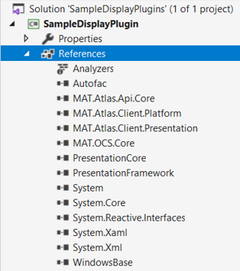
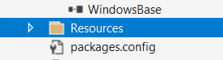
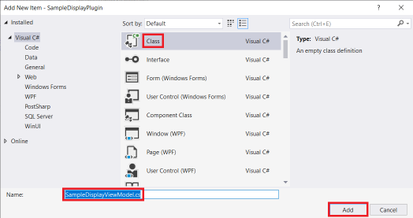

# Create Custom Display Plugin from Scratch

The following steps demonstrate how to create a custom display plugin from scratch.

!!! note

    The code for this tutorial can be reviewed at [Tutorials/SampleDisplayPlugin](https://github.com/mat-docs/Atlas.DisplayAPI.Examples/tree/master/SampleDisplayPlugin)

A custom display plugin is a .Net DLL that when deployed to the ATLAS program files, is automatically loaded and registered on startup.

!!! note

    Currently only one custom display type is allowed per custom display plugin project.

    However, any number of instances of a custom display type may be added to a workbook.

## Create Project

Create a new _C# WPF User Control Library (.NET Framework)_ project with Visual Studio.

!!! tip

    Enter _wpf_ into the Search box


!!! caution

    Create a _.NET Framework WPF_ project and not a _.Net Core WPF_ project


!!! attention

    Ensure there is _Plugin_ somewhere within the name, otherwise ATLAS will not load the plugin

!!! note

    This project type includes a template for the _View_

## Update Assembly Information

Edit project settings


Click _Assembly Information..._


Modify the Title, Description and GUID (if not already set) properties


The _Title_ property corresponds to the custom display window title


The _Description_ property corresponds to the custom display icon tooltip


!!! attention

    A GUID must be specified otherwise ATLAS will fail to start.

    Use Tools->Create GUID as necessary

    

    Copy Registry Format

    

    Remember to remove '{' and '}' from beginning and end of the string

## Add reference to _Atlas.DisplayAPI_ NuGet package

Manage NuGet packages of project


Browse to _Atlas.DisplayAPI_ NuGet package and install


Once installed the references should look similar to this



## Add an icon for the toolbar

Add a _Resources_ folder to the project


Which should look like



Add an existing item to the Resources folder


!!! note

    The icon should be a 16 x 16 pixel PNG file compatible with ATLAS dark theme

Select and _Add_ icon


Which should look like


Ensure _Build Action_ is set to _Resource_


## Configure _View_ class

The _View_ class presents the custom visualization. 

- Rename `UserControl1` to `SampleDisplayView`
    - Rename `UserControl1.xaml` to `SampleDisplayView.xaml`
        - Update `x:Class` to `SampleDisplayPlugin.SampleDisplayView`
    - Rename `UserControl1.xaml.cs` to `SampleDisplayView.xaml.cs`
        - Rename `UserControl1` class to `SampleDisplayView`

    ```c# hl_lines="3 5"
    namespace SampleDisplayPlugin
    {
        public partial class SampleDisplayView
        {
            public SampleDisplayView()
            {
                InitializeComponent();
            }
        }
    }
    ```

- Add to the _XAML_ a simple `<TextBlock>` to display white text

    ```xml hl_lines="9-13"
    <UserControl x:Class="SampleDisplayPlugin.SampleDisplayView"
                 xmlns="http://schemas.microsoft.com/winfx/2006/xaml/presentation"
                 xmlns:x="http://schemas.microsoft.com/winfx/2006/xaml"
                 xmlns:mc="http://schemas.openxmlformats.org/markup-compatibility/2006"
                 xmlns:d="http://schemas.microsoft.com/expression/blend/2008"
                 mc:Ignorable="d"
                 d:DesignHeight="450" d:DesignWidth="800">
        <Grid>
            <TextBlock VerticalAlignment="Center"
                       HorizontalAlignment="Center"
                       Foreground="White"
                       FontSize="20"
                       Text="My First Display" />
        </Grid>
    </UserControl>
    ```

!!! note

    Text is white to be compatible with the ATLAS dark theme

## Add _View Model_ class

The _View Model_ class provides the business logic behind the custom visualization. 

Add a _New Item_ to the project


Add a _Class_ named _SampleDisplayViewModel_ to the project



!!! important

    Remember to derive the _View Model_ class from the _DisplayPluginViewModel_ base class, otherwise the custom display will not be available to ATLAS  

```c# hl_lines="5"
using MAT.Atlas.Client.Presentation.Displays;

namespace SampleDisplayPlugin
{
    public sealed class SampleDisplayViewModel : DisplayPluginViewModel
    {
    }
}
```

!!! note

    Subsequent tutorials will expand the _View Model_ class to interact with the _View_ and retrieve data from ATLAS to visualize.

## Add _Plugin_ class

The _Plugin_ class registers the _View_ class, _View Model_ class and _Icon_ location with ATLAS.

- Create a class named _Plugin_ as per [View Model class](#add-view-model-class)
    - Derive from _DisplayPlugin&lt;Plugin&gt;_
- Decorate class with _DisplayPlugin_ attribute
    - Set appropriate values for: _View_, _ViewModel_ and _IconUrl_ properties

```c# hl_lines="5-9"
using MAT.Atlas.Client.Presentation.Plugins;

namespace SampleDisplayPlugin
{
    [DisplayPlugin(
        View = typeof(SampleDisplayView),
        ViewModel = typeof(SampleDisplayViewModel),
        IconUri = "Resources/icon.png")]
    public sealed class Plugin : DisplayPlugin<Plugin>
    {
    }
}
```

## Add _PluginModule_ class

The _PluginModule_ class provides the entry point for ATLAS to initialise the custom display plugin.

- Create a class named _PluginModule_ as per [View Model class](#add-view-model-class)
    - Derive from _Module_ (provided by _Autofac_)
- Decorate class with _Export_ attribute (provided by _MEF_)
    - Add a reference to _System.ComponentModel.Composition_ if required

    

- Override _Load_ method and register display plugin 

```c# hl_lines="10-11 13 15"
using System.ComponentModel.Composition;

using Autofac;
using Autofac.Core;

using MAT.Atlas.Client.Presentation.Plugins;

namespace SampleDisplayPlugin
{
    [Export(typeof(IModule))]
    public sealed class PluginModule : Module
    {
        protected override void Load(ContainerBuilder builder)
        {
            DisplayPlugin<Plugin>.Register(builder);
        }
    }
}
```

## Optional: combine _PluginModule_ and _Plugin_ classes

To reduce boilerplate code the _plugin_ class may be nested within the _PluginModule_ class

```c# hl_lines="13-23"
using System.ComponentModel.Composition;

using Autofac;
using Autofac.Core;

using MAT.Atlas.Client.Presentation.Plugins;

namespace SampleDisplayPlugin
{
    [Export(typeof(IModule))]
    public sealed class PluginModule : Module
    {
        protected override void Load(ContainerBuilder builder)
        {
            Plugin.Register(builder);
        }

        [DisplayPlugin(
            View = typeof(SampleDisplayView),
            ViewModel = typeof(SampleDisplayViewModel),
            IconUri = "Resources/icon.png")]
        private sealed class Plugin : DisplayPlugin<Plugin>
        {
        }
    }
}
```

## Build, Deploy and Debug

- Build _Debug_ or _Release_ solution configuration
- Copy plugin DLL to ATLAS 10 program files
    - Manually copy from bin/Debug or bin/Release, or
    - Add a post build step to automatically copy, see [Deployment Script](deploymentscript.md)
- Debug using ATLAS 10 (updating the project settings to start ATLAS on debugging)

    

- Assuming all went well, there should be a toolbar icon for the custom display in ATLAS

    

- Clicking the custom display toolbar icon should display a window containing the contents of the _View_

    
