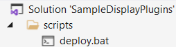
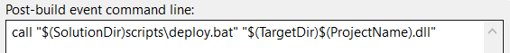
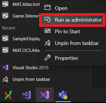

# Deployment Script

To aid development efficiency, automatically copy the custom display plugin DLL to ATLAS program files after each successful build.

- Create a deployment batch file
    - Add a _scripts_ folder under _Solution_
    - Create _deploy.bat_ file with the following contents

    ```
    NET SESSION >nul 2>&1
    IF %ERRORLEVEL% EQU 0 (
        IF EXIST "C:\Program Files\McLaren Applied Technologies\ATLAS 10\" (
            xcopy /r /y %1 "C:\Program Files\McLaren Applied Technologies\ATLAS 10"
        ) ELSE (
            echo "No Atlas installation detected - skip deploying"
        )
    ) ELSE (
        echo "This script requires admin privileges - skip deploying"
        exit /b 0
    )
    ```

    - Add _deploy.bat_ to _scripts_ folder

    

- Add a post build step via project settings

    ```
    call "$(SolutionDir)scripts\deploy.bat" "$(TargetDir)$(ProjectName).dll“
    ```

    

!!! attention

    Special permissions are needed to write to program files, therefore you will need to run Visual Studio as Administrator

    