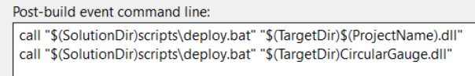

# Gauge display

Many displays just need to visualize the current value (at the cursor) of one or more display parameters.

As it is such a common use case, [ParameterSampleDisplayViewModelBase](displaypluginlibrary.md#parametersampledisplayviewmodelbase-view-model-base-class) has been provided to make creating such a display quick and simple.

!!! note

    The code for this tutorial can be reviewed at [Tutorials/SimpleGaugePlugin](https://github.com/mat-docs/Atlas.DisplayAPI.Examples/tree/master/SimpleGaugePlugin)

Start the tutorial by [creating a new display from scratch](createfromscratch.md) named `SimpleGaugePlugin`.

## Add a reference to `CircularGauge`

Add a NuGet reference to [`CircularGauge`](https://www.nuget.org/packages/CircularGauge/)

## Update the _View_ class

Configure the user interface as follows

- Wrap an `ItemsControl` to display a collection of display parameter values within a `ScrollViewer` with `HorizontalScrollBarVisibility=Auto` and `VerticalScrollBarVisibility=Auto`
    - Bind `ItemsSource` attribute to the _View Model_ `Parameters` property
- Set the `ItemsPanel` element to a `UniformGrid`
- Set the `ItemTemplate` element to a `DataTemplate` containing a `CircularGaugeControl`
    - Bind the `MinValue` attribute to the  _Parameter View Model_ `DisplayMinimum` property
    - Bind the `MaxValue` attribute to the  _Parameter View Model_ `DisplayMaximum` property
    - Bind the `CurrentValue` attribute to the  _Parameter View Model_ `Value` property
    - Bind the `DialText` attribute to the  _Parameter View Model_ `Description` property

```xml
<ScrollViewer HorizontalScrollBarVisibility="Auto" VerticalScrollBarVisibility="Auto">
    <ItemsControl ItemsSource="{Binding Parameters}">
        <ItemsControl.ItemsPanel>
            <ItemsPanelTemplate>
                <UniformGrid />
            </ItemsPanelTemplate>
        </ItemsControl.ItemsPanel>
        <ItemsControl.ItemTemplate>
            <DataTemplate>
                <circularGauge:CircularGaugeControl
                    Radius="150"
                    BorderThickness="0"
                    ScaleRadius="110"
                    ScaleStartAngle="120"
                    ResetPointerOnStartUp="True"
                    ScaleSweepAngle="300"
                    PointerLength="85" 
                    PointerCapRadius="35"
                    MinValue="{Binding DisplayMinimum}"
                    MaxValue="{Binding DisplayMaximum}"
                    MajorDivisionsCount="10"
                    MinorDivisionsCount="5"
                    CurrentValue="{Binding Value}"
                    RangeIndicatorThickness="0"
                    RangeIndicatorRadius="0"
                    ScaleLabelRadius="90"
                    ScaleLabelSize="40,20"
                    ScaleLabelFontSize="11"
                    ScaleLabelForeground="Black"
                    MajorTickSize="10,3"
                    MinorTickSize="3,1"
                    MajorTickColor="DarkGray"
                    MinorTickColor="DarkGray"
                    ImageOffset="-50"
                    GaugeBackgroundColor="DarkSlateGray"
                    PointerThickness ="12"
                    OptimalRangeStartValue="300"
                    OptimalRangeEndValue="700" 
                    DialTextOffset="40"
                    DialText="{Binding Description}"
                    DialTextColor="WhiteSmoke"
                    DialBorderThickness="16" />
            </DataTemplate>
        </ItemsControl.ItemTemplate>
    </ItemsControl>
</ScrollViewer>
```

## Add _Parameter View Model_ class

Add a simple _View Model_ class to represent a display parameter value (derived from `ParameterSampleViewModelBase`).

Add the following backers, properties and method overrides

- `string` field named `description` as backer for the `Description` property
- `double` field named `displayMaximum` as backer for the `DisplayMaximum` property
- `double` field named `displayMinimum` as backer for the `DisplayMinimum` property
- `string` property named `Description` to display within the gauge
- `double` property named `DisplayMaximum` to define the scale of the gauge
- `double` property named `DisplayMinimum` to define the scale of the gauge
- override `OnUpdate()` to set the `DisplayMinimum` and `DisplayMaximum` properties
- override `OnValueChanged()` to update the `Description` property

```c#
public sealed class ParameterViewModel : ParameterSampleViewModelBase
{
    private string description;
    private double displayMaximum;
    private double displayMinimum;

    public string Description
    {
        get => this.description;
        set => this.SetProperty(ref description, value);
    }

    public double DisplayMaximum
    {
        get => this.displayMaximum;
        set => this.SetProperty(ref displayMaximum, value);
    }

    public double DisplayMinimum
    {
        get => this.displayMinimum;
        set => this.SetProperty(ref displayMinimum, value);
    }

    protected override void OnUpdate()
    {
        this.DisplayMinimum = this.DisplayParameter.SessionParameter.Minimum;
        this.DisplayMaximum = this.DisplayParameter.SessionParameter.Maximum;
    }

    protected override bool OnValueChanged(double? oldValue, double newValue)
    {
        this.OnUpdate();
        if (newValue < this.DisplayMinimum || newValue > this.DisplayMaximum)
        {
            return false;
        }

        this.Description = $"{this.Name}\r{this.Value}";
        return true;
    }
}
```

## Update the _View Model_ class

Derive from [ParameterSampleDisplayViewModelBase](displaypluginlibrary.md#parametersampledisplayviewmodelbase-view-model-base-class) and allow parameters by specifying the [`DisplayPluginSettings`](../parameters.md) attribute

```c#
[DisplayPluginSettings(ParametersMaxCount = 100)]
public sealed class SampleDisplayViewModel : ParameterSampleDisplayViewModelBase<ParameterViewModel>
```

Inject the `ISignalBus`, `IDataRequestSignalFactory` and `ILogger` services into the _View Model_ constructor and pass to the base constructor

```c#
public SampleDisplayViewModel(
    ISignalBus signalBus,
    IDataRequestSignalFactory dataRequestSignalFactory,
    ILogger logger) :
        base(signalBus, dataRequestSignalFactory, logger)
```

Override `OnCreateParameterViewModel` and return an instance of _Parameter View Model_

```c#
protected override ParameterViewModel OnCreateParameterViewModel() => new ParameterViewModel();
```

## Copy CircularGauge.dll to ATLAS program files

Add a post build step via project settings

```
call "$(SolutionDir)scripts\deploy.bat" "$(TargetDir)CircularGauge.dll“
```



## Testing the display

To view a gauge for each display parameter

- Add a session via the _Session Browser_ to the compare set associated with the display 
- Add some display parameters to the display via the _Parameter Browser_
- Use a _Waveform_ display to change the cursor
