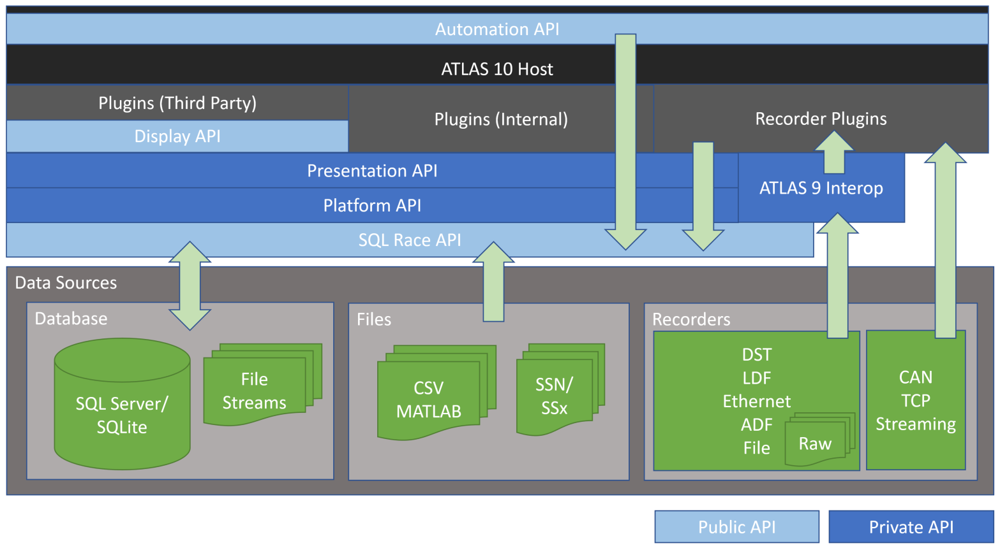

# Introduction to the ATLAS Display API

ATLAS ships with a range of standard displays such as: Waveform, Scatterplot and Numeric to name a few.

In addition to standard displays, ATLAS is fully customizable, allowing custom displays to be added via plugins created using the ATLAS Display API.

Using the Display API, custom displays can be made to look, behave and act just like the standard displays with full access to session and parameter data for custom visualizations tailored to specific third party needs.

## Plugins

ATLAS is a modular platform, the ATLAS application executable provides a user interface shell whereby the majority of functionality is provided by plugins.

There are essentially three types of plugin

- Display Plugins, such as: Waveform, Scatterplot, Numeric
- Functionality Plugins, such as: Session Browser, Parameter Browser, Alarms
- Recorder Plugins, such as: DTS, File, Advanced Streams

A plugin is a standard C# library DLL that exposes an entry point class derived from a suitable base class provided by the ATLAS APIs.

At startup, ATLAS will dynamically load compatible plugins that reside within the ATLAS program files folder. 

## Architecture Overview

All ATLAS functionality is built on top of the ATLAS Platform and Presentation APIs. These APIs should be seen as "internal/private APIs" that are actively developed and changed between each ATLAS release.

The Display API is a thin wrapper over these internal APIs, providing a stable and versioned API for third parties to develop custom display plugins. Changes to the Display API is purely additive, meaning custom display plugins remain compatible with future releases of ATLAS.

!!! note

    All data access is through the SQL Race API.

### Direct use of Platform and Presentation APIs

!!! attention

    The Display API is by its very nature a subset of the internal APIs.

    When coming across a feature that is not present in the Display API, but is available in the internal APIs, it may be tempting to just reference the internal APIs and use them directly.

    However, as ATLAS continues to be developed, we reserve the right to change the internal APIs as we see fit without regard for backwards compatibility, There is a high chance that future releases of ATLAS will become incompatible with custom display plugins that use internal APIs, with the most likely consequence being crashes on startup.

    Before calling internal APIs, please contact McLaren Applied for advice, whereby alternative APIs may be recommended, or future enhancements to the Display API will be considered.

## Display API Features

Here are the main features of the Display API that can be used to create custom displays.

### Native look and feel
Custom displays look, behave and act like standard displays.

### Fully integrated into ATLAS 
- Appear on main Toolbar
- Docking support
- Access to Parameter Browser
- Properties Window support
- Saved to Workbook

### Track common actions via Events
- Session loaded/unloaded/associated
- Parameters added/removed
- Timebase updated
- Cursor position changed
- Page activated

### Fetch Parameter Samples and Data
- Just for primary session or composite sessions
- Actual or resampled data

## Display API deployment

The Display API is deployed as a NuGet package hosted on GitHub, see [https://github.com/mat-docs/packages](https://github.com/mat-docs/packages)

The NuGet packages contains the following

