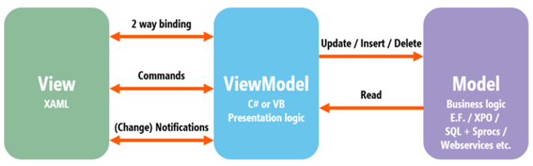

# Model-View-ViewModel (MVVM)

[MVVM](https://docs.microsoft.com/en-us/archive/msdn-magazine/2009/february/patterns-wpf-apps-with-the-model-view-viewmodel-design-pattern) is a popular software architecture pattern commonly used with WPF applications

- _Model-View-ViewModel_ pattern
    - _2 way binding_
        -  The _View_ `DataContext` property should be assigned an implementation of the _View Model_
        - `“{Binding …}”` _XAML_ element links a _View_ property to a _View Model_ property
    - _Change notification_
        - _View Model_ should implement the `INotifyPropertyChanged` interface
            - `PropertyChanged` event should be raised whenever a property value changes
    - _Commands_
        - _View Model_ must provide an implementation of the `ICommand` interface per _command_ 
- Helper classes provided by the _Display API_ to implement the above
    - `BindableBase` base class
        - Implements `INotifyPropertyChanged`
        - Provides `SetProperty` methods to simplify following the pattern
    - `DisposableBindableBase` base class
        - As per `BindableBase` but also supports `IDisposable`
    - `DelegateCommand` class
        - Provides a generic implementation of `ICommand` for _commands_