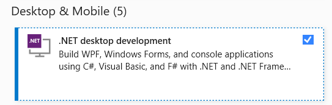

# Display API prerequisites

## Visual Studio

- [Visual Studio 2019](https://visualstudio.microsoft.com/downloads/?utm_medium=microsoft&utm_source=docs.microsoft.com&utm_campaign=inline+link&utm_content=download+vs2019) with the **.NET desktop development** workload installed

## Display API NuGet package

- Access to _Atlas.DisplayAPI_ NuGet package, see [https://github.com/mat-docs/packages](https://github.com/mat-docs/packages)

## ATLAS

- A recent version ATLAS 10 should be installed for testing custom displays, see [McLaren Applied Software Portal](https://www.mclarenelectronics.com/Portal)

## Required Knowledge

- C#
    - ATLAS has been implemented in the [C# programming language](https://docs.microsoft.com/en-us/dotnet/csharp/tour-of-csharp/) and therefore C# is the preferred implementation language for custom displays
- WPF
    - [Windows Presentation Foundation](https://docs.microsoft.com/en-us/visualstudio/designers/getting-started-with-wpf) is the User Interface technology used by ATLAS and therefore custom displays should also be implemented in WPF
- MVVM
    -  [MVVM](mvvm.md) has been used extensively in ATLAS and therefore the Display API has been designed to be fully MVVM compliant

