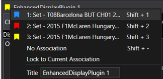

# Working with Sessions

A _Session_ is a collection of data samples obtained from a data source.

Multiple _Sessions_ may be loaded at one time and grouped into _Sets_.

Custom displays should respond appropriately when _Sessions_ are loaded/unloaded.

## Sessions Object Model

Each _Set_ is represented by a _composite session container_

A _Set_ is associated with a _display_

A _composite session container_ contains zero or more _composite sessions_.

When there is more than one _composite session_ that constitutes a _compare set_ (_overlay_)

A _composite session_ contains one or more _sessions_.

When there is more than one _session_ they can either be appended or overlaid

!!! note

    Associate sessions are not part of the this model.

### Session properties, notification overrides and services

- `DisplayPluginViewModel` properties
    - `ActiveCompositeSessionContainer` property
        - Access to the _Set_ associated with a _display_ (can be `null` if no association)
- `DisplayPluginViewModel` notifications
    - The following overrides are called for sessions
        - `OnCompositeSessionLoaded()`
            - Called when a _composite session_ is loaded
        - `OnCompositeSessionUnLoaded()`
            - Called when a _composite session_ is unloaded
        - `OnCompositeSessionContainerChanged()`
            - Called when a _Set_ associated with a _display_ is changed (i.e. `ActiveCompositeSessionContainer` property has changed)
- Session Services
    - `ISessionService`
        - `GetParameter()`
            - Get details about a specific parameter
        - `GetParametersCount()`
            -  Get the count of all parameters within a _composite session_
        - `GetParameters()`
            - Get details of all parameters within a _composite session_
    - `ISessionSummaryService`
        - `GetSessionSummary()`
            - Get session summary for _session_

