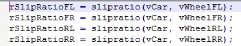
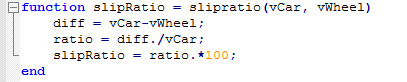

# Working with Functions

There different ways to work with functions in the SQLRace API. Existing FDL functions can be exposed through the API as FunctionParameters. Functions can also be defined from scratch in code. In addition to functions written in ATLAS's Function Definition Language (FDL) ATLAS 10 is able to call external interpreters to evaluate functions written in alternative languages. 

## Exposing ATLAS Functions Through the API
The API's License Program Name will need to be changed to the name of your ATLAS license. This will either be 'ATLAS 10 Premium' or 'ATLAS 10 Data Platform.' By default this is set to 'SQLRace.' The `LicenceProgramName` property needs to be set prior to the `Core.Initialize()` statement. Upon changing the license program name, the functions you have defined will be exposed through the session and can be used as any other parameter would.

=== "C#"

    ``` csharp
    Core.LicenceProgramName = "ATLAS 10 Premium";
    Core.Initialize();
    ```

=== "Python"

    ``` python
    Core.LicenceProgramName = "ATLAS 10 Premium"
    Core.Initialize()
    ```

=== "MATLAB"

    ``` matlab
     NET.setStaticProperty('MESL.SqlRace.Domain.Core.LicenceProgramName', 'ATLAS 10 Premium');
     Core.Initialize();
    ```

## Implementing Functions From Scratch
=== "C#"

    ``` csharp
    // Some additional import statements
    using MESL.SqlRace.Enumerators;
    using MESL.SqlRace.Domain.Functions;
    using MESL.SqlRace.Domain.Functions.Fdl;
    using MESL.SqlRace.Functions.Interfaces.Enums;

    var functionManager = FunctionManagerFactory.Create();

    // Create function
    const string CarSpeedDoubledInFdl = "return ($GPSSpeed:ECU * 2)";
    var functionDefinition = functionManager.CreateFunctionDefinition(FdlFunctionConstants.UniqueId);

    // The implementation of a function is completely agnostic. We requested a function definition from
    // the FDL runtime, so the generic function implementation definition in the definition returned can
    // be safely cast to the more specific FDL implementation definition.
    var fdlFunctionImplementationDefinition = (IFdlFunctionImplementationDefinition)functionDefinition.ImplementationDefinition;
    fdlFunctionImplementationDefinition.FunctionCode = CarSpeedDoubledInFdl;

    // FDL doesn't define the output for a single parameter - it's simply the return value of the
    // function - so we have to tell the function executor what to do with the output it generates
    var outputParameter = FunctionOutputParameterDefinition
        .Create("GPSSpeedDoubled", "FunctionParameters", "Double car speed!")
        .Units("MPH")
        .FormatOverride("%.2f")
        .MinimumValue("0.0")
        .MaximumValue("700.0");

    functionDefinition.OutputParameterDefinitions.Add(outputParameter);

    // Functions in ATLAS 9 have a number of different properties that define how, where, when and on
    // what a function executes. ATLAS 10 will add more of these properties. Each value here is the
    // default for its property, shown for illustration.
    functionDefinition.Name = $"DoubleCarSpeed_{Environment.TickCount}";
    functionDefinition.FunctionMode = FunctionMode.Instantaneous;
    functionDefinition.CalculationModeInfoDefinition.Mode = CalculationMode.EachSamplePoint;
    functionDefinition.InterpolateBetweenSamples = false;
    functionDefinition.JoinGapsAroundNull = true;
    functionDefinition.CalculateOverWholeSession = false;
    functionDefinition.StoreInSession = false;
    functionDefinition.ShouldHide = false;
    functionDefinition.ShouldPersist = false;

    var buildResults = functionManager.Build(functionDefinition);

    if (buildResults.Errors.Any())
    {
        Console.WriteLine("Function build failed.");
    }

    // Use this outputFunctionParameter to create PDA
    var outputFunctionParameter = functionDefinition.OutputParameterDefinitions.First();
    ```

=== "Python"

    ``` python
    # Some additional import statements
    from MESL.SqlRace.Enumerators import *
    from MESL.SqlRace.Domain.Functions import *
    from MESL.SqlRace.Domain.Functions.Fdl import *
    from MESL.SqlRace.Functions.Interfaces.Enums import *

    function_manager = FunctionManagerFactory.Create()

    # Create function
    car_speed_doubled_in_fdl = "return ($GPSSpeed:ECU * 2)"
    function_definition = function_manager.CreateFunctionDefinition(FdlFunctionConstants.UniqueId)

    # The implementation of a function is completely agnostic. We requested a function definition from
    # the FDL runtime, so the generic function implementation definition in the definition returned can
    # be safely cast to the more specific FDL implementation definition.
    fdl_function_implementation_definition = IFdlFunctionImplementationDefinition(function_definition.ImplementationDefinition)
    fdl_function_implementation_definition.FunctionCode = car_speed_doubled_in_fdl

    # FDL doesn't define the output for a single parameter - it's simply the return value of the
    # function - so we have to tell the function executor what to do with the output it generates
    output_parameter = FunctionOutputParameterDefinition.Create("GPSSpeedDoubled", "FunctionParameters", "Double car speed!")
    output_parameter.Units = "MPH"
    output_parameter.FormatOverride = "%.2f"
    output_parameter.MinimumValue = "0.0"
    output_parameter.MaximumValue = "700.0"

    function_definition.OutputParameterDefinitions.Add(output_parameter)

    # Functions in ATLAS 9 have a number of different properties that define how, where, when and on
    # what a function executes. ATLAS 10 will add more of these properties. Each value here is the
    # default for its property, shown for illustration.
    function_definition.Name = f"DoubleCarSpeed_{Environment.TickCount}"
    function_definition.FunctionMode = FunctionMode.Instantaneous
    function_definition.CalculationModeInfoDefinition.Mode = CalculationMode.EachSamplePoint
    function_definition.InterpolateBetweenSamples = False
    function_definition.JoinGapsAroundNull = True
    function_definition.CalculateOverWholeSession = False
    function_definition.StoreInSession = False
    function_definition.ShouldHide = False
    function_definition.ShouldPersist = False

    build_results = function_manager.Build(function_definition)

    if (build_results.Errors):
        print(f"Function build failed with error: {build_results.Errors}")

    # Use this output_function_parameter to create PDA
    output_function_parameter = function_definition.OutputParameterDefinitions[0]
    ```

=== "MATLAB"

    ``` matlab
    % Some additional import statements
    import MESL.SqlRace.Enumerators.*
    import MESL.SqlRace.Domain.Functions.*
    import MESL.SqlRace.Domain.Functions.Fdl.*
    import MESL.SqlRace.Functions.Interfaces.Enums.*

    %% Create Function
    functionManager = FunctionManagerFactory.Create();

    % Define function in FDL
    carSpeedDoubledInFdl = "return ($GPSSpeed:ECU * 2)";
    functionDefinition = functionManager.CreateFunctionDefinition(FdlFunctionConstants.UniqueId);

    % The implementation of a function is completely agnostic. We requested a function definition from
    % the FDL runtime, so the generic function implementation definition in the definition returned can
    % be safely cast to the more specific FDL implementation definition.
    fdlFunctionImplementationDefinition = functionDefinition.ImplementationDefinition;
    fdlFunctionImplementationDefinition.FunctionCode = carSpeedDoubledInFdl;

    % FDL doesn't define the output for a single parameter - it's simply the return value of the
    % function - so we have to tell the function executor what to do with the output it generates
    outputParameter = FunctionOutputParameterDefinition.Create("GPSSpeedDoubled", "FunctionParameters", "Double car speed!");
    outputParameter.Units = "MPH";
    outputParameter.FormatOverride = "%.2f";
    outputParameter.MinimumValue = "0.0";
    outputParameter.MaximumValue = "700.0";
  
    functionDefinition.OutputParameterDefinitions.Add(outputParameter);

    % Functions in ATLAS 9 have a number of different properties that define how, where, when and on
    % what a function executes. ATLAS 10 will add more of these properties. Each value here is the
    % default for its property, shown for illustration.
    functionDefinition.Name = sprintf("DoubleCarSpeed_%s", Environment.TickCount);
    functionDefinition.FunctionMode = FunctionMode.Instantaneous;
    functionDefinition.CalculationModeInfoDefinition.Mode = CalculationMode.EachSamplePoint;
    functionDefinition.InterpolateBetweenSamples = false;
    functionDefinition.JoinGapsAroundNull = true;
    functionDefinition.CalculateOverWholeSession = false;
    functionDefinition.StoreInSession = false;
    functionDefinition.ShouldHide = false;
    functionDefinition.ShouldPersist = false;

    buildResults = functionManager.Build(functionDefinition);

    if buildResults.Errors.Count > 0
        fprintf("Function build failed with error: %s", buildResults.Errors.Item(0).ErrorText);
    end

    %% Retrieve data
    % Use this outputFunctionParameter to create PDA
    outputFunctionParameter = functionDefinition.OutputParameterDefinitions.Item(0);
    ```

## Build a .NET Function .dll
!!! tip "The following modules must be referenced:"
    - OCS.Core
    - SQLRace.Domain
    - SQLRace.Enumerators
    - SQLRace.Functions.Interfaces
    - SQLRace.Functions.Types

Each function is implemented in a class that implements IDotNetFunction and is exported via the following attribute:
``` csharp
[Export(typeof(IDotNetFunction))]
```

With the following namespaces:
``` csharp
using MESL.SqlRace.Domain.Functions;
using MESL.SqlRace.Domain.Functions.DotNet;
using MESL.SqlRace.Enumerators;
using MESL.SqlRace.Functions.Interfaces.Enums;
using MAT.OCS.Core;
```

The function is defined and build in:
``` csharp
public void Initialize(IFunctionManager functionManager)
```

The function properties match those you would specify when creating a function from the editor. 

Remember to assign “this” to the ImplementationDefinition.

!!! note
    RelativePath can be set to override the location of the function within the parameter browser.

and executed in:
``` csharp
public void Execute(IExecutionContext executionContext)
```

where the timestamp of each input(s) is accessed by:
``` csharp
executionContext.FunctionInput.Timestamps[];
```

and values for each input via:
``` csharp
executionContext.FunctionInput.Values[][];  // (input parameter index, input value)
```

The indexes of input parameters can be looked up by name:
``` csharp
executionContext.FunctionInput.InputParameterIndexes;
```

The combined status of the inputs is accessed by:
``` csharp
executionContext.FunctionInput.Statuses[];
```

NB: if the status is `DataStatusType.Missing`, then assign `double.NaN` to the corresponding output values to indicate no value.

Output values are assigned to each output parameter for each input value, via:
``` csharp
executionContext.FunctionOutput.OutputParametersValues[][];  // (output parameter index, output value)
```

The indexes of output parameters can be looked up by name:
``` csharp
executionContext.FunctionOutput.OutputParameterIndexes;
```

Copy just the output module to:
`C:\Users\<user>\Documents\McLaren Electronic Systems\SQL Race\Functions\` or sub folder.

Restart ATLAS10 and on inspecting the parameter browser, you should see the function(s) populated.

### Code Example
``` csharp
using MESL.SqlRace.Domain.Functions;
using MESL.SqlRace.Domain.Functions.DotNet;
using MESL.SqlRace.Enumerators;
using MESL.SqlRace.Functions.Interfaces.Enums;
using System;
using System.ComponentModel.Composition;
using System.Linq;

namespace MAT.SqlRace.Functions.HelloDotNet
{
    [Export(typeof(IDotNetFunction))]
    [Serializable]
    public class HelloFunction : IDotNetFunction
    {
        internal const string FunctionName = "HelloDotNet";
        internal const string ParameterName = "vCarDoubledParam";
        internal const string ApplicationName = "DotNetGroup";
        internal const string ParameterIdentifier = ParameterName + ":" + ApplicationName;

        public string Name => FunctionName;

        /// <summary>
        ///     This method will be called by SqlRace framework.
        /// </summary>
        /// <param name="functionManager"></param>
        public void Initialize(IFunctionManager functionManager)
        {
            // create the function definition
            var functionDefinition = functionManager.CreateFunctionDefinition(DotNetFunctionConstants.UniqueId, FunctionMode.Instantaneous, CalculationModeInfoDefinition.EachSamplePoint());
            //var functionDefinition = functionManager.CreateFunctionDefinition(DotNetFunctionConstants.UniqueId);
            functionDefinition.CalculateOverWholeSession = false;
            functionDefinition.InterpolateBetweenSamples = false;
            functionDefinition.JoinGapsAroundNull = false;
            functionDefinition.Name = FunctionName;
            functionDefinition.StoreInSession = false;

            // set the implementation 
            var implementationDefinition = (DotNetFunctionImplementationDefinition)functionDefinition.ImplementationDefinition;
            implementationDefinition.Function = this;

            // create the single output parameter
            functionDefinition.OutputParameterDefinitions.Add(
                new FunctionOutputParameterDefinition
                {
                    ApplicationName = ApplicationName,
                    ByteOrder = ByteOrderType.BigEndian,
                    Description = "HelloDotNet.vCarDoubled",
                    FormatOverride = @"%5.2f",
                    Name = ParameterName,
                    Units = "km/h",
                    MaximumValue = "800",
                    MinimumValue = "0",
                    ShowInBrowser = true
                });

            functionDefinition.InputParameterIdentifiers.Add("vCar:Chassis");

            // build the function
            var buildResults = functionManager.Build(functionDefinition);

            // make sure we have no build errors
            if (buildResults.Errors.Count > 0)
            {
                Console.WriteLine($"Error building DotNet function '{FunctionName}': {buildResults.Errors.FirstOrDefault()?.ErrorText}.");
            }
            else
            {
                Console.WriteLine($"DotNet function '{FunctionName}' created successfully.");
            }
        }

        /// <summary>
        ///     This method is called once per data request.
        /// </summary>
        /// <param name="executionContext"></param>
        public void Execute(IExecutionContext executionContext)
        {
            var timestamps = executionContext.FunctionInput.Timestamps;
            var timestampsCount = timestamps.Length;

            var index = executionContext.FunctionOutput.OutputParameterIndexes[ParameterIdentifier];
            var parameterOutput = executionContext.FunctionOutput.OutputParametersValues[index];
            var input = executionContext.FunctionInput.Values[index];

            for (int i = 0; i < timestampsCount; i++)
            {
                parameterOutput[i] = input[i] * 2;
                //Console.WriteLine($"{data.Timestamp[i]},{new DateTime(data.Timestamp[i] / 100):HH:mm:ss.fff},{data.Data[i]} = {result[i]}");
            }
        }
    }
}
```
**Additional Notes**

``` csharp
functionDefinition.CalculationModeInfoDefinition.Mode = CalculationMode.FixedFrequency;
```
`FixedFrequency` can be replaced by `EachSamplePoint` or `HighestRate`
It is also possible to use corresponding numbers:
``` csharp
functionDefinition.CalculationModeInfoDefinition.Mode = 0;
```
!!! tip "Numbers Corresponding To Their Calculation Mode"
    - 0 = EachSamplePoint
    - 1 = FixedFrequency
    - 2 = HighestRate

If you use `FixedFrequency`, the following line is used to set the Frequency (Example for 1Hz):
``` csharp
functionDefinition.CalculationModeInfoDefinition.Frequency = 1;
```

[GitHub Example](https://github.com/mat-docs/MAT.OCS.SQLRace.Examples/tree/master/MAT.SqlRace.Functions.HelloDotNet)

## C# Embedded .XFNs

There are two methods to call .NET functions, one way is to write a Dynamic Link Library (.DLL) containing the functions' implementations the other is to embed the C# code directly into an .XFN file. A C# .NET function can be implemented directly in a specially constructed .XFN file.  Each .XFN function file can implement multiple function outputs. 

The .XFN file must be in the ATLAS 10 Functions directory: `%HOMEPATH%\Documents\McLaren Electronic Systems\SQL Race\Functions`

To try this example:

1. Download the SinAndCosOfSteeringWheelAngle.xfn file attached to this example and place it in the functions directory. 
2. Start ATLAS 10 (or if it is already running, restart it).
3. Only one input parameter is referenced by the function aSteerWheel:Chassis so for the function to calculate, data containing this parameter must be loaded.
4. Two output parameters are calculated steerWheelSin:FunctionParameters and steerWheelCos:FunctionParameters.  These should now be available to add to any display from the ATLAS 10 Parameter Browser or Quick Access shortcut.

Firstly the InputParameters section defines which ATLAS parameter identifiers are to be sourced by the .NET function. There should be an Identifier line for each input parameter to the function.

The OutputParameters section defines the output function parameter properties for each value the .NET function calculates. Each OutputParameter must have a Name, Description, Units, Format, DisplayMin and DisplayMax. Your .NET function can define more than one output parameter. The calculation defaults should be left as they are.

The FunctionCode section defines the actual function implementation in C#.  At the top of the implementation the three using statements bring the required types into the namespace without using their fully qualified names.  The IFunction interface comes from MESL.SqlRace.Domain.Functions so this must be imported.  In this example System is needed for the maths functions and System.Collections.Generic is not actually needed as no collections defined by this are being used (List<> for example). 

The function must define a class which implements the IFunction interface.  It may be named anything you want but it is best practice to have it match the name of the XFN file which contains the class.  Because each function is compiled separately there should be no name clashes though. 

The interface requires an Execute() method which is called by ATLAS to calculate the function values.  It is inside this method where the named output parameters get assigned their calculated values.  The class can contain other methods which are called by Execute() to perform the actual calculations. 

### Code Example
```xml
<?xml version="1.0" encoding="ISO-8859-1"?>
<Xfn2Function xmlns="http://www.mclarenelectronics.com/schemas/OcsXfn"
               xmlns:xsi="http://www.w3.org/2001/XMLSchema-instance"
               xsi:schemaLocation="C:\Users\USER_NAME\OneDrive - McLaren Applied\Documents\McLaren Electronic Systems\ATLAS 9\Funclib\OcsXFn.xsd">
    <InputParameters>
        <Identifier>aSteering:TAG400NApp1</Identifier>
    </InputParameters>
    <OutputParameters>
        <OutputParameter>
            <Name>steerWheelSin</Name>
            <Description><![CDATA[Sine of steering wheel angle]]></Description>
            <Units>°</Units>
            <Format>%.2f</Format>
            <DisplayMin>-1.00</DisplayMin>
            <DisplayMax>1.00</DisplayMax>
        </OutputParameter>
        <OutputParameter>
            <Name>steerWheelCos</Name>
            <Description><![CDATA[Cosine of steering wheel angle]]></Description>
            <Units>°</Units>
            <Format>%.2f</Format>
            <DisplayMin>-1.00</DisplayMin>
            <DisplayMax>1.00</DisplayMax>
        </OutputParameter>
    </OutputParameters>
    <FunctionMode>XFN_Instantaneous</FunctionMode>
	<CalculationMode>XFN_EachSample</CalculationMode>
	<InterpolateBetweenSamples>false</InterpolateBetweenSamples>
	<JoinGapsAroundNull>true</JoinGapsAroundNull>
	<CalculateOverWholeSession>false</CalculateOverWholeSession>
	<StoreInSession>false</StoreInSession>
    <Implementation>
        <CSharpFunctionImplementationDefinition>
            <FunctionCode>
                <![CDATA[
                    using System;
                    using System.Collections.Generic;
                    using MESL.SqlRace.Domain.Functions;

                    public sealed class CalculatesSineAndCosine : IFunction
                    {
                        public void Execute(IExecutionContext executionContext)
                        {
                            var functionInput = executionContext.FunctionInput;
                            var functionOutput = executionContext.FunctionOutput;

                            var timestampsCount = functionInput.Timestamps.Length;

                            var aSteerWheelIndex = functionInput.InputParameterIndexes["aSteering:TAG400NApp1"];
                            var steerWheelSinIndex = functionOutput.OutputParameterIndexes["steerWheelSin:Functions"];
                            var steerWheelCosIndex = functionOutput.OutputParameterIndexes["steerWheelCos:Functions"];

                            var aSteerWheel = functionInput.Values[aSteerWheelIndex];
                            var steerWheelSin = functionOutput.OutputParametersValues[steerWheelSinIndex];
                            var steerWheelCos = functionOutput.OutputParametersValues[steerWheelCosIndex];
                            for (var i = 0; i < timestampsCount; i++)
                            {
                                var aSteerWheelValueDeg = aSteerWheel[i];
                                var aSteerWheelValueRad = DegreesToRadians(aSteerWheelValueDeg);
                                steerWheelSin[i] = Math.Sin(aSteerWheelValueRad);
                                steerWheelCos[i] = Math.Cos(aSteerWheelValueRad);
                            }
                        }
                        
                        private double DegreesToRadians(double degrees)
                        {
                            return Math.PI * degrees / 180.0;
                        }
                    }
                ]]>
            </FunctionCode>
        </CSharpFunctionImplementationDefinition>
    </Implementation>
    <Trigger>
        <ExecuteOnEveryDataRequestDefinition />
    </Trigger>
</Xfn2Function>
```

## MATLAB Embedded .XFNs

A MATLAB function comprises at least two parts; an .XFN file which gives ATLAS 10 an XML interface to the MATLAB function and a .M file which contains the actual MATLAB script implementation. .M files can call one another so it is possible to have multiple .M files making up a single definition.

The .XFN file must be in the ATLAS 10 Functions directory: `%HOMEPATH%\Documents\McLaren Electronic Systems\SQL Race\Functions`

The .M files are referenced by absolute path from the .XFN file so can be located anywhere. All .M files which make up a single function definition however must be in the same folder or in folders on the MATLAB path. In this example they will be placed in the ATLAS 10 Functions directory like the .XFN file above.

1. The three files in this example are CalculateSlipRatios.xfn, calculateslipratios.m and slipratio.m, download these and place them all in the functions directory.
2. Edit the CalculateSlipRatios.xfn file in any normal text editor, find the <FilePath>...</FilePath> line and edit it so the correct, absolute path to the calculateslipratios.m file is in the inner pair of square brackets.
3. Start ATLAS 10 (or if it is already running, restart it).
4. Four ATLAS input parameters are referenced; `vCar:Chassis`, `vWheelFL:Chassis`, `vWheelFR:Chassis`, `vWheelRL:Chassis` and `vWheelRR:Chassis` so for the function to calculate, data containing these parameters must be loaded.
5. Four output parameters are calculated: `rSlipRatioFL:Functions`, `rSlipRatioFR:Functions`, `rSlipRatioRL:Functions` and `rSlipRatioRR:Functions`. These should now be available to add to any display from the ATLAS 10 Parameter Browser or Quick Access shortcut.

### The .XFN File

Firstly the InputParameters section defines which ATLAS parameter identifiers are to be sourced by the MATLAB function. There should be an Identifier line for each input parameter to the function.

The OutputParameters section defines the output function parameter properties for each value the MATLAB function calculates. Each OutputParameter must have a Name, Description, Units, Format, DisplayMin and DisplayMax. Your MATLAB function can define more than one output parameter.

The calculation defaults should be left as they are, these will be described in more detail in later Help documents.

The FilePath line is the link between ATLAS and the MATLAB .M file which contains the implementation in MATLAB script. This is an absolute path.

The InputMappings section defines how the ATLAS input parameter identifiers appear to MATLAB in the .M script. In this example the input parameter `vCar:Chassis` is translated to a MATLAB variable named simply vCar which is referenced in the code. There must be a Mapping entry for each of the Identifiers lines in the InputParameters section.

The OutputMappings section defines how the MATLAB output parameters appear to ATLAS 10 in the Parameter Browser. In this example the MATLAB variable output by the script rSlipRatioFL will appear with the `rSlipRatioFL:Functions` identifier in ATLAS. There must be a Mapping entry for each of the OutputParameter entries in the OutputParameters section.

### The .M File

The absolute basic .M file just assigns values to the OutputParameter Mapping MATLAB variable names. Our slightly more complicated example uses a MATLAB function call, referencing the input variables as arguments and assigns the function return to the output variable names. Any valid MATLAB code can appear in the .M files.

So in our example the .XFN function definition references calculateslipratios.m



This calls the MATLAB function `slipratio()` using the input parameter names as the function arguments and assigns the function return to the four output variables. The actual calculation is done inside slipratio.m which defines a standard function in MATLAB



### Code Example
**CalculateSlipRatio.xfn**
```xml
<?xml version="1.0" encoding="ISO-8859-1"?>
<Xfn2Function xmlns="http://www.mclarenelectronics.com/schemas/OcsXfn"
               xmlns:xsi="http://www.w3.org/2001/XMLSchema-instance"
               xsi:schemaLocation="C:\Users\USER_NAME\OneDrive - McLaren Applied\Documents\McLaren Electronic Systems\ATLAS 9\Funclib\OcsXFn.xsd">
    <InputParameters>
        <Identifier>vCar:Chassis</Identifier>
        <Identifier>vWheelFL:Chassis</Identifier>
        <Identifier>vWheelFR:Chassis</Identifier>
        <Identifier>vWheelRL:Chassis</Identifier>
        <Identifier>vWheelRR:Chassis</Identifier>
    </InputParameters>
    <OutputParameters>
        <OutputParameter>
            <Name>rSlipRatioFL</Name>
            <Description><![CDATA[Front-left slip ratio]]></Description>
            <Units>%</Units>
            <Format>%.2f</Format>
            <DisplayMin>-5.00</DisplayMin>
            <DisplayMax>90.00</DisplayMax>
        </OutputParameter>
        <OutputParameter>
            <Name>rSlipRatioFR</Name>
            <Description><![CDATA[Front-right slip ratio]]></Description>
            <Units>%</Units>
            <Format>%.2f</Format>
            <DisplayMin>-5.00</DisplayMin>
            <DisplayMax>90.00</DisplayMax>
        </OutputParameter>
        <OutputParameter>
            <Name>rSlipRatioRL</Name>
            <Description><![CDATA[Rear-left slip ratio]]></Description>
            <Units>%</Units>
            <Format>%.2f</Format>
            <DisplayMin>-5.00</DisplayMin>
            <DisplayMax>90.00</DisplayMax>
        </OutputParameter>
        <OutputParameter>
            <Name>rSlipRatioRR</Name>
            <Description><![CDATA[Rear-right slip ratio]]></Description>
            <Units>%</Units>
            <Format>%.2f</Format>
            <DisplayMin>-5.00</DisplayMin>
            <DisplayMax>90.00</DisplayMax>
        </OutputParameter>
    </OutputParameters>
    <FunctionMode>XFN_LeadingEdge</FunctionMode>
	<CalculationMode>XFN_EachSample</CalculationMode>
	<InterpolateBetweenSamples>false</InterpolateBetweenSamples>
	<JoinGapsAroundNull>true</JoinGapsAroundNull>
	<CalculateOverWholeSession>false</CalculateOverWholeSession>
	<StoreInSession>false</StoreInSession>
    <Implementation>
        <MatlabFunctionImplementationDefinition>
            <FilePath><![CDATA[C:\Projects\xfn_matlab\calculateslipratios.m]]></FilePath>
            <InputMappings>
                <Mapping>
                    <From>vCar:Chassis</From>
                    <To>vCar</To>
                </Mapping>
                <Mapping>
                    <From>vWheelFL:Chassis</From>
                    <To>vWheelFL</To>
                </Mapping>
                <Mapping>
                    <From>vWheelFR:Chassis</From>
                    <To>vWheelFR</To>
                </Mapping>
                <Mapping>
                    <From>vWheelRL:Chassis</From>
                    <To>vWheelRL</To>
                </Mapping>
                <Mapping>
                    <From>vWheelRR:Chassis</From>
                    <To>vWheelRR</To>
                </Mapping>
            </InputMappings>
            <OutputMappings>
                <Mapping>
                    <From>rSlipRatioFL</From>
                    <To>rSlipRatioFL:Functions</To>
                </Mapping>
                <Mapping>
                    <From>rSlipRatioFR</From>
                    <To>rSlipRatioFR:Functions</To>
                </Mapping>
                <Mapping>
                    <From>rSlipRatioRL</From>
                    <To>rSlipRatioRL:Functions</To>
                </Mapping>
                <Mapping>
                    <From>rSlipRatioRR</From>
                    <To>rSlipRatioRR:Functions</To>
                </Mapping>
            </OutputMappings>
        </MatlabFunctionImplementationDefinition>
    </Implementation>
    <Trigger>
        <ExecuteOnSessionEndDefinition />
    </Trigger>
</Xfn2Function>
```

**calculateslipratios.m**
```matlab
%vCar = [10, 20, 30, 40, 50];
%vWheelFL = [9, 18, 27, 36, 45];

rSlipRatioFL = slipratio(vCar, vWheelFL);
rSlipRatioFR = slipratio(vCar, vWheelFR);
rSlipRatioRL = slipratio(vCar, vWheelRL);
rSlipRatioRR = slipratio(vCar, vWheelRR);
```
**slipratio.m**
```matlab
function slipRatio = slipratio(vCar, vWheel)
    diff = vCar-vWheel;
    ratio = diff./vCar;
    slipRatio = ratio.*100;
end
```

