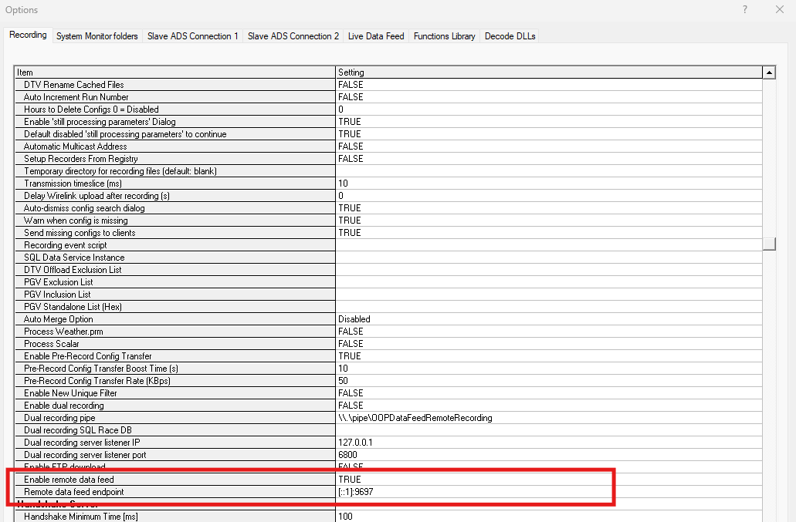

# Getting Started

This guide walks you through the minimum steps to get Bridge Service publishing data to Kafka.
Choose the tab that matches your deployment.

!!! tip "Not sure which tab applies?"
    See [Which deployment do I have?](index.md#which-deployment-do-i-have) on the Overview page.

---

=== "Bundled with ADS"

    ## Prerequisites { #bundled-prereqs }

    - ADS installed (Bridge Service is included in the ADS installer).
    - A running Kafka broker reachable from the ADS machine.
    - The Kafka broker address (host and port).

    ## Step 1 — Edit the config file

    Open `BridgeServiceConfig.json` in:

    ```
    …/Documents/McLaren Electronic Systems/ATLAS9/BridgeService/
    ```

    The file only needs two sections. The minimal working config using partition-based streaming:

    ```json title="BridgeServiceConfig.json (partition-based, minimal)" linenums="1"
    {
      "StreamApiConfig": {
        "StreamCreationStrategy": 1,
        "BrokerUrl": "localhost:9094",
        "PartitionMappings": [
          { "Stream": "Live", "Partition": 1 }
        ],
        "IntegrateSessionManagement": true,
        "IntegrateDataFormatManagement": true,
        "UseRemoteKeyGenerator": false,
        "RemoteKeyGeneratorServiceAddress": "",
        "BatchingResponses": false,
        "StreamApiPort": 13579
      },
      "StreamSelectionConfig": {
        "Auto": true,
        "Mappings": []
      }
    }
    ```

    - Replace `localhost:9094` with your actual broker address.
    - `"Auto": true` maps every ADS app group to a stream of the same name.
    - The data source name is taken automatically from ADS → Setup → General → General Network
      Settings → **Name**.

    !!! note "`StreamApiPort` is a Streaming API setting"
        `StreamApiPort` is a [Streaming API configuration](../stream_api/reference_docs/configuration/server-config.md)
        key, not a Bridge field. It is shown here because it appears in the real ADS-generated
        config; leave it as supplied unless the Stream API docs tell you otherwise.

    For topic-based streaming or custom stream mappings, see the
    [Configuration Guide](configuration.md).

    ## Step 2 — Enable the remote data feed in ADS

    In ADS, go to **Tools → Options → Recording → General** and set
    **Enable remote data feed** to **True**.

    

    ## Step 3 — Restart ADS

    Close and reopen ADS. Bridge Service will start automatically in a separate command prompt
    window.

    ## Step 4 — Confirm data is flowing

    Once a session starts in ADS, check that messages appear on your Kafka topic or partition.
    You can use the [Stream API Usage Sample](https://github.com/mat-docs/MA.Streaming.Api.UsageSample)
    to subscribe and verify packets are arriving.

    ## First-run problems (Bundled)

    **No data arrives on Kafka**

    - Confirm "Enable remote data feed" is **True** and ADS was restarted after changing it.
    - Check that `BrokerUrl` in the config matches your actual Kafka address.
    - Check the log file at `…/ATLAS9/log/BridgeLogYYYYMMDD.txt` for connection errors.

    **Bridge Service command prompt closes immediately**

    - The config file has a JSON syntax error — validate it with a JSON linter.
    - The broker is unreachable — confirm Kafka is running and the URL is correct.

    **Data appears but sessions are not managed correctly**

    - Ensure `IntegrateSessionManagement` and `IntegrateDataFormatManagement` are both `true`.

=== "Standalone / Container"

    ## Prerequisites { #standalone-prereqs }

    - .NET 8 runtime (or Docker) on the host machine.
    - The Bridge Service host executable built from `MA.DataPlatforms.Bridge.Host`.
    - A running Kafka broker reachable from the Bridge Service host.
    - CFG, PGV, and PUL file directories accessible from the host.

    ## Step 1 — Create the config file

    Create `AppConfig.json` (default path: `Configs/AppConfig.json` next to the host executable,
    or supply a custom path with `-c`).

    Minimal working config using partition-based streaming:

    ```json title="AppConfig.json (standalone, minimal)" linenums="1"
    {
      "StreamApiConfig": {
        "StreamCreationStrategy": 1,
        "BrokerUrl": "localhost:9094",
        "PartitionMappings": [
          { "Stream": "Live", "Partition": 1 },
          { "Stream": "Offload", "Partition": 2 }
        ],
        "IntegrateSessionManagement": true,
        "IntegrateDataFormatManagement": true,
        "UseRemoteKeyGenerator": false,
        "RemoteKeyGeneratorServiceAddress": "",
        "BatchingResponses": false,
        "InitialisationTimeoutSeconds": 1,
        "Domain": "Test2"
      },
      "StreamSelectionConfig": {
        "Auto": false,
        "Mappings": [ { "AppName": "*", "Stream": "Live" } ]
      },
      "BridgeConfig": {
        "DataSource": "MyBridge",
        "UseStringIdentifier": true,
        "ProcessFlow": "DropOldest",
        "LiveConcurrencyFactor": 12,
        "OffloadConcurrencyFactor": 24,
        "OffloadProcessing": true,
        "OffloadStream": "Offload"
      },
      "EssentialsConfig": {
        "CfgDirectoryPaths": [ "/data/cfg" ],
        "PgvDirectoryPaths": [ "/data/pgv" ]
      },
      "RdaConfig": {
        "PulFilesSearchPaths": [ "/data/pul" ]
      },
      "Serilog": {
        "MinimumLevel": { "Default": "Information" },
        "WriteTo": [
          {
            "Name": "Console",
            "Args": {
              "outputTemplate": "[{Timestamp:HH:mm:ss} {Level:u3}] {SourceContext}: {Message:lj}{NewLine}{Exception}"
            }
          }
        ]
      }
    }
    ```

    - Replace `localhost:9094` with your broker address.
    - Set `DataSource` to a meaningful name for this bridge instance.
    - Update `CfgDirectoryPaths`, `PgvDirectoryPaths`, and `PulFilesSearchPaths` to point at
      your actual file locations.
    - `"AppName": "*"` maps all app groups to the `Live` stream.

    !!! note "What to change vs. leave alone"
        Every other field in this example can be left exactly as shown for a basic setup — only
        the items listed above need your attention.

    ## Step 2 — Start the host executable

    Run the Bridge host executable. To specify a custom config path:

    ```bash
    # Using default config path (Configs/AppConfig.json)
    ./MA.DataPlatforms.Bridge.Host

    # Using a custom config path
    ./MA.DataPlatforms.Bridge.Host -c /path/to/AppConfig.json

    # With a custom log path
    ./MA.DataPlatforms.Bridge.Host -c /path/to/AppConfig.json -l /path/to/bridge.log
    ```

    On Windows, use the equivalent `.exe` output from the build.

    !!! note "Docker / container"
        Set `CONFIG_FILE_PATH` and `LOG_FILE_PATH` environment variables instead of `-c` and
        `-l` when running in a container.

    ## Step 3 — Confirm data is flowing

    Once a session starts, check that messages appear on your Kafka partition or topic.
    Use the [Stream API Usage Sample](https://github.com/mat-docs/MA.Streaming.Api.UsageSample)
    to subscribe and verify packets arrive.

    ## First-run problems (Standalone)

    **Host exits immediately or fails to start**

    - The config file is missing or has a JSON syntax error — validate it with a JSON linter.
    - The path passed to `-c` does not exist — check the path and file permissions.
    - The broker is unreachable — confirm Kafka is running at the address in `BrokerUrl`.

    **No data arrives on Kafka**

    - Confirm the ADS (or data source) is actually sending a stream to the Bridge Service host
      port (default feed port is configurable via `FeedPort` in `BridgeConfig` or `-p`).
    - Check the console or log file for connection or decoding errors.

    **CFG/PGV/PUL errors on startup**

    - Ensure `CfgDirectoryPaths` and `PgvDirectoryPaths` point at directories containing the
      correct `.cfg` and `.pgv` files for your parameters.
    - Ensure `PulFilesSearchPaths` points at your PUL (licence) file directories.

---

## Next steps

- [Configuration Guide](configuration.md) — tune streams, throughput, and stream mapping.
- [Configuration Reference](configuration-reference.md) — every field explained.
- [Troubleshooting](troubleshooting.md) — if something isn't working.
