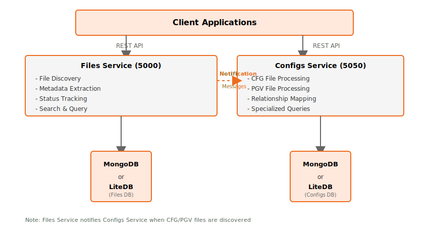

# Data Platform Indexing Solution

A microservice solution for file and configuration indexing, designed specifically for Motion Applied's data platform infrastructure.

## Overview

The solution provides robust file system indexing and specialized configuration file processing capabilities through two complementary microservices:

- **Files Service** (Port 5000): General-purpose file indexing and management
- **Configs Service** (Port 5050): Specialized CFG and PGV file processing

This solution is particularly suited for configuration management, and large-scale file system auditing scenarios.

## Architecture



## Features

### Files Service Features

- **Recursive Directory Scanning** with configurable file extensions
- **Metadata Extraction** (size, modification dates, checksums)
- **Status Tracking** (Exist, Processed, NotFound, Error)
- **Advanced Search** with pagination and filtering
- **Scheduled Scanning** using Quartz cron expressions
- **Manual Operations** via REST APIs
- **Health Monitoring** with heartbeat endpoints

### Configs Service Features

- **CFG File Processing** with configuration ID extraction
- **PGV File Processing** with application version tracking
- **Relationship Mapping** between CFG and PGV files
- **Specialized Queries** for configuration management
- **Dual Scanning** processes for different file types
- **Processing Coordination** and aggregation

## Technology Stack

- **Framework**: ASP.NET Core 8.0+ with C# 11+
- **Databases**: MongoDB (production) / LiteDB (development)
- **Scheduling**: Quartz.NET with cron expressions
- **Logging**: Serilog with structured logging
- **Configuration**: ASP.NET Core Configuration with environment variables
- **API**: RESTful APIs with comprehensive error handling

## Documentation

Comprehensive documentation is available:

| Document | Description |
|----------|-------------|
| **[Service Overview](service-overview.md)** | High-level architecture and service descriptions |
| **[API Documentation](api-documentation.md)** | Complete REST API reference with examples |
| **[Configuration Guide](appsettings-configuration.md)** | Detailed appsettings and environment variables |

## Getting Started

### Prerequisites

- .NET 8.0 SDK or later
- MongoDB (for production) or LiteDB (automatic for development)
- Visual Studio 2022 or VS Code

### Configuration

#### Basic Configuration (appsettings.json)

**Files Service:**
```json
{
  "Directories": ["C:\\YourDataPath"],
  "Extensions": [".pgv", ".cfg", ".pul"],
  "StorageType": 0,
  "LiteDb": { "FileName": "FileIndexingDB" }
}
```

**Configs Service:**
```json
{
  "FileIndexerEndpoints": {
    "CfgEndpoint": "http://your-files-service:5000/",
    "PgvEndpoint": "http://your-files-service:5000/"
  },
  "StorageType": 0,
  "LiteDb": { "FileName": "ConfigIndexingDB" }
}
```

#### Environment Variables
```bash
# Files Service
Directories__0=C:\Data\Files
Extensions__0=.pgv
StorageType=1
MongoDb__ConnectionString=mongodb://your-mongo-server:27017

# Configs Service  
FileIndexerEndpoints__CfgEndpoint=http://your-files-service:5000/
StorageType=1
```

## Production Deployment

### Docker Deployment
```yaml
# docker-compose.yml example
version: '3.8'
services:
  file-indexer-service:
    image: atlasplatformdocker/file-indexing-service:latest
    ports:
      - "5000:5000"
    environment:
      - StorageType=1
      - MongoDb__ConnectionString=mongodb://mongo:27017
      - ASPNETCORE_URLS='http://*:5000'
      - Directories__0='/app/data'
      - Extensions__0='.pgv'
      - Extensions__1='.cfg'
    volumes:
      - /data:/app/data
    depends_on:
      - mongodb

  config-indexer-service:
    image: atlasplatformdocker/config-indexing-service:latest
    ports:
      - "5050:5050"
    environment:
      - StorageType=1
      - MongoDb__ConnectionString=mongodb://mongo:27017
      - ASPNETCORE_URLS='http://*:5050'
      - FileIndexerEndpoints__CfgEndpoint='http://file-indexer-service:5000'
      - FileIndexerEndpoints__PgvEndpoint='http://file-indexer-service:5000'
    depends_on:
      - mongodb
      - file-indexer-service
    volumes:
      - /data:/app/data

  mongodb:
    image: mongodb/mongodb-community-server:latest
    ports:
      - "27017:27017"
```


## Configuration Reference

| Service | Default Port | Database | Primary File Types |
|---------|-------------|----------|------------------|
| Files | 5000 | MongoDB/LiteDB | .pgv, .cfg, .pul |
| Configs | 5050 | MongoDB/LiteDB | .cfg, .pgv |

### Storage Types
- **0**: LiteDB (embedded, file-based)
- **1**: MongoDB (production, scalable)


**Built by Motion Applied Data Platform Team**