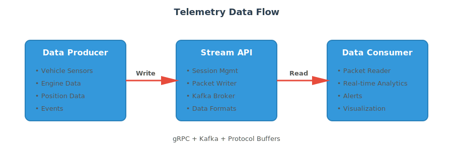

# Telemetry Example

This example demonstrates how to build a complete telemetry data streaming application using the Stream API.

## Overview

We'll create a system that:

- Simulates vehicle telemetry data from multiple sensors (mocked data generation)
- Streams the data in real-time to Kafka
- Processes and analyzes the streaming data
- Provides real-time dashboards and alerts

**Note:** This example uses simulated sensor data for demonstration purposes. In a production environment, you would replace the mock data generators with actual sensor readings from vehicle systems.

## Prerequisites

- Stream API server running (see [Docker Setup](../configuration/docker-setup.md))
- .NET 8.0+ SDK for the client application
- Basic understanding of telemetry data concepts

## Architecture



The architecture consists of three main components:

1. **Simulated Vehicle Data**: Mock data generators simulate real-time sensor readings from vehicle systems
2. **Stream API Server**: Handles data ingestion, processing, and distribution via Kafka
3. **Analytics Dashboard**: Processes and visualizes streaming telemetry data in real-time


## Data Producer

### Telemetry Configuration

First, define the telemetry parameters using Protocol Buffers:

```csharp
// Create configuration packet with all telemetry parameters
private readonly ConfigurationPacket telemetryConfig = new()
{
    ConfigId = "vehicle-telemetry-v1",
    ParameterDefinitions =
    {
        // Engine parameters
        new ParameterDefinition
        {
            Identifier = "Engine.Rpm",
            Name = "Engine RPM",
            ApplicationName = "VehicleTelemetry",
            Description = "Engine revolutions per minute",
            Units = "RPM",
            DataType = DataType.Float64,
            FormatString = "%5.0f",
            MinValue = 0.0,
            MaxValue = 12000.0,
            Groups = { "Engine" },
            Frequencies =
            {
                10.0
            }, // 10 Hz
            IncludesRowData = true
        },
        new ParameterDefinition
        {
            Identifier = "Engine.Temperature",
            Name = "Engine Temperature",
            ApplicationName = "VehicleTelemetry",
            Description = "Engine coolant temperature",
            Units = "°C",
            DataType = DataType.Float64,
            FormatString = "%5.1f",
            Groups = { "Engine" },
            MinValue = -40.0,
            MaxValue = 150.0,
            Frequencies =
            {
                1.0
            } // 1 Hz
        },
        new ParameterDefinition
        {
            Identifier = "Engine.OilPressure",
            Name = "Oil Pressure",
            ApplicationName = "VehicleTelemetry",
            Description = "Engine oil pressure",
            Units = "bar",
            DataType = DataType.Float64,
            FormatString = "%5.1f",
            Groups = { "Engine" },
            MinValue = 0.0,
            MaxValue = 10.0,
            Frequencies =
            {
                2.0
            } // 2 Hz
        },
        // Brake parameters
        new ParameterDefinition
        {
            Identifier = "Brakes.FrontLeft.Temperature",
            Name = "Front Left Brake Temperature",
            ApplicationName = "VehicleTelemetry",
            Description = "Front left brake disc temperature",
            Units = "°C",
            DataType = DataType.Float64,
            FormatString = "%5.1f",
            MinValue = 0.0,
            MaxValue = 800.0,
            Groups = { "Brakes" },
            WarningMaxValue = 700.0,
            Frequencies =
            {
                5.0
            } // 5 Hz
        },
        // Position parameters
        new ParameterDefinition
        {
            Identifier = "Position.Latitude",
            Name = "Latitude",
            ApplicationName = "VehicleTelemetry",
            Description = "GPS latitude coordinate",
            Units = "degrees",
            DataType = DataType.Float64,
            FormatString = "%5.6f",
            Groups = { "Position" },
            MinValue = -90.0,
            MaxValue = 90.0,
            IncludesRowData = true
        },
        new ParameterDefinition
        {
            Identifier = "Position.Longitude",
            Name = "Longitude",
            ApplicationName = "VehicleTelemetry",
            Description = "GPS longitude coordinate",
            Units = "degrees",
            DataType = DataType.Float64,
            FormatString = "%5.6f",
            Groups = { "Position" },
            MinValue = -180.0,
            MaxValue = 180.0,
            IncludesRowData = true
        },
        new ParameterDefinition
        {
            Identifier = "Position.Speed",
            Name = "Vehicle Speed",
            ApplicationName = "VehicleTelemetry",
            Description = "Vehicle ground speed",
            Units = "km/h",
            DataType = DataType.Float64,
            FormatString = "%5.1f",
            MinValue = 0.0,
            MaxValue = 400.0,
            Groups = { "Position" },
            IncludesRowData = true
        }
    },
    EventDefinitions =
    {
        new EventDefinition
        {
            Identifier = "Engine.OverTemp",
            Name = "Engine Overtemperature",
            ApplicationName = "VehicleTelemetry",
            Description = "Engine temperature exceeds safe operating limits",
            Priority = EventPriority.Critical,
            Groups = { "Engine" },
            DataTypes =
            {
                DataType.Float64
            }, // Temperature value
            Units =
            {
                "°C"
            }
        },
        new EventDefinition
        {
            Identifier = "Brakes.Overheat",
            Name = "Brake Overheating",
            ApplicationName = "VehicleTelemetry",
            Description = "Brake temperature exceeds safe limits",
            Priority = EventPriority.High,
            Groups = { "Brakes" },
            DataTypes =
            {
                DataType.String,
                DataType.Float64
            }, // Location, Temperature
            Units =
            {
                "",
                "°C"
            }
        }
    },
    GroupDefinitions =
    {
        new GroupDefinition
        {
            Identifier = "VehicleTelemetry",
            ApplicationName = "VehicleTelemetry",
            Name = "Vehicle Telemetry",
            Description = "Vehicle Telemetry",
            Groups =
            {
                new GroupDefinition
                {
                    Identifier = "Brakes",
                    ApplicationName = "VehicleTelemetry",
                    Name = "Brakes",
                    Description = "Brake system telemetry"
                },
                new GroupDefinition
                {
                    Identifier = "Engine",
                    ApplicationName = "VehicleTelemetry",
                    Name = "Engine",
                    Description = "Engine telemetry"
                },
                new GroupDefinition
                {
                    Identifier = "Position",
                    ApplicationName = "VehicleTelemetry",
                    Name = "Position",
                    Description = "Vehicle position telemetry"
                }
            }
        }
    }
};
```

### Telemetry Producer

```csharp
public class TelemetryProducer
{
    private readonly PacketWriterService.PacketWriterServiceClient packetWriter;
    public readonly string SessionKey;
    private readonly string vehicleId;
    // Create configuration packet with all telemetry parameters
    private readonly ConfigurationPacket telemetryConfig = new()
    {
        ConfigId = "vehicle-telemetry-v1",
        ParameterDefinitions =
        {
            // Engine parameters
            new ParameterDefinition
            {
                Identifier = "Engine.Rpm",
                Name = "Engine RPM",
                ApplicationName = "VehicleTelemetry",
                Description = "Engine revolutions per minute",
                Units = "RPM",
                DataType = DataType.Float64,
                FormatString = "%5.0f",
                MinValue = 0.0,
                MaxValue = 12000.0,
                Groups = { "Engine" },
                Frequencies =
                {
                    10.0
                }, // 10 Hz
                IncludesRowData = true
            },
            new ParameterDefinition
            {
                Identifier = "Engine.Temperature",
                Name = "Engine Temperature",
                ApplicationName = "VehicleTelemetry",
                Description = "Engine coolant temperature",
                Units = "°C",
                DataType = DataType.Float64,
                FormatString = "%5.1f",
                Groups = { "Engine" },
                MinValue = -40.0,
                MaxValue = 150.0,
                Frequencies =
                {
                    1.0
                } // 1 Hz
            },
            new ParameterDefinition
            {
                Identifier = "Engine.OilPressure",
                Name = "Oil Pressure",
                ApplicationName = "VehicleTelemetry",
                Description = "Engine oil pressure",
                Units = "bar",
                DataType = DataType.Float64,
                FormatString = "%5.1f",
                Groups = { "Engine" },
                MinValue = 0.0,
                MaxValue = 10.0,
                Frequencies =
                {
                    2.0
                } // 2 Hz
            },
            // Brake parameters
            new ParameterDefinition
            {
                Identifier = "Brakes.FrontLeft.Temperature",
                Name = "Front Left Brake Temperature",
                ApplicationName = "VehicleTelemetry",
                Description = "Front left brake disc temperature",
                Units = "°C",
                DataType = DataType.Float64,
                FormatString = "%5.1f",
                MinValue = 0.0,
                MaxValue = 800.0,
                Groups = { "Brakes" },
                WarningMaxValue = 700.0,
                Frequencies =
                {
                    5.0
                } // 5 Hz
            },
            // Position parameters
            new ParameterDefinition
            {
                Identifier = "Position.Latitude",
                Name = "Latitude",
                ApplicationName = "VehicleTelemetry",
                Description = "GPS latitude coordinate",
                Units = "degrees",
                DataType = DataType.Float64,
                FormatString = "%5.6f",
                Groups = { "Position" },
                MinValue = -90.0,
                MaxValue = 90.0,
                IncludesRowData = true
            },
            new ParameterDefinition
            {
                Identifier = "Position.Longitude",
                Name = "Longitude",
                ApplicationName = "VehicleTelemetry",
                Description = "GPS longitude coordinate",
                Units = "degrees",
                DataType = DataType.Float64,
                FormatString = "%5.6f",
                Groups = { "Position" },
                MinValue = -180.0,
                MaxValue = 180.0,
                IncludesRowData = true
            },
            new ParameterDefinition
            {
                Identifier = "Position.Speed",
                Name = "Vehicle Speed",
                ApplicationName = "VehicleTelemetry",
                Description = "Vehicle ground speed",
                Units = "km/h",
                DataType = DataType.Float64,
                FormatString = "%5.1f",
                MinValue = 0.0,
                MaxValue = 400.0,
                Groups = { "Position" },
                IncludesRowData = true
            }
        },
        EventDefinitions =
        {
            new EventDefinition
            {
                Identifier = "Engine.OverTemp",
                Name = "Engine Overtemperature",
                ApplicationName = "VehicleTelemetry",
                Description = "Engine temperature exceeds safe operating limits",
                Priority = EventPriority.Critical,
                Groups = { "Engine" },
                DataTypes =
                {
                    DataType.Float64
                }, // Temperature value
                Units =
                {
                    "°C"
                }
            },
            new EventDefinition
            {
                Identifier = "Brakes.Overheat",
                Name = "Brake Overheating",
                ApplicationName = "VehicleTelemetry",
                Description = "Brake temperature exceeds safe limits",
                Priority = EventPriority.High,
                Groups = { "Brakes" },
                DataTypes =
                {
                    DataType.String,
                    DataType.Float64
                }, // Location, Temperature
                Units =
                {
                    "",
                    "°C"
                }
            }
        },
        GroupDefinitions =
        {
            new GroupDefinition
            {
                Identifier = "VehicleTelemetry",
                ApplicationName = "VehicleTelemetry",
                Name = "Vehicle Telemetry",
                Description = "Vehicle Telemetry",
                Groups =
                {
                    new GroupDefinition
                    {
                        Identifier = "Brakes",
                        ApplicationName = "VehicleTelemetry",
                        Name = "Brakes",
                        Description = "Brake system telemetry"
                    },
                    new GroupDefinition
                    {
                        Identifier = "Engine",
                        ApplicationName = "VehicleTelemetry",
                        Name = "Engine",
                        Description = "Engine telemetry"
                    },
                    new GroupDefinition
                    {
                        Identifier = "Position",
                        ApplicationName = "VehicleTelemetry",
                        Name = "Position",
                        Description = "Vehicle position telemetry"
                    }
                }
            }
        }
    };
    public readonly string DataSource;

    public TelemetryProducer(StreamingApiConfiguration configuration, string vehicleId)
    {
        StreamingApiClient.Initialise(
            configuration,
            new CancellationTokenSourceProvider(),
            new KafkaBrokerAvailabilityChecker(),
            new LoggingDirectoryProvider(@"C:\Temp"));
        var sessionManagement = StreamingApiClient.GetSessionManagementClient();
        var response = sessionManagement.CreateSession(
            new CreateSessionRequest
            {
                DataSource = vehicleId,
                Type = "Session",
                Version = 1,
                UtcOffset = new Duration
                {
                    Seconds = 0
                },
                Identifier = "sample-session",
                Details =
                {
                    {
                        "Description", $"Telemetry session for vehicle {vehicleId}"
                    },
                    {
                        "weather", "dry"
                    },
                    {
                        "temperature", "22°C"
                    }
                }
            });

        Console.WriteLine($"Session {response.SessionKey} created.");
        this.packetWriter = StreamingApiClient.GetPacketWriterClient();
        this.vehicleId = vehicleId;
        this.SessionKey = response.SessionKey;
        this.DataSource = vehicleId;
    }

    public async Task StartCollecting(CancellationToken cancellationToken = default)
    {
        Console.WriteLine($"Starting telemetry collection for vehicle {this.vehicleId}");

        // Send configuration first
        await this.SendConfiguration();

        while (!cancellationToken.IsCancellationRequested)
        {
            var timestamp = (ulong)DateTimeOffset.UtcNow.ToUnixTimeMilliseconds() * 1000000; // Convert to nanoseconds

            // Send telemetry data as periodic packets
            await Task.WhenAll(
                this.StreamEngineData(timestamp),
                this.StreamPositionData(timestamp),
                this.CheckForEvents(timestamp)
            );

            await Task.Delay(100, cancellationToken); // 10Hz data rate
        }
    }

    private async Task SendConfiguration()
    {
        // Send the telemetry configuration (as defined above)
        await this.packetWriter.WriteDataPacketAsync(
            new WriteDataPacketRequest
            {
                Detail = new DataPacketDetails
                {
                    DataSource = this.DataSource,
                    SessionKey = this.SessionKey,
                    Message = new Packet
                    {
                        Content = this.telemetryConfig.ToByteString(),
                        Type = "Configuration",
                        IsEssential = true,
                        SessionKey = this.SessionKey
                    }
                }
            });
    }

    private async Task StreamEngineData(ulong timestamp)
    {
        // Simulate engine sensor readings
        var engineData = new PeriodicDataPacket
        {
            DataFormat = new SampleDataFormat
            {
                ParameterIdentifiers = new ParameterList
                {
                    ParameterIdentifiers =
                    {
                        "Engine.Rpm",
                        "Engine.Temperature",
                        "Engine.OilPressure"
                    }
                }
            },
            StartTime = timestamp,
            Interval = 100000000, // 100ms in nanoseconds  
            Columns =
            {
                new SampleColumn // RPM
                {
                    DoubleSamples = new DoubleSampleList
                    {
                        Samples =
                        {
                            new DoubleSample
                            {
                                Value = this.GenerateRpm(),
                                Status = DataStatus.Valid
                            }
                        }
                    }
                },
                new SampleColumn // Temperature
                {
                    DoubleSamples = new DoubleSampleList
                    {
                        Samples =
                        {
                            new DoubleSample
                            {
                                Value = this.GenerateEngineTemp(),
                                Status = DataStatus.Valid
                            }
                        }
                    }
                },
                new SampleColumn // Oil Pressure
                {
                    DoubleSamples = new DoubleSampleList
                    {
                        Samples =
                        {
                            new DoubleSample
                            {
                                Value = this.GenerateOilPressure(),
                                Status = DataStatus.Valid
                            }
                        }
                    }
                }
            }
        };

        await this.packetWriter.WriteDataPacketAsync(
            new WriteDataPacketRequest
            {
                Detail = new DataPacketDetails
                {
                    DataSource = this.DataSource,
                    Stream = "engine",
                    SessionKey = this.SessionKey,
                    Message = new Packet
                    {
                        Content = engineData.ToByteString(),
                        Type = "PeriodicData",
                        IsEssential = false,
                        SessionKey = this.SessionKey
                    }
                }
            });
    }

    private async Task StreamPositionData(ulong timestamp)
    {
        // GPS position as row data (timestamped samples)
        var positionData = new RowDataPacket
        {
            DataFormat = new SampleDataFormat
            {
                ParameterIdentifiers = new ParameterList
                {
                    ParameterIdentifiers =
                    {
                        "Position.Latitude",
                        "Position.Longitude",
                        "Position.Speed"
                    }
                }
            },
            Timestamps =
            {
                timestamp
            },
            Rows =
            {
                new SampleRow
                {
                    DoubleSamples = new DoubleSampleList
                    {
                        Samples =
                        {
                            new DoubleSample
                            {
                                Value = this.GenerateLatitude(),
                                Status = DataStatus.Valid
                            },
                            new DoubleSample
                            {
                                Value = this.GenerateLongitude(),
                                Status = DataStatus.Valid
                            },
                            new DoubleSample
                            {
                                Value = this.GenerateSpeed(),
                                Status = DataStatus.Valid
                            }
                        }
                    }
                }
            }
        };

        await this.packetWriter.WriteDataPacketAsync(
            new WriteDataPacketRequest
            {
                Detail = new DataPacketDetails
                {
                    DataSource = this.DataSource,
                    Stream = "position",
                    SessionKey = this.SessionKey,
                    Message = new Packet
                    {
                        Content = positionData.ToByteString(),
                        Type = "RowData",
                        IsEssential = false,
                        SessionKey = this.SessionKey
                    }
                }
            });
    }

    private async Task CheckForEvents(ulong timestamp)
    {
        var engineTemp = this.GenerateEngineTemp();

        // Check for overtemperature event
        if (engineTemp > 120.0)
        {
            var eventPacket = new EventPacket
            {
                DataFormat = new EventDataFormat
                {
                    EventIdentifier = "Engine.OverTemp"
                },
                Timestamp = timestamp,
                RawValues =
                {
                    engineTemp
                }
            };

            await this.packetWriter.WriteDataPacketAsync(
                new WriteDataPacketRequest
                {
                    Detail = new DataPacketDetails
                    {
                        DataSource = this.DataSource,
                        Stream = "events",
                        SessionKey = this.SessionKey,
                        Message = new Packet
                        {
                            Content = eventPacket.ToByteString(),
                            Type = "Event",
                            IsEssential = false,
                            SessionKey = this.SessionKey
                        }
                    }
                });
        }

    }

    // Simulation methods
    private double GenerateRpm()
    {
        return 2000 + Random.Shared.NextDouble() * 4000;
    }

    private double GenerateEngineTemp()
    {
        return 85 + Random.Shared.NextDouble() * 50;
    }

    private double GenerateOilPressure()
    {
        return 4.5 + Random.Shared.NextDouble() * 2.0;
    }

    private double GenerateLatitude()
    {
        return 52.0747 + Random.Shared.NextDouble() * 0.001;
    }

    private double GenerateLongitude()
    {
        return -1.0174 + Random.Shared.NextDouble() * 0.001;
    }

    private double GenerateSpeed()
    {
        return Random.Shared.NextDouble() * 200;
    }
}
```

## Data Consumer

### Real-time Processor

```csharp
public class TelemetryProcessor
{
    private readonly string dataSource;
    private readonly string sessionKey;
    private readonly PacketReaderService.PacketReaderServiceClient packetReader;
    private readonly ConnectionManagerService.ConnectionManagerServiceClient connectionManager;

    public TelemetryProcessor(StreamingApiConfiguration configuration, string dataSource, string sessionKey)
    {
        this.dataSource = dataSource;
        this.sessionKey = sessionKey;
        StreamingApiClient.Initialise(
            configuration,
            new CancellationTokenSourceProvider(),
            new KafkaBrokerAvailabilityChecker(),
            new LoggingDirectoryProvider(@"C:\Temp"));

        this.packetReader = StreamingApiClient.GetPacketReaderClient();
        this.connectionManager = StreamingApiClient.GetConnectionManagerClient();
    }

    public async Task StartProcessing(CancellationToken cancellationToken = default)
    {
        // Create connection for all telemetry streams
        var connection = await this.connectionManager.NewConnectionAsync(
            new NewConnectionRequest
            {
                Details = new ConnectionDetails
                {
                    DataSource = this.dataSource,
                    SessionKey = this.sessionKey,
                    Streams =
                    {
                        "engine",
                        "brakes",
                        "suspension",
                        "position"
                    },
                    StreamOffsets =
                    {
                        0,
                        0,
                        0,
                        0
                    } // Start from beginning
                }
            });

        Console.WriteLine($"Connected for processing with ID: {connection.Connection.Id}");

        // Start processing stream
        var readRequest = new ReadPacketsRequest
        {
            Connection = connection.Connection
        };

        var stream = this.packetReader.ReadPackets(readRequest);

        while (await stream.ResponseStream.MoveNext(cancellationToken))
        {
            var response = stream.ResponseStream.Current;
            foreach (var data in response.Response)
            {
                await this.ProcessTelemetryPacket(data.Packet);
            }
        }
    }

    private async Task ProcessTelemetryPacket(Packet packet)
    {
        try
        {
            // Process based on packet type
            switch (packet.Type)
            {
                case "PeriodicData":
                    var periodicData = PeriodicDataPacket.Parser.ParseFrom(packet.Content);
                    await this.ProcessPeriodicData(periodicData);
                    break;
                case "RowData":
                    var rowData = RowDataPacket.Parser.ParseFrom(packet.Content);
                    await this.ProcessRowData(rowData);
                    break;
                case "Event":
                    var eventData = EventPacket.Parser.ParseFrom(packet.Content);
                    await this.ProcessEventData(eventData);
                    break;
                default:
                    Console.WriteLine($"Unknown packet type: {packet.Type}");
                    break;
            }
        }
        catch (Exception ex)
        {
            Console.WriteLine($"Error processing packet from {packet.SessionKey}: {ex.Message}");
        }
    }

    private async Task ProcessPeriodicData(PeriodicDataPacket periodicData)
    {
        // Extract parameter values based on the data format
        var parameterIds = periodicData.DataFormat.ParameterIdentifiers.ParameterIdentifiers ?? [];

        for (var columnIndex = 0; columnIndex < periodicData.Columns.Count; columnIndex++)
        {
            if (columnIndex >= parameterIds.Count)
            {
                break;
            }

            var parameterId = parameterIds[columnIndex];
            var column = periodicData.Columns[columnIndex];

            if (column.DoubleSamples != null)
            {
                foreach (var sample in column.DoubleSamples.Samples)
                {
                    await this.ProcessParameterValue(parameterId, sample.Value, sample.Status);
                }
            }
        }
    }

    private async Task ProcessRowData(RowDataPacket rowData)
    {
        var parameterIds = rowData.DataFormat.ParameterIdentifiers?.ParameterIdentifiers ?? [];

        for (var rowIndex = 0; rowIndex < rowData.Rows.Count; rowIndex++)
        {
            var row = rowData.Rows[rowIndex];

            if (row.DoubleSamples != null)
            {
                for (var sampleIndex = 0; sampleIndex < row.DoubleSamples.Samples.Count && sampleIndex < parameterIds.Count; sampleIndex++)
                {
                    var parameterId = parameterIds[sampleIndex];
                    var sample = row.DoubleSamples.Samples[sampleIndex];

                    await this.ProcessParameterValue(parameterId, sample.Value, sample.Status);
                }
            }
        }
    }

    private async Task ProcessParameterValue(string parameterId, double value, DataStatus status)
    {
        if (status != DataStatus.Valid)
        {
            Console.WriteLine($"Invalid data for {parameterId}: {status}");
            return;
        }

        // Process based on parameter identifier
        switch (parameterId)
        {
            case "Engine.Rpm":
                await this.ProcessEngineRpm(value);
                break;
            case "Engine.Temperature":
                await this.ProcessEngineTemperature(value);
                break;
            case "Engine.OilPressure":
                await this.ProcessOilPressure(value);
                break;
            case "Brakes.FrontLeft.Temperature":
            case "Brakes.FrontRight.Temperature":
            case "Brakes.RearLeft.Temperature":
            case "Brakes.RearRight.Temperature":
                await this.ProcessBrakeTemperature(parameterId, value);
                break;
            case "Position.Latitude":
            case "Position.Longitude":
            case "Position.Speed":
                await this.ProcessPositionData(parameterId, value);
                break;
            default:
                // Log unknown parameter for debugging
                Console.WriteLine($"Unknown parameter: {parameterId} = {value}");
                break;
        }
    }

    private async Task ProcessEngineRpm(double rpm)
    {
        if (rpm > 6500)
        {
            await this.RaiseAlert("Engine Over-rev", $"Engine RPM: {rpm:F0}");
        }

        await this.UpdateDashboard(
            "engine",
            new
            {
                rpm
            });
    }

    private async Task ProcessEngineTemperature(double temperature)
    {
        if (temperature > 95)
        {
            await this.RaiseAlert("Engine Overheat", $"Engine temperature: {temperature:F1}°C");
        }

        await this.UpdateDashboard(
            "engine",
            new
            {
                temperature
            });
    }

    private async Task ProcessOilPressure(double pressure)
    {
        if (pressure < 2.0)
        {
            await this.RaiseAlert("Low Oil Pressure", $"Oil pressure: {pressure:F1} bar");
        }

        await this.UpdateDashboard(
            "engine",
            new
            {
                oil_pressure = pressure
            });
    }

    private async Task ProcessBrakeTemperature(string location, double temperature)
    {
        if (temperature > 350)
        {
            await this.RaiseAlert("Brake Overheat", $"{location} temperature: {temperature:F1}°C");
        }

        await this.UpdateDashboard(
            "brakes",
            new
            {
                location,
                temperature
            });
    }

    private async Task ProcessPositionData(string parameter, double value)
    {
        // Store position data for combined processing
        await this.UpdateDashboard(
            "position",
            new
            {
                parameter,
                value
            });
    }

    private async Task ProcessEventData(EventPacket eventData)
    {
        var eventId = eventData.DataFormat.EventIdentifier;
        var timestamp = eventData.Timestamp;
        var values = eventData.RawValues;

        switch (eventId)
        {
            case "Engine.OverTemp":
                var temperature = values.Count > 0 ? values[0] : 0;
                await this.RaiseAlert("Engine Overtemperature Event", $"Temperature: {temperature:F1}°C");
                break;
            case "Brakes.Overheat":
                var brakeLocation = values.Count > 1 ? $"Temperature: {values[1]:F1}°C" : "Unknown";
                await this.RaiseAlert("Brake Overheating Event", brakeLocation);
                break;
            default:
                Console.WriteLine($"Received event: {eventId} at {timestamp} with {values.Count} values");
                break;
        }
    }

    private async Task RaiseAlert(string alertType, string message)
    {
        Console.WriteLine($"🚨 ALERT: {alertType} - {message}");

        // Send alert as an event packet
        var eventPacket = new EventPacket
        {
            DataFormat = new EventDataFormat
            {
                EventIdentifier = "System.Alert"
            },
            Timestamp = (ulong)DateTimeOffset.UtcNow.ToUnixTimeMilliseconds() * 1000000
        };

        var packetWriter = StreamingApiClient.GetPacketWriterClient();
        await packetWriter.WriteDataPacketAsync(
            new WriteDataPacketRequest
            {
                Detail = new DataPacketDetails
                {
                    DataSource = "vehicle-telemetry",
                    Stream = "alerts",
                    SessionKey = "alert-system",
                    Message = new Packet
                    {
                        Content = eventPacket.ToByteString(),
                        Type = "Event",
                        IsEssential = true
                    }
                }
            });
    }

    private async Task UpdateDashboard(string component, object data)
    {
        // Send to dashboard via WebSocket or similar
        await Task.Run(() =>
        {
            Console.WriteLine($"📊 Dashboard Update: {component} = {data}");
        });
    }
}
```

## Main Application

### Program Entry Point

```csharp

class Program
{
    private static async Task Main(string[] args)
    {
        var port = IsPortAvailable(13579) ? 13579 : FindFreePortAfter(13579);
        var configuration = new StreamingApiConfiguration(StreamCreationStrategy.TopicBased, "localhost:9092", [], port);
        var cancellationTokenSource = new CancellationTokenSource();
        Console.CancelKeyPress += (_, e) =>
        {
            e.Cancel = true;
            cancellationTokenSource.Cancel();
            cancellationTokenSource.Dispose();
        };

        var tasks = new List<Task>();
        var producer = new TelemetryProducer(configuration, "vehicle-001");

        tasks.Add(producer.StartCollecting(cancellationTokenSource.Token));

        var processor = new TelemetryProcessor(configuration, producer.DataSource, producer.SessionKey);
        tasks.Add(processor.StartProcessing(cancellationTokenSource.Token));
        Console.WriteLine("Telemetry application started. Press Ctrl+C to stop.");

        try
        {
            await Task.WhenAll(tasks);
        }
        catch (OperationCanceledException)
        {
            Console.WriteLine("Application stopped.");
        }
    }

    private static int FindFreePortAfter(int startPort, int maxPort = 65535)
    {
        for (var port = startPort + 1; port <= maxPort; port++)
        {
            if (IsPortAvailable(port))
            {
                return port;
            }
        }

        throw new Exception("No free port found in the specified range.");
    }

    private static bool IsPortAvailable(int port)
    {
        try
        {
            using var listener = new TcpListener(IPAddress.Loopback, port);
            listener.Start();
            listener.Stop();
            return true;
        }
        catch (SocketException)
        {
            return false;
        }
    }
}
```

## Running the Example

### Build and Run

```bash
# Create new console project
dotnet new console -n TelemetryExample
cd TelemetryExample

# Replace Program.cs with the example code above
# Build the project
dotnet build

# Run producer only
dotnet run 
```

### Expected Output

```
Telemetry application started in both mode. Press Ctrl+C to stop.
Starting telemetry collection for vehicle vehicle-001
Connected for processing with ID: 12345
📊 Dashboard Update: engine = {"rpm":4523.2,"temperature":87.3}
📊 Dashboard Update: brakes = {"max_temp":245.7}
📊 Dashboard Update: position = {"speed":125.4,"latitude":52.0234,"longitude":-0.9876}
🚨 ALERT: Engine Overheat - Engine temperature: 96.2°C
```

## Next Steps

- [Docker Setup Guide](../configuration/docker-setup.md)
- [Monitoring and Metrics](../reference/troubleshooting.md)