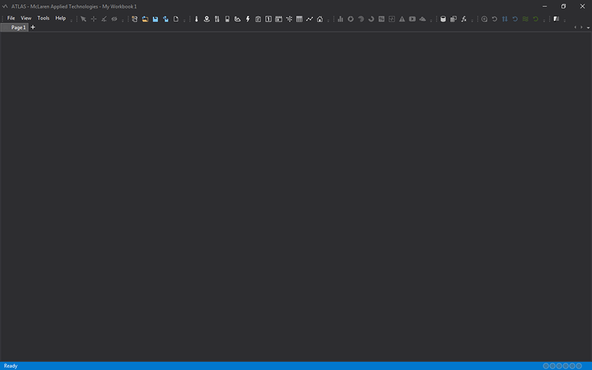

# Getting started

## Launching ATLAS

To start ATLAS, if installed in the default location:

* Click Start > All Programs > McLaren Applied Technologies> ATLAS

A new Workbook is opened with a single empty Page by default.

## Adding a Licence

Use the Licence Manager utility to display and modify licence information. Licence codes may be added after ATLAS has been installed.
The default location on the Start menu is: All Programs > McLaren Applied Technologies >  Licence Manager.

## Using ATLAS

### Sessions

Use the Session Browser (*CTRL + L*) to record a new session or load an existing one. The Session Browser allows you to define different sets of data to use across the Workbook. Sessions, either Live or Historical, may be combined into a single set using Compare or Append mode.

Add historical data to the set from the Sources tab or directly from files. The preview pane displays detailed session information to help identify the session you need.

Access live data via Recorders. A Recorder streams raw telemetry data, and several types are available depending on the data source, protocol, and system architecture.

### Displays
Once data has been added, begin building your Workbook by adding Displays to Pages. Multiple types of Displays are available, each of which can be customised to meet specific requirements. Displays may be docked in various layouts to optimise visibility across the Workbook.

For detailed information on types of Displays, shortcuts and different display options refer to the embedded documentation: Help > View Help (Preview) (*F1*).

### Parameters
Use the Parameter Browser (*P*) to select one or more parameters to display. Double-click a parameter or drag and drop it onto the Display. To remove a parameter, click on it and press *DELETE*.

Once parameters are visible in the Display, customise the visual presentation using the Display Properties (*D*) panel. Key display options are also available by right-clicking anywhere on the Display.

