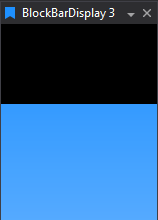

# Block Bar Display

Minimal single‑parameter bar—quick, graphic visualization without numeric clutter. Optional gradient colour and conditional colouring using parameter warning/critical thresholds.

## Adding a Block Bar Display

To add a Block Bar Display to a Page do one of the following:

- Click the Block Bar Display button on the Display Toolbar.

- Click `File > New > Display` and select Block Bar Display.

- Press `Ctrl + Q` twice to use the Quick Access Assistant and select New Block Bar Display.
