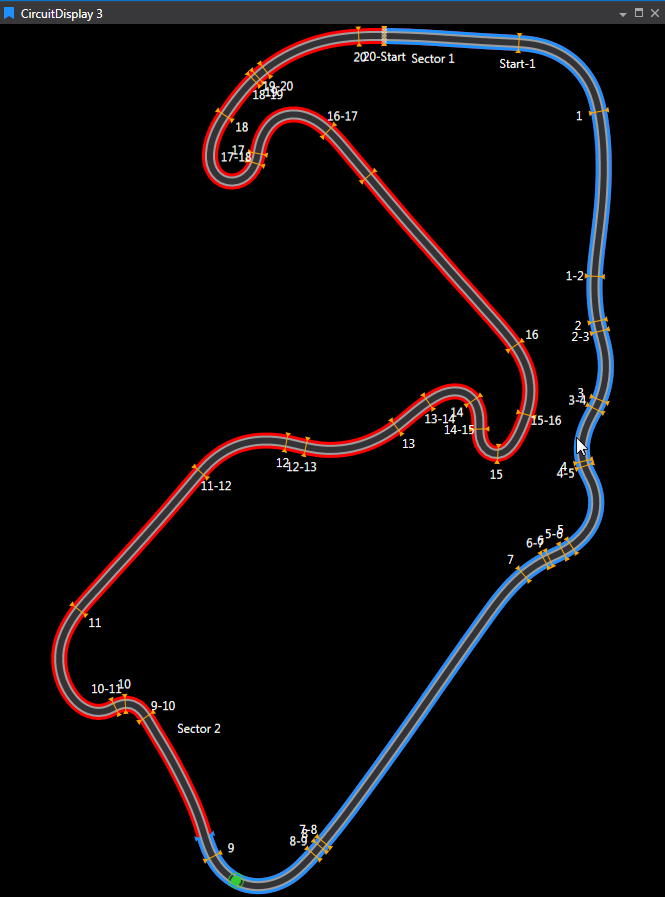
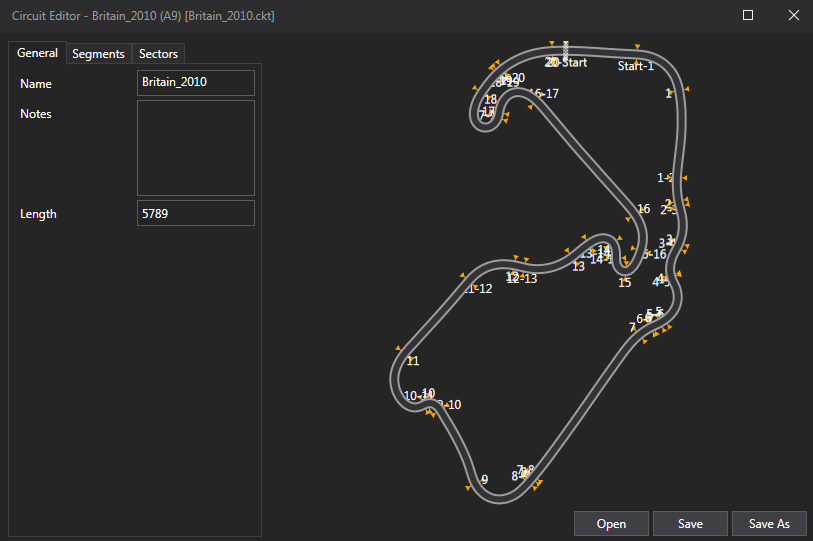

# Circuit Display

Track map from a Circuit Definition file, with cursor‑synchronised car position indicator and optional sectors/segments; a shaded Timebase Region on the map mirrors the Waveform timebase.

## Adding a Circuit Display

To add a Circuit Display to a Page do one of the following:
- Click the Circuit Display button  on the Display Toolbar.

- Click `File > New > Display` and select Circuit Display.

-  Press `Ctrl + Q` twice to use the Quick Access Assistant and select New Circuit Display.

You can now use the Parameter Browser to add some Parameters to set up the display as required. The current cursor position is shown on the circuit if you add the sLap Parameter.

## Circuit Editor 

The Circuit Editor is a tool within ATLAS that allows users to create and modify Circuit Definition files. These files control how a racing track is visually represented and subdivided into Segments (Corners and Straights) and Sectors, ensuring consistency across displays such as Circuit Display and Waveform.

- **Segments**: Engineering-relevant divisions of the lap, typically representing corners (green) and straights (yellow).
- **Sectors**: User-defined partitions of the lap, often used for timing and analysis, with customizable colors.

### File Management

- Circuit definitions are stored in a user-configurable folder (set in Options ▸ Plugins).
- The Circuit Display’s dropdown menu is populated from files in this folder.
- Supported formats:
    - `.cktx`: ATLAS Circuit Definition (preferred; always written on save).
    - `.ckt`: Atlas 9 legacy format (can be opened and converted to `.cktx`).

### Using the Editor

You can open the Circuit Editor in two ways:
1. Via **Tools ▸ Circuit Editor**, then select a `.cktx` or `.ckt` file.
2. By right-clicking an existing Circuit Display and choosing **Edit**.

- **Save**: Writes the current definition in `.cktx` format. Legacy `.ckt` files are converted.
- **Save As**: Allows duplication under a new name, useful for creating event-specific variants.

The editor is organized into three tabs, each with a live preview:

1. **General Tab**
     - Set the circuit’s name, add documentation notes, and specify total length.
     - Preview shows the circuit as it will appear in displays.

2. **Segments Tab**
     - Define the sequence of corners and straights.
     - Add, rename, or delete segments; adjust boundaries by dragging or entering values.
     - Segments are color-coded and labeled for clarity.

3. **Sectors Tab**
     - Partition the lap for timing/analysis.
     - Add, rename, recolor, or delete sectors; adjust boundaries interactively.
     - Sectors are independent of segments.

## Workflows

- **Create Segments**: Open a circuit, switch to Segments, insert boundaries, set types and names, adjust distances, and save.
- **Define Sectors**: Switch to Sectors, insert splits, name and color sectors, adjust boundaries, and save.
- **Correct Mistakes**: Use Add/Delete without moving the cursor to revert changes.
- **Document**: Update the circuit’s name and notes for clarity and team standards.

!!! tip "Tips & Best Practices"
    - Keep segment/sector boundaries monotonic and within adjacent limits.
    - The Start/Finish line is fixed; plan boundaries accordingly.
    - Use **Save As** for alternate layouts to avoid overwriting base definitions.
    - Undo is limited; use Add→Delete cycles for safe reversion.

## Integration Checklist

- Ensure Circuit Display shows the correct circuit, segments, sectors, and orientation.
- Waveform pages should use the intended circuit definition and enable Circuit Stripe as needed.
- Confirm the Options ▸ Plugins folder points to the correct repository for shared access.