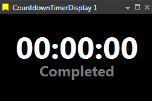

# Countdown Timer Display

A configurable countdown clock (or Time Offset from now) with custom text pre‑ and post‑expiry.

| Option         | Description                                                                                  |
|----------------|---------------------------------------------------------------------------------------------|
| **Timer Mode** | Choose between Countdown Timer (counts down to set time) or Time Offset (shows offset time).|
| **ExpiryHour** | Hour of expiry for the countdown timer.                                                     |
| **ExpiryMinute** | Minute of expiry for the countdown timer.                                                 |
| **OffsetHours** | Hours offset from current time for Time Offset mode.                                       |
| **OffsetMinutes** | Minutes offset from current time for Time Offset mode.                                   |

## Adding a Countdown Timer Display

To add a Countdown Timer Display to a Page do one of the following:

- Click the Countdown Timer Display button  on the Display Toolbar.

- Click `File > New > Display` and select Countdown Timer Display.

- Press `Ctrl + Q` twice to use the Quick Access Assistant and select New Countdown Timer Display.