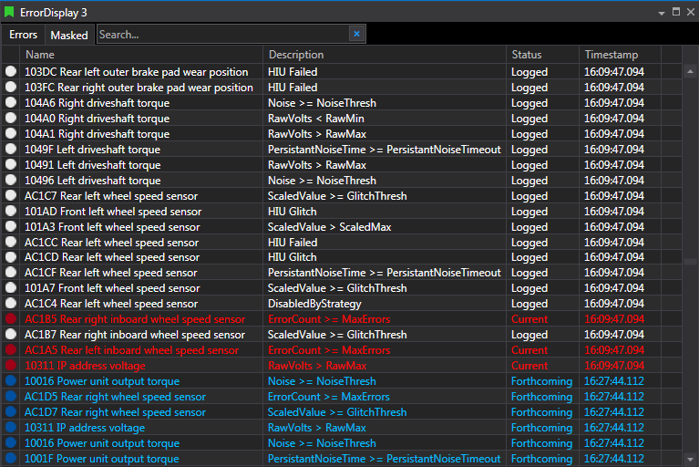

# Error Display

ECU errors during live connection. Columns include Status (Forthcoming/Current/Logged, with colours), Name, Description, Timestamp. Double‑clicking an error jumps the timeline cursor to first occurrence. Logged errors persist until ECU reset based on your choice (per Lap or Session).

## Adding an Error Display

You can add an Error Display to a Page using any of the following methods:
- **Display Toolbar:** Click the Error Display button.
- **Menu:** Go to `File > New > Display` and select Error Display.
- **Quick Access Assistant:** Press `Ctrl + Q` twice, then select New Error Display.

## Error Row Details

Each error is displayed as a row with the following columns:

- **Status Indicator:**  
    A coloured symbol representing the error status:
    - *Forthcoming*: Error expected to occur later in the session.
    - *Current*: Error is actively occurring (displayed in red).
    - *Logged*: Error occurred previously but is no longer active (displayed in white).

    *Note:* The error text colour matches the status indicator.

- **Name:**  
    Displays the error code and name.

- **Description:**  
    Provides a brief description of the error.

- **Status:**  
    Indicates the error's relation to the session timeline:
    - *Forthcoming*: Will occur later in the session.
    - *Current*: Actively occurring error.
    - *Logged*: Previously occurred, now inactive.

- **Timestamp:**  
    Shows the time when the error was first detected.

## Error Status Behaviour

- When an error is detected, it appears in red text with a *Current* status.
- If the sensor returns to normal, the error switches to *Logged* status and white text.
- Logged errors remain visible and will revert to *Current* if the same error is detected again.
