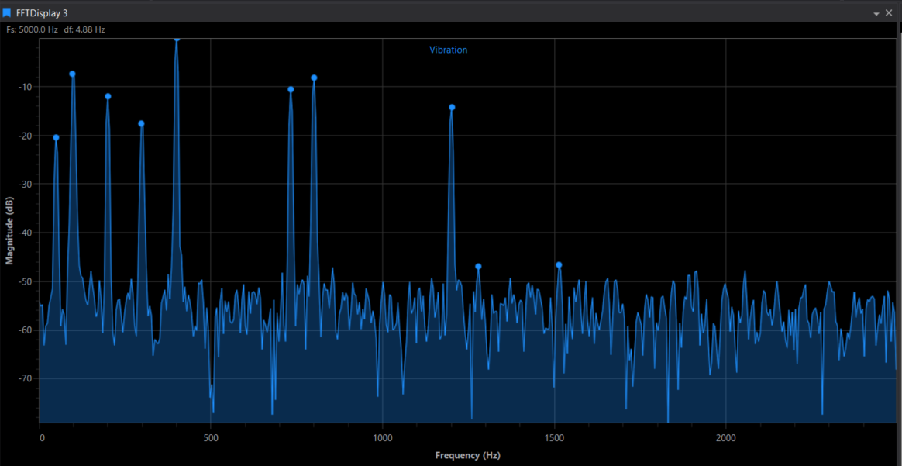

!!! danger "Preview Functionality"
    The FFT Display is currently a preview feature. As such, the content in this page is subject to change based on feedback and roadmap changes.

# FFT Display

Frequency content of a single parameter. The FFT Display takes the samples in the current session timebase and transforms them into a spectrum — magnitude against frequency — so you can see *which* frequencies are present in a signal rather than how it varies over time.



## When to Use FFT Display

:vibration_mode: **Vibration analysis**: Identify the dominant frequencies in an accelerometer or strain channel.

:gear: **Rotational orders**: Relate spectral peaks to shaft, wheel or engine speeds.

:radio: **Noise and interference**: Spot mains hum, sensor noise or aliasing artefacts in a channel.

:chart_with_upwards_trend: **Filter checking**: Confirm that a filtered signal has actually lost the frequencies you expected.

## Enabling the FFT Display

!!! note
    The FFT Display is off by default. Enable it in **Tools > Options > General > Preview Features** by ticking **Allow FFT display**, then restart ATLAS. Until you do, the display does not appear on the toolbar, in the **File > New > Display** menu, or in the Quick Access Assistant.

## Adding an FFT Display

To add an FFT Display to a page, use one of the following methods:

- **Display Toolbar:** Click the **FFT Display** button .
- **Menu:** Go to **File > New > Display** and select **FFT Display**.
- **Quick Access Assistant:** Press `Ctrl + Q` twice, then select **New FFT Display**.

## Adding a Parameter

The FFT Display shows **one parameter at a time**.

- Press `P` to open the Parameter Browser and select a parameter, or
- Drag a parameter onto the display from the Parameter Browser or another display.

Dropping a parameter onto a display that already has one **replaces** it — you do not need to remove the old parameter first. The spectrum trace, the fill and the peak markers all take the parameter's colour, and the parameter name is shown at the top of the plot.

## Display Anatomy

- **Header readouts**: `Fs` — the sample rate used for the transform, and `df` — the frequency resolution (the width of one bin). Both appear at the top left once a spectrum has been computed.
- **X-Axis**: Frequency in Hz, from 0 up to the Nyquist frequency (half the sample rate).
- **Y-Axis**: Magnitude, either linear or in dB.
- **Spectrum trace**: The parameter's spectrum, optionally filled below the curve.
- **Peak markers**: Circular markers on the most prominent peaks.
- **Status message**: Replaces the plot when there is not enough data to transform.

## Display Properties

Press `D` or right-click > **Display Properties** to open the property grid.

| Category | Property | Default | Description |
|---|---|---|---|
| General | **Background Colour** | Black | The background colour of the display. |
| FFT | **Logarithmic Scale (dB)** | Off | Switches the magnitude axis between linear and dB. |
| FFT | **Window Function** | Hann | The window applied before the transform: None, Hann, Hamming or Blackman. |
| FFT | **FFT Size** | 1024 | The maximum number of samples used for the transform. |
| FFT | **Show Fill** | On | Shows or hides the shaded area under the spectrum curve. |
| FFT | **Show Peaks** | On | Shows or hides the peak markers. |

### FFT Size

FFT Size sets the *maximum* number of samples fed into the transform. It is limited to the range 64 to 16384 and is always snapped to a power of two: entering a larger value rounds up to the next power of two, entering a smaller one rounds down to the previous one. So typing `1000` gives 1024, and typing `900` when the size was 1024 gives 512.

The size you choose trades frequency resolution against the amount of data summarised:

| FFT Size | Frequency resolution | Use when |
|---|---|---|
| Smaller (64–512) | Coarser | You only need the broad shape of the spectrum. |
| Default (1024) | Balanced | General-purpose analysis. |
| Larger (2048–16384) | Finer | You need to separate peaks that are close together in frequency. |

If the parameter has fewer samples than the FFT Size, the transform still runs at the next power of two above the sample count, and the remainder is zero-padded.

### Window Function

A window function tapers the ends of the sample block before the transform, which reduces the spectral leakage that would otherwise smear a peak across neighbouring bins.

| Window | Character |
|---|---|
| **None** | No tapering. Sharpest possible peak, most leakage. |
| **Hann** | Good general-purpose compromise between peak width and leakage. Default. |
| **Hamming** | Slightly narrower main lobe than Hann, with a higher first side lobe. |
| **Blackman** | Widest main lobe, lowest leakage — best for spotting a small peak next to a large one. |

### Logarithmic Scale

With **Logarithmic Scale (dB)** off, the Y-axis shows linear magnitude and is titled *Magnitude*. With it on, magnitudes are converted to decibels (20 × log₁₀ of the linear magnitude) and the axis is titled *Magnitude (dB)*. The dB view compresses the range, which makes small peaks visible alongside a dominant one.

!!! note
    Switching the scale clears and recomputes the spectrum, so the plot blanks briefly.

## Reading the Spectrum

Hover anywhere on the trace to get a tooltip with the frequency and magnitude of the nearest point:

```text
Freq: 42.50 Hz
Mag: 0.0138
```

The two header readouts tell you what the spectrum is capable of showing:

- **Fs** is estimated from the timestamps of the samples returned for the session, so it reflects the actual logging rate of the parameter. The highest frequency the plot can show is half of it.
- **df** is the spacing between adjacent points on the frequency axis — the sample rate divided by the transform length. Two components closer together than `df` cannot be resolved into separate peaks.

### Peak Markers

With **Show Peaks** on, the display marks the peaks in the spectrum — up to ten of them, chosen by magnitude — with a circular marker. Hover over a marker for its exact frequency and magnitude. Turn **Show Peaks** off for a cleaner trace when you are only interested in the overall shape.

## Zoom and Navigation

| Action | How |
|---|---|
| **Zoom to a region** | Hold the right mouse button and drag a box over the area of interest. |
| **Zoom with the wheel** | Scroll up to zoom in, down to zoom out. The zoom centres on the pointer. |
| **Left-drag zoom** | Right-click > **Zoom Box**, then drag once with the left button. |
| **Undo Zoom** | Right-click > **Undo Zoom**. Steps back one zoom level. |
| **Undo All Zooms** | Right-click > **Undo All Zooms**. Returns to the full spectrum. |

Both axes auto-range until you zoom. Undoing past the first zoom level restores auto-ranging, so the display resumes fitting the whole spectrum as new data arrives.

## Refreshing

The display recomputes when the data it depends on changes — a new session, a new parameter, or a change to any of the FFT properties. Requests are throttled to five a second, and the spectrum is computed over the whole of the current session timebase rather than a cursor window. Changing or removing the session clears the display.

## Troubleshooting

| Symptom | Cause | Fix |
|---|---|---|
| The FFT Display is not on the toolbar or in the display menu | The preview feature is not enabled, or ATLAS has not been restarted since enabling it | Tick **Allow FFT display** in **Tools > Options > General > Preview Features** and restart ATLAS. |
| "Insufficient data (*n* samples, minimum 8 required)" | The parameter returned fewer than eight samples for the session timebase | Choose a parameter logged at a higher rate, or a session with a longer timebase. |
| The plot is empty and there are no readouts | No parameter has been added, or the session has no data for it | Press `P` and select a parameter, or drag one onto the display. |
| The peaks you expect are missing or merged | The frequency resolution is too coarse to separate them | Increase **FFT Size**, or switch **Window Function** to Blackman if a large peak is masking a small one. |
| A small peak is invisible next to a large one | Linear magnitude scaling | Turn on **Logarithmic Scale (dB)**. |

## Quick Reference

| Key | Action |
|---|---|
| `D` | Display Properties |
| `P` | Parameter Browser |
| `Ctrl + Q, Ctrl + Q` | Quick Access Assistant |
