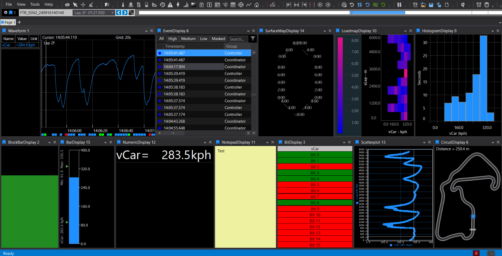
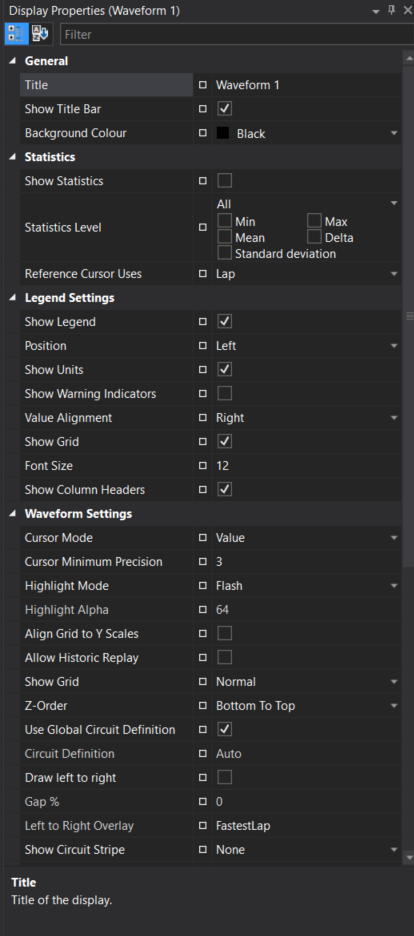
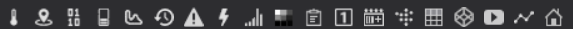

# Displays Overview

ATLAS Viewer displays are visual components that show telemetry data from your sessions. Each display specialises in presenting data in a specific format — from time-series waveforms to numeric readouts, bar gauges, scatter plots, and more. You can add multiple displays to a workbook page, dock or float them, and save layouts in workbooks.

!!! info "20+ Display Types"
    ATLAS includes over 20 display types, each optimised for specific analysis tasks. Choose the right display for your data visualisation needs.

## Adding a Display

=== "Quick Access"
    Press `Ctrl+Q` twice, type the display name, press `Enter`
    
    :zap: **Fastest** — searchable, works from anywhere

=== "Display Toolbar"
    Click the display icon on the toolbar. Hover to see display names.
    
    :mouse: **One click** when you know the icon

=== "Menu"
    **File** > **New** > **Display** and select the display type
    
    :books: **Browse** all available displays

!!! tip "Pro Tip"
    Use `Ctrl+Q` twice for fastest access. It's searchable and works from anywhere!

## Display Comparison

| Display Type | Purpose | Key Features | Max Parameters |
|--------------|---------|--------------|----------------|
| [**Waveform**](waveform.md) | Multi-parameter time/distance traces | Interactive legend, reference cursor, autoscale, event markers, live telemetry | 100 (default, adjustable) |
| [**Scatterplot**](scatterplot.md) | 2D plot of Y vs X, optional Z colour mapping | Best-fit/reference lines, up to 5 parameter sets, custom draw styles | 24 |
| [**Histogram**](histogram.md) | Distribution of a single parameter | Spectral/cumulative modes, adjustable bins, auto-refresh | 1 |
| [**Loadmap**](loadmap.md) | Pseudo-3D heatmap of time in parameter ranges | Adjustable buckets, colour bar, lap refresh | 2 |
| [**Surface Map**](surface.md) | Interactive 3D mesh graph | Rotate/zoom, axis/grid customisation, requires .3d file | 2 |
| [**Numeric**](numeric.md) | Instant numeric readouts | Auto-sizing text, colour thresholds, grid layout | 150 |
| [**Bar**](bar.md) | Vertical gauge bars with numeric values | Real-time updates, custom refresh/background | 16 |
| [**Block Bar**](block.md) | Minimalistic single-parameter bar | Conditional/gradient colouring, orientation options | 1 |
| [**Bit**](bit.md) | Status bits with custom colours/labels | Boolean/status flags, .bcg file support, layout options | 20 |
| [**Summary**](summary.md) | Lap-based statistics table or plot | Min/Max/Mean per lap, resizable columns, snapshot export | Multiple |
| [**Circuit**](circuit.md) | Track map with car position | Sectors/segments, shaded timebase, circuit editor | 1 |
| [**PCU Dash**](pcu.md) | Steering wheel display simulator | Multiple dash types, auto-load config | Default only |
| [**Event**](event.md) | ECU events with priority and snapshots | Priority filtering, masking, row colouring | 100 |
| [**Error**](error.md) | Live ECU error monitoring | Status tracking, filtering, double-click to jump | N/A |
| [**Notepad**](notepad.md) | Free-text session notes | Custom fonts/colours, snapshot/copy | N/A |
| [**Bing Map**](map.md) | Satellite map of GPS location | Zoom/scale, GPS formats, lock map centre | N/A |
| [**Web Browser**](web.md) | Embedded browser | Live feeds/web content, show/hide controls | N/A |
| [**Countdown Timer**](countdown.md) | Countdown clock or time offset | Custom text, font/colour options | N/A |
| [**Video**](video.md) | Synchronised video playback | In-car camera, event correlation | N/A |

## Switching Between Sessions

If you have multiple sessions loaded (Compare Sets):

| Action | Shortcut | Result |
|--------|----------|--------|
| Switch selected display | `Shift+<n>` | Changes active display only |
| Switch entire page | `Ctrl+<n>` | All displays on page switch together |
| Click coloured tag | Mouse click | Menu shows available sets |

When a whole page shows the same set, a coloured line appears across the page header.

## Display Tools

### Display Properties

Every display has a **Display Properties** panel (press `D` or right-click > **Display Properties**) for formatting options specific to that display type.

Properties can be:

- **◻️ Square**: Default value. Reset to default with the reset button.
- **♦️ Diamond**: Changed for this instance only.
- **⚪ Circle**: Global setting — affects all future instances of that display type.

Right-click any property to make it global, clear global assignment, or reset to default. The meaning of each property is shown at the bottom of the Display Properties window when selected.

!!! warning "Global Properties"
    Global properties affect ALL future displays of that type. Use carefully!

### Zoom

There are two types of zoom operation:

- **X only**: Zoom the X-axis only. Changes the Duration on the Timebase (Waveform Display only).
- **X and Y**: Click and drag a Zoom Box to zoom both axes in Waveform or Scatterplot displays.

In a Waveform Display, drawing from top-to-bottom creates an X+Y zoom box; drawing bottom-to-top creates an X-only zoom strip. In a Scatterplot Display, the zoom region is always a box regardless of direction.

### Columns

Some displays (e.g., Event, Error, Summary) have resizable/hideable columns. Hover at a header edge to resize; double-click to auto-fit. Fully hiding a column by shrinking width to zero can be reversed by grabbing the split-line cursor and dragging open.

### Toolbar

The display toolbar has buttons for adding all displays quickly to the current workbook page. Hover over an icon to see its name; click to add.

### Context Menus

Right-click on most displays to access:

- Copy to clipboard
- Export snapshot
- Display properties
- Parameter properties
- Reset zoom/scale
- Display-specific tools

## Adding Parameters

After opening a display, use the **Parameter Browser** to add telemetry channels:

1. Open Parameter Browser (`Ctrl+P` or View menu)
2. Browse or search for parameters
3. Drag parameters onto the display, or select and click "Add to Display"

Many displays allow double-clicking an item (bar, axis, legend row, etc.) to open **Parameter Properties** for fast formatting.

## Live Telemetry

When connected to live telemetry:

- Displays update in real-time
- Waveform scrolls as data arrives
- Numeric/Bar displays show current values
- Pause scrolling by clicking the plot area

## Workbooks

Displays are saved in workbooks which remember:

- Display types and positions
- Parameter selections
- Display properties
- Layout configuration

Save your workbook (`Ctrl+S`) to preserve your display setup for future sessions.

## Quick Reference

| Key | Action |
|-----|--------|
| `Ctrl+Q, Ctrl+Q` | Quick Access Assistant |
| `Ctrl+P` | Parameter Browser |
| `D` | Display Properties |
| `Shift+<n>` | Switch display to Compare Set n |
| `Ctrl+<n>` | Switch page to Compare Set n |
| `Ctrl+S` | Save workbook |

---

For in-depth guidance on parameters, sessions, cursors, workbooks, and common workflows, see the [Working with Displays](essentials.md) guide.
