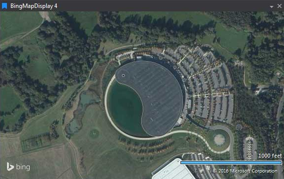

# Bing Map Display

Satellite map centered on the current location (with zoom control and scale).

## Adding a Bing Map Display

To add a Bing Map Display to a Page do one of the following:

- Click the Bing Map Display button  on the Display Toolbar.

- Click `File > New > Display` and select Bing Map Display.

- Press `Ctrl + Q` twice to use the Quick Access Assistant and select New Bing Map Display.

In the bottom right hand corner of the display is the scale. This changes when using zoom in and zoom out.

To zoom in and out of the display use the mouse wheel or press Ctrl + or Ctrl -.
