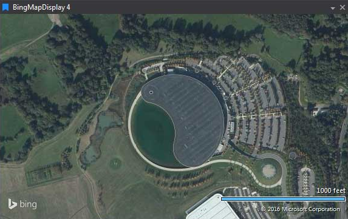
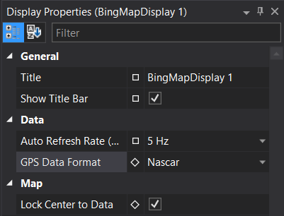

# Bing Map Display

Satellite map centered on the current location (with zoom control and scale).

## Adding a Bing Map Display

To add a Bing Map Display to a Page do one of the following:

- Click the Bing Map Display button  on the Display Toolbar.

- Click `File > New > Display` and select Bing Map Display.

- Press `Ctrl + Q` twice to use the Quick Access Assistant and select New Bing Map Display.

In the bottom right hand corner of the display is the scale. This changes when using zoom in and zoom out.

To zoom in and out of the display use the mouse wheel or press Ctrl + or Ctrl -.

## Parameter Selection

The Bing Map requires **Latitude** and **Longitude** parameters to be added to the display **respectively**.

To show the parameter selection dialog do one of the following:

- Press **P** in the Bing Map display.

- Right click the display and select **Parameter Selection**.

## Display Properties

To show the display properties do one of the following:

- Press **D** in the Bing Map display.

- Right click the display and select **Display Properties**.

**Note:** Clicking on a property provides a description of the property at the bottom of the tool window.

The options for the Bing Map Display are as follows:

| Group | Name | Description |
|-------------|-----------|-----------|
| General | Show Title Bar | Shows or hides the Display's title bar |
| General | Title | Title of the Display |
| Data | Auto Refresh Rate (Hz) | Sets the display updates rate (Hz) when automatically panning data. |
| Data | GPS Data Format | Format of GPS data in the session. It can be Decimal Degrees, F1MS, or Nascar. |
| Map | Lock Center to Data | Lock the center of the display to the current data location. |
