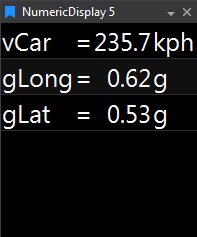

# Numeric Display

Instant numeric readout for up to 40 parameters at the cursor. Text auto‑sizes to fit; colours can reflect Warning/Critical thresholds. Double‑click a value to edit that parameter’s properties.

## Adding a Numeric Display

To add a Numeric Display to a page, choose one of the following methods:

- **Toolbar:** Click the **Numeric Display** button on the Display Toolbar.
- **Menu:** Go to **File > New > Display** and select **Numeric Display**.
- **Shortcut:** Press `Ctrl + Q` twice to open the Quick Access Assistant, then select **New Numeric Display**.

Once added, use the **Parameter Browser** to add parameters and configure the display as needed.

### Display Layout and Editing

- The text size and layout automatically adjust to fit the Display Window.
- To edit a parameter’s display properties, double-click its value or use the **Parameter Properties** panel.

### Colour and Thresholds

- **Normal:** Text is displayed in white.
- **Warning:** Text colour changes when a value enters its warning range.
- **Critical:** If enabled, critical values use the selected critical colour (default: red).
- **Non-Critical:** If critical is disabled, non-critical values use the selected colour (default: blue).

Set warning and critical ranges for each parameter in the **Appearance** section of the Parameter Properties panel.
