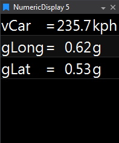

# Numeric Display

!!! abstract "At a Glance"
    **Parameters**: Up to 150  
    **Layout**: Auto-sizing grid  
    **Key Features**: Colour thresholds, hex formatting, status indicators  
    **Best For**: Dashboards, live monitoring, quick inspection

The Numeric Display shows instant numeric readouts for up to 150 parameters at the cursor position. Text auto-sizes to fit the display window, and colours can reflect warning/critical thresholds. Double-click a value to edit that parameter's properties.

## When to Use Numeric Display

:satellite: **Live monitoring**: Watch current values during recording

:bar_chart: **Dashboard creation**: Build custom parameter dashboards

:mag: **Quick inspection**: Check exact values at any cursor position

:traffic_light: **Status monitoring**: Use colour thresholds to highlight issues

:left_right_arrow: **Parameter comparison**: View multiple related parameters together

## Adding a Numeric Display

To add a Numeric Display to a page, choose one of the following methods:

- **Toolbar:** Click the **Numeric Display** button on the Display Toolbar.
- **Menu:** Go to **File > New > Display** and select **Numeric Display**.
- **Shortcut:** Press `Ctrl+Q` twice to open the Quick Access Assistant, type "Numeric", and select **New Numeric Display**.

Once added, use the **Parameter Browser** to add parameters and configure the display as needed.

## Display Anatomy

The Numeric Display shows a grid of parameters with:

- **Parameter name** (optional)
- **Current value** (at cursor position)
- **Units** (optional)
- **Colour highlighting** based on thresholds

Text size automatically adjusts to fit the available space.

## Key Features

### Auto-Sizing Layout

The display automatically:

- Calculates optimal text size based on window size
- Arranges parameters in a grid
- Adjusts when you resize the window
- Fills available space efficiently

You can override auto-sizing with fixed font size if preferred.

### Colour Thresholds

Parameters can show different colours based on their values:

!!! success "Normal"
    Default text colour (typically white)

!!! warning "Warning"
    Text colour changes when a value enters its warning range

!!! danger "Critical"
    Uses critical colour (default red) for critical values

!!! info "Non-Critical"
    If critical is disabled, non-critical values use the selected colour (default blue)

!!! note "Configuration"
    Set warning and critical ranges for each parameter in the **Appearance** section of the Parameter Properties panel.

### Flexible Formatting

Control what's displayed for each parameter:

- Show/hide parameter name
- Show/hide description
- Show/hide numeric value
- Show/hide units
- Show/hide sign (+ or -)
- Show/hide status indicator

### Status Indicators

Parameters can display status symbols:

- **Up arrow**: Value increasing
- **Down arrow**: Value decreasing
- **Warning symbol**: In warning range
- **Critical symbol**: In critical range

### Hex Formatting

For parameters displayed in hexadecimal:

- Option to show "0x" prefix
- Configurable uppercase/lowercase
- Full hex formatting control

### Grid Overlay

Optional grid lines between parameters:

- Show/hide grid
- Custom grid colour
- Adjustable padding around items
- Column spacing control

## Display Properties

### Text Formatting

**Font Family**: Choose from available system fonts

**Font Size**:

- **Auto**: Automatically scales to fit window (recommended)
- **Fixed**: Specify exact point size

**Alignment**:

- Name alignment (Left, Center, Right)
- Value alignment (Left, Center, Right)

**Visibility**:

- Show parameter name
- Show parameter description
- Show value
- Show units
- Show sign (+ or -)
- Show status indicator

### Colour Options

**Text Colouring**:

- **Single colour for all**: All parameters use same text colour
- **Individual colours**: Each parameter uses its own colour
- **Apply critical/warning to text**: Threshold colours affect text colour

**Background Colouring**:

- **Display background**: Overall display background colour
- **Apply critical/warning to background**: Threshold colours affect background
- **Selected item colours**: Foreground and background for selected parameters

**Note**: Critical/warning colours can apply to text OR background, not both simultaneously.

### Grid and Layout

- **Show grid**: Enable/disable grid lines between parameters
- **Grid colour**: Colour of grid lines
- **Column padding**: Space between columns
- **Item padding**: Space around each parameter

### Data Update

- **Refresh rate**: Update frequency in Hz (1-1000 Hz)
- **Auto-refresh**: Enable continuous updates

## Adding Parameters

After creating a Numeric Display:

1. Open Parameter Browser (`Ctrl+P`)
2. Find the parameters you want to monitor
3. Drag parameters onto the display, or
4. Select parameters and Add to Display

You can add up to 150 parameters.

## Editing Parameter Properties

Double-click any parameter value to open its Parameter Properties panel where you can:

- Change parameter colour
- Set warning/critical thresholds
- Adjust decimal places
- Change display format (decimal, hex, scientific)
- Set custom units
- Enable/disable features per parameter

## Working with Parameters

### Selecting Parameters

- Click a parameter to select it
- Selected parameters show highlighted background
- `Ctrl+Click`: Add to selection
- `Shift+Click`: Select range

### Reordering Parameters

Drag parameters to reorder them within the grid.

### Removing Parameters

- Select parameter(s)
- Press `Delete` key, or
- Right-click > Remove Parameter

### Copying Values

**Copy to Clipboard**:

- Right-click > Copy (for selected parameters)
- Right-click > Copy All

Values copied as tab-delimited text, suitable for pasting into Excel or other tools.

### Snapshot Export

Export current display values to file:

1. Right-click display
2. Select "Snapshot to File"
3. Choose format and location

## Keyboard Shortcuts

| Key | Action |
|-----|--------|
| `D` | Display Properties |
| `Delete` | Remove selected parameters |
| `Ctrl+C` | Copy selected values |
| `Ctrl+A` | Select all parameters |
| `↑/↓/←/→` | Navigate selection |

## Example Configurations

=== "Dashboard Layout"
    Create a clean monitoring dashboard:
    
    - [x] Set **Show parameter name**: ON
    - [x] Set **Show value**: ON
    - [x] Set **Show units**: ON
    - [ ] Set **Show description**: OFF
    - [x] Enable **Apply critical/warning to text**
    - [x] Set appropriate thresholds
    
    :bar_chart: **Perfect for**: Live monitoring stations

=== "Minimal Value Display"
    Show just the numbers:
    
    - [ ] Set **Show parameter name**: OFF
    - [x] Set **Show value**: ON
    - [ ] Set **Show units**: OFF
    - [x] Use **Individual colours** for differentiation
    - [ ] Disable **Show status indicator**
    - [ ] Hide grid for cleaner look
    
    :1234: **Perfect for**: Dense parameter grids

=== "Status Monitor"
    Highlight issues immediately:
    
    - [x] Enable **Apply critical/warning to background**
    - [x] Set **Display background**: Dark colour
    - [x] Configure warning/critical thresholds
    - [x] Enable **Show status indicator**
    - [x] Use **Auto font size** for visibility
    
    :traffic_light: **Perfect for**: Alert dashboards

## Tips & Tricks

!!! tip "Layout Optimization"
    :white_check_mark: **Dashboard creation**: Use Numeric Display as main dashboard component
    
    :art: **Colour coding**: Set up threshold colours to instantly spot issues
    
    :arrows_counterclockwise: **Live monitoring**: Keep refresh rate reasonable (20-60 Hz) to avoid flicker

!!! tip "Data Display"
    :1234: **Hex values**: Great for displaying status words and bit fields
    
    :mag: **Quick check**: Add Numeric Display temporarily to inspect specific values
    
    :desktop_computer: **Multi-monitor**: Float Numeric Display on second monitor for live monitoring
    
    :bookmark_tabs: **Parameter grouping**: Group related parameters for easier monitoring

## Troubleshooting

??? question "Text too small to read?"
    - Reduce number of parameters
    - Increase window size
    - Use fixed font size instead of auto

??? question "Text too large?"
    - Add more parameters to fill space
    - Use fixed font size and reduce point size

??? question "Colours not showing?"
    - Check warning/critical thresholds are configured in Parameter Properties
    - Verify "Apply critical/warning" option is enabled
    - Check text vs background colour application setting

??? question "Values not updating?"
    - Check refresh rate is appropriate
    - Verify session is loaded and active
    - Check cursor is moving (if not live)

??? question "Parameter disappeared?"
    May have been deleted instead of hidden. Re-add from Parameter Browser.
