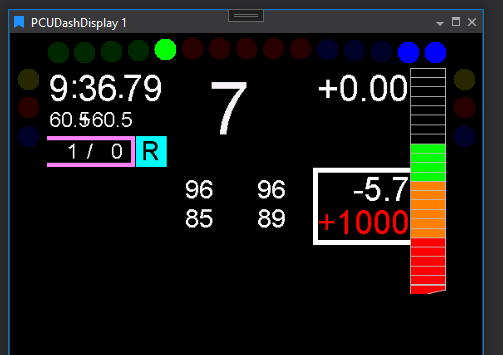
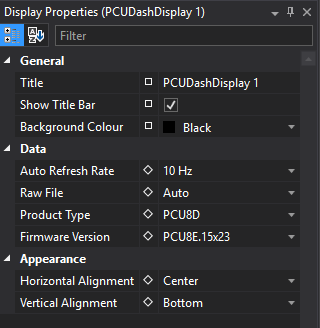

# PCU Dash Display

A simulator of the Motion Applied PCU Dash (as fitted to steering wheels). Supports multiple dash product types; auto‑loads a raw file if present (per Options). Positioning/alignment controls help fit the simulator to the display window.

## Adding a PCU Dash Display

To add a PCU Dash Display to a Page do one of the following:

- Click the PCU Dash Display button  on the Display Toolbar.

- Click `File > New > Display` and select PCU Dash Display.

- Press `Ctrl + Q` twice to use the Quick Access Assistant and select New PCU Dash Display.

## Display Properties

Formatting options for the PCU Dash Display can be found in the display properties window.

To show the display properties, press **D** in the PCU Dash Display or right click the display and select **Display Properties**.

The options for the PCU Dash Display are as follows:

### General

- **Title** - The title of the display
- **Show Title Bar** - Option to show or hide the title bar
- **Background Colour** - Sets the background colour of the display

### Data

- **Auto Refresh Rate (Hz)** - Sets the display update rate (Hz) with 5 Hz as the default setting
- **Raw File** - When set to Auto, automatically loads the raw file when a new session is loaded, recording started or compare set for a display changed - if found in the location specified in the [Options reference](options.md)
- **Product Type** - Sets which PCU Dash display type for the simulator to use
- **Firmware Version** - Dropdown for different firmware versions for any PCU type selected in the *Product Type* dropdown list

### Appeareance
- **Horizontal Alignment** - Sets the horizontal alignment of the simulator if the display is wider than the simulator
- **Vertical Alignment** - Sets the vertical alignment of the simulator if the display is taller than the simulator

## Custom Product Type Configuration

This is a field found in `Tools > Options > Plugins > PCU Dash Display` where users can set an XML file in which they can specify any PCU Dash type and firmware version of their choice which can then be selected in the *ProductType* and *firmware version* dropdowns in the Display Properties window.

