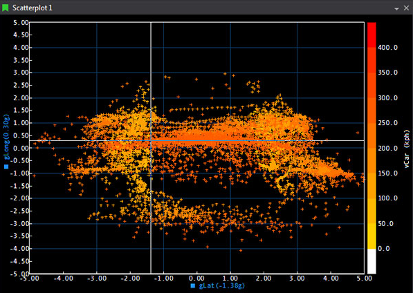
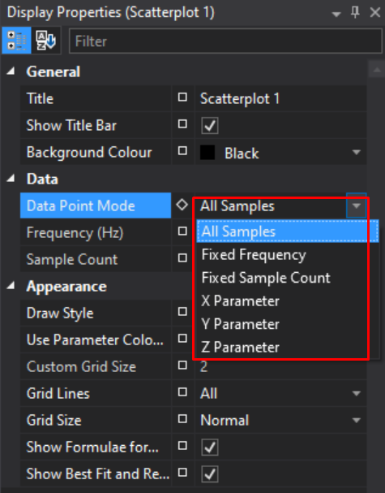
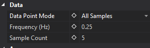
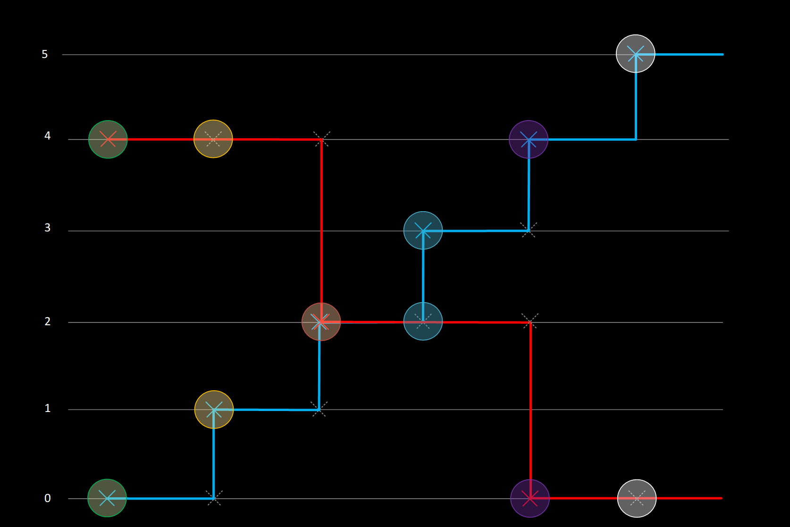
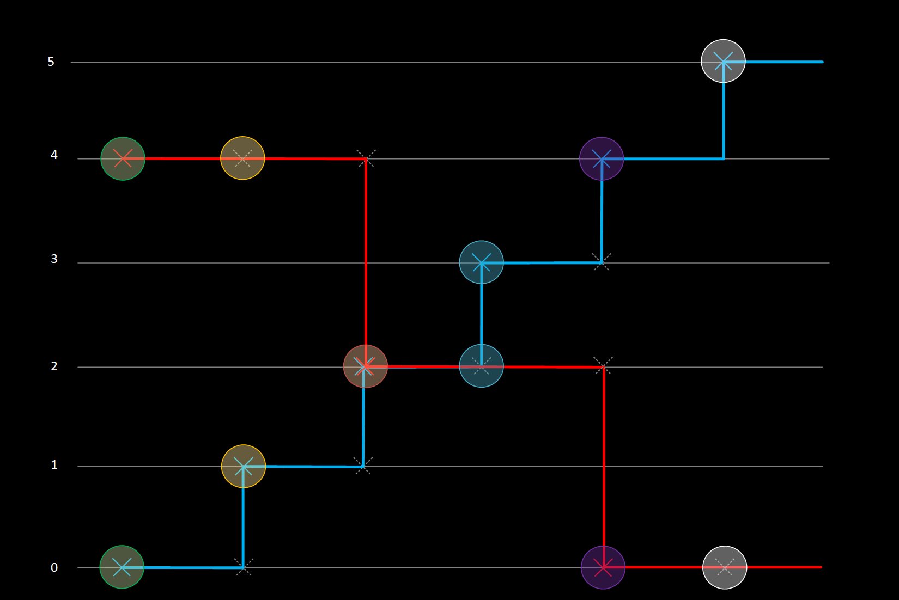
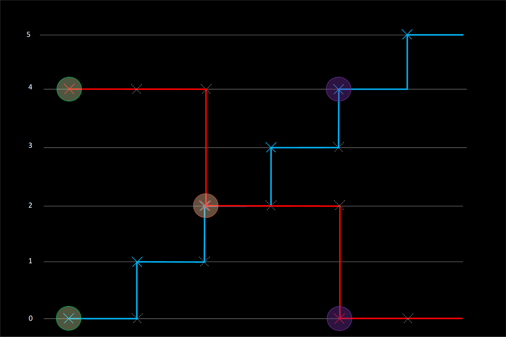
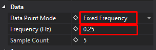
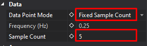
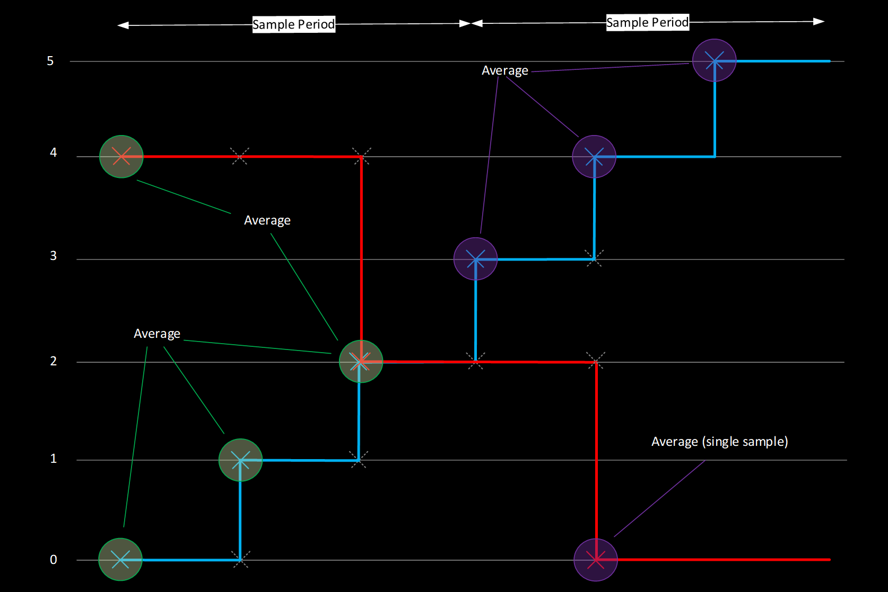

# Scatterplot Display

!!! abstract "At a Glance"
    **Parameters**: Up to 5 XYZ sets  
    **Modes**: 2D (XY) or 3D (XYZ with colour mapping)  
    **Key Features**: Best-fit lines, zoom box, colour mapping  
    **Best For**: Correlation analysis, efficiency maps, calibration maps

The Scatterplot is a two-dimensional (X-Y) plot of one parameter against another, optionally colour-mapped by a third Z parameter. It's designed to reveal relationships and trends across sessions, with controls for sampling density, draw style, best-fit curves, and engineering reference lines. Up to five parameter sets can be shown in one display.

## When to Use Scatterplot Display

:chart_with_upwards_trend: **Correlation analysis**: See how two parameters relate to each other

:world_map: **Map creation**: Create torque maps, efficiency maps, calibration maps

:mag: **Pattern identification**: Spot trends and clusters in data

:art: **Multi-parameter relationships**: Visualise three parameters simultaneously with colour mapping

:left_right_arrow: **Comparison**: Plot multiple parameter sets to compare behaviour

## Adding a Scatterplot Display

To add a Scatterplot Display to a page, use one of the following methods:

- **Toolbar:** Click the **Scatterplot Display** button on the Display Toolbar.
- **Menu:** Go to **File > New > Display** and select **Scatterplot Display**.
- **Shortcut:** Press `Ctrl+Q` twice to open the QuickAccess Assistant, type "Scatterplot", and select **New Scatterplot Display**.
- **From Waveform:** Select two parameters in a Waveform legend and use **View Scatterplot of Selected Parameters** (`Ctrl+T`) to create a Scatterplot pre-wired to those signals.

A third "Z" parameter can be selected to create a three-dimensional scatter plot.

### Adding the Z-axis

1. Press `P` on the display to open parameter configuration.
2. Click the **Use Z Axis** box.
3. Select the parameter from the list.
4. The Z-axis is scaled using a colour bar on the Scatterplot display.

## Display Anatomy

- **Plot Area**: Shows data points
- **X-Axis**: Horizontal axis (first selected parameter)
- **Y-Axis**: Vertical axis (second selected parameter)
- **Colour Bar**: Shows Z-axis mapping (if 3D mode)
- **Grid**: Optional grid overlay
- **Best-Fit Lines**: Optional trend lines
- **Zero Axes**: Optional reference lines at X=0 and Y=0

## Key Features

### 2D and 3D Plotting

**2D Mode (X vs Y)**:

- Plot one parameter against another
- Points coloured by parameter or fixed colour
- Simple correlation analysis

**3D Mode (X vs Y vs Z)**:

- Third parameter mapped to point colours
- Colour bar shows Z-value scale
- Visualise three dimensions simultaneously

### Multiple Parameter Sets

Add up to 5 different XY or XYZ parameter sets:

- Each set plots as separate series
- Different colours per set
- Compare different parameter relationships
- Independent best-fit lines per set

### Colour Mapping

When using Z-axis (3D mode):

- Points coloured by Z-value
- Colour bar shows value-to-colour mapping
- Customise colour scale
- Adjust colour range

### Draw Styles

Choose how data points appear:

- Points (dots)
- Lines connecting points
- Points with connecting lines
- Filled shapes

### Grid Configuration

**Grid Size Options**:

- Small: Fine grid for detailed work
- Medium: Balanced grid spacing
- Large: Coarse grid for overview
- Custom: Specify exact spacing

**Grid Display**:

- Show/hide major gridlines
- Show/hide minor gridlines
- Custom grid colours
- Adjust grid opacity

### Zoom and Navigation

**Zoom Box**:

- Click and drag to create zoom region
- Automatically zooms to selected area
- Undo/redo zoom with toolbar buttons

**Zoom History**:

- Multiple zoom levels remembered
- Navigate back/forward through zoom history
- Reset to full view

**Manual Scaling**:

- Set exact X and Y axis ranges
- Auto-scale to data
- Lock aspect ratio (optional)

### Cursor Modes

**Value Mode**: Standard cursor

**Crosshair Mode**: Adds horizontal and vertical reference lines

**In-Place Reference Line**: Fixed reference marker

## Best Fit & Reference Lines

### Opening the Editor

- Right-click the Scatterplot and choose **Edit Best Fit and Reference Lines...**.
- The editor lists all current lines with X/Y parameter binding, type (Best Fit or Reference), formula (for Reference Lines), and specified order (for Best Fit).

### Best Fit Lines

- Polynomial fit up to 5th order.
- **Order:**
    - *Unspecified*: ATLAS automatically selects the most accurate polynomial order (up to 5).
    - *Specified (1-5)*: Forces that exact order (e.g., 1 = linear).
- **Limits:** Define which samples are used for the fit (do not clip the drawn line). The calculated line spans the entire plot area.
- **Colour & Sessions:** Line colour defaults to the set's colour. In compare mode, each Best Fit line is recalculated per session and uses the session colour. Custom colours apply only in single-session mode.

**Fit Types Available:**

| Type | Use Case | Formula |
|------|----------|---------|
| Linear | Straight relationships | y = mx + b |
| Polynomial | Curved relationships | y = aₓxⁿ + ... + a₁x + a₀ |
| Power | Power law | y = axᵇ |
| Exponential | Growth/decay | y = aeᵇˣ |
| Logarithmic | Log relationships | y = a ln(x) + b |

!!! tip "Formula Display"
    Enable **Show Formula** to display the equation with coefficients near the line. Updates when data changes!

### Reference Lines

- Explicit formula: Supply coefficients for `Y = f(X)`. Use **Auto Calculate** to fill coefficients from the current sample set.
- **Limits:** Define where the line is drawn (limits do clip the rendered extent).
- **Colour:** Reference line colour is retained across sessions — one line per scatterplot.

### Placing a Linear Reference Line (Interactive)

- Choose **Place Linear Reference Line** from the right-click menu.
- A temporary white line with drag handles appears:
    - Drag centre to move; drag ends to pivot and stretch.
- Confirm to persist the line, then select which scatterplot set to apply it to.
- X/Y axis limits are inferred from handle positions. Changing the selected set updates coefficients and limits; manual tweaks are lost if you switch sets again.

### Line Lifecycle & Visibility

- **Automatic deletion:** Lines are tied to specific X/Y parameter pairs. Deleting X or Y, swapping axes, or replacing Z with X or Y deletes associated lines without warning. Undo does not restore them.
- **Global toggles:**
    - *Show Best Fit and Reference Lines* (on/off for all lines).
    - *Show Best Fit Line Formulas* (shows formulas under the X-axis).
- Per-line or per-set visibility toggles are not available.

!!! warning "Lines and Parameter Changes"
    If lines disappear after changing parameters, remember that changing X/Y (or swapping with Z) auto-deletes associated lines. Recreate them after the change.

## Scatterplot Sampling Modes

In the ATLAS Scatterplot, there is a selection of different _Data Point Modes_.
The different _Data Point Mode_ selection alters the way in which the X, Y (and Z) samples are calculated for plotting co-ordinates on the scatterplot.

These can be accessed via the _Display Properties_ Window for the Scatterplot.

There are 6 different modes, each illustrated below with a worked example:

* All Samples
* Fixed Frequency
* Fixed Sample Count
* X Parameter
* Y Parameter
* Z Parameter

This mode setting applies at a _display_ level, so any plots within that display inherit these properties.

### All Samples Mode

_ATLAS 10.4.1 and later_

!!! note
    In this mode, the _Frequency (Hz)_ and _Sample Count_ fields are ignored and read only.

_All Samples_ mode operates by taking each sample of the highest rate parameter, and referencing the sample and hold values of the other parameter(s). There is no averaging of samples, and only real values will be plotted.

If the X Parameter is logged at 100Hz, and the Y at 10Hz, the Y parameter will effectively be super-sampled at 100Hz in order to plot a point for each X parameter sample. If super-sampling is not desired, we recommend creating a function(s) which down-samples parameters where required, such that X, Y (and Z) are all at the same rate.

**Example**

| Time  | X Parameter Value (Blue) 2Hz   | Y Parameter Value (Red) 1Hz    | X Co-ordinate plotted  | Y Co-ordinate plotted  |
| ----- | --------------------------------- | --------------------------------- | ------------------------- | ------------------------- |
| 0.0   | 0                                 | 4                                 | 0                         | 4                         |
| 0.5   | 1                                 |                                   | 1                         | 4                         |
| 1.0   | 2                                 | 2                                 | 2                         | 2                         |
| 1.5   | 3                                 |                                   | 3                         | 2                         |
| 2.0   | 4                                 | 0                                 | 4                         | 0                         |
| 2.5   | 5                                 |                                   | 5                         | 0                         |

### X, Y, Z Parameter

_ATLAS 10.4.3 and later_

ATLAS 10.4.3 introduced 3 new modes in the scatterplot: X, Y and Z Parameter.

These work in a similar manner to _All Samples_ mode — however instead of inferring the highest rate parameter and using that to look up corresponding values on the other axes, the user can specify explicitly whether the X, Y or Z parameter is used as the "master".

**Example: X Parameter**

For every sample of the X Parameter, a corresponding value of Y (or Z) is referenced regardless of the rate of these parameters:

| Time  | X Parameter Value (Blue) 2Hz   | Y Parameter Value (Red) 1Hz    | X Co-ordinate plotted  | Y Co-ordinate plotted  |
| ----- | --------------------------------- | --------------------------------- | ------------------------- | ------------------------- |
| 0.0   | 0                                 | 4                                 | 0                         | 4                         |
| 0.5   | 1                                 |                                   | 1                         | 4                         |
| 1.0   | 2                                 | 2                                 | 2                         | 2                         |
| 1.5   | 3                                 |                                   | 3                         | 2                         |
| 2.0   | 4                                 | 0                                 | 4                         | 0                         |
| 2.5   | 5                                 |                                   | 5                         | 0                         |

**Example: Y Parameter**

For every sample of the Y Parameter, corresponding samples of X (or Z) are referenced:

| Time  | X Parameter Value (Blue) 2Hz   | Y Parameter Value (Red) 1Hz    | X Co-ordinate plotted  | Y Co-ordinate plotted  |
| ----- | --------------------------------- | --------------------------------- | ------------------------- | ------------------------- |
| 0.0   | 0                                 | 4                                 | 0                         | 4                         |
| 0.5   | 1                                 |                                   |                           |                           |
| 1.0   | 2                                 | 2                                 | 2                         | 2                         |
| 1.5   | 3                                 |                                   |                           |                           |
| 2.0   | 4                                 | 0                                 | 4                         | 0                         |
| 2.5   | 5                                 |                                   |                           |                           |

### Fixed Frequency and Fixed Sample Count Modes

_Fixed Frequency_ mode reads the _Frequency (Hz)_ field, but ignores _Sample Count_.

_Fixed Sample Count_ mode reads the _Sample Count_ field, but ignores _Frequency (Hz)_.

_Fixed Frequency_ & _Fixed Sample Count_ modes calculate samples to plot in a very similar way.
Both of these modes calculate a Time Period and then plot **averages** of X, Y or Z parameters over that Period.

* If a Period only spans a single sample, then the real sample value will be used;
* If the Period spans multiple samples, then those samples will be averaged.

The only difference between the modes is how the Time Period is calculated.

**Fixed Frequency Period Calculation**

Fixed Frequency Sample Time Period is set by a frequency.

_Time Period = 1/Frequency (Hz)_

If the Frequency is set to _0.25Hz_, then the Time period will be _4 seconds_ _(1/0.25)_.

**Fixed Sample Count Period Calculation**

Fixed Sample Count Time Period is set by splitting up the Display Time range, into a number of samples.

_Time Period = Display Time Range / Number of Samples_

If the Display Time range is displaying _20 seconds_ of data (can be changed by Zoom Level), and the Number of Samples is set to _5_, then the Time Period will be _4 seconds_ _(20/5)_.

**Example: Fixed Frequency & Fixed Sample Counts**

<table>
    <thead>
        <tr>
            <th>Time</th>
            <th>X Parameter Value (Blue) 2Hz</th>
            <th>Y Parameter Value (Red) 1Hz</th>
            <th>X Co-ordinate plotted</th>
            <th>Y Co-ordinate plotted</th>
        </tr>
    </thead>
    <tbody>
        <tr>
            <th rowspan="3" style="writing-mode: sideways-lr">Sample Period 1 0-1.5 Seconds</th>
            <td>0</td>
            <td>4</td>
            <td rowspan="3">(0+1+2) / 2 = 1.5</td>
            <td rowspan="3">(4+2) / 2 = 3</td>
        </tr>
        <tr>
            <td>1</td>
            <td></td>
        </tr>
        <tr>
            <td>2</td>
            <td>2</td>
        </tr>
        <tr>
            <th rowspan="3" style="writing-mode: sideways-lr">Sample Period 2 1.5-3.0 Seconds</th>
            <td>3</td>
            <td></td>
            <td rowspan="3">(3+4+5) / 2 = 6</td>
            <td rowspan="3">0</td>
        </tr>
        <tr>
            <td>4</td>
            <td>0</td>
        </tr>
        <tr>
            <td>5</td>
            <td></td>
        </tr>
    </tbody>
</table>

In the example above, Sample Period of 1.5 seconds could be achieved in both _Fixed Frequency_ or _Fixed Sample Count_:

_Time Period (Fixed Frequency) = 1 / **0.667Hz**_

_Time Period (Number of Samples) = 6 (seconds on display) / **2 (samples)**_

## Display Properties

### Data Configuration

- Fixed frequency (Hz)
- Fixed sample count
- Data point mode (see [Sampling Modes](#scatterplot-sampling-modes))
- Show Z-axis colour mapping

### Grid Settings

- Grid size (Small/Medium/Large/Custom)
- Custom grid spacing
- Show major gridlines
- Show minor gridlines
- Grid colour

### Visual Options

- Primary draw style
- Show boundary lines (best-fit)
- Show zero axes
- Show best-fit formulas
- Show colour bar (3D mode)
- Background colour

### Axes

- X-axis label and range
- Y-axis label and range
- Z-axis label and range (3D)
- Auto-scale options
- Lock aspect ratio

## Working with Parameters

### Adding Parameter Sets

1. Add X-axis parameter (first)
2. Add Y-axis parameter (second)
3. (Optional) Add Z-axis parameter (third)
4. Repeat for additional parameter sets (up to 5)

### Editing Parameter Properties

Double-click axis label or parameter to configure:

- Parameter selection
- Colour assignment
- Scale and range
- Units display
- Decimal precision

### Removing Parameters

- Select parameter set
- Press `Delete` or right-click > Remove

## Keyboard Shortcuts

| Key | Action |
|-----|--------|
| `D` | Display Properties |
| `P` | Parameter configuration |
| `Z` | Zoom box mode |
| `Ctrl+Z` | Undo zoom |
| `Ctrl+Y` | Redo zoom |
| `Home` | Reset zoom |
| `Ctrl+T` | View Scatterplot of Selected Parameters (from Waveform) |
| `Delete` | Remove selected parameter set |

## Example Use Cases

=== "Torque Map"
    Create an engine torque map:
    
    1. Add Scatterplot Display
    2. **X-axis**: Engine RPM
    3. **Y-axis**: Throttle Position
    4. **Z-axis**: Engine Torque (colour mapped)
    5. Enable colour bar
    6. Adjust grid for readability
    7. Set appropriate axis ranges
    
    :gear: **Result**: Visual map of torque across RPM and throttle

=== "Correlation Analysis"
    Analyse parameter relationships:
    
    1. Add parameters to analyse (X vs Y)
    2. Add linear best-fit line
    3. Enable "Show Formula"
    4. Look for strong correlation (tight to line)
    5. R² value indicates correlation strength
    
    :mag: **Result**: Quantify relationship between parameters

=== "Efficiency Mapping"
    Find efficient operating zones:
    
    1. **X-axis**: Speed
    2. **Y-axis**: Power
    3. **Z-axis**: Fuel consumption (colour)
    4. Identify efficient zones (cooler colours)
    5. Spot inefficiencies (warmer colours)
    
    :zap: **Result**: Optimise performance and efficiency

## Tips & Tricks

!!! tip "Getting Started"
    :white_check_mark: **Start simple**: Begin with 2D, add Z-axis when needed
    
    :grid: **Grid sizing**: Use Custom grid for specific map resolutions
    
    :art: **Colour scales**: Adjust Z-axis range to enhance colour contrast

!!! tip "Analysis"
    :mag: **Zoom in**: Work at appropriate detail level for analysis
    
    :chart_with_upwards_trend: **Best-fit lines**: Use to quantify relationships numerically
    
    :left_right_arrow: **Multiple sets**: Compare different sessions or laps
    
    :floppy_disk: **Save templates**: Save scatterplot configurations for repeated use

!!! tip "Performance"
    If the plot feels cluttered, reduce density via Fixed Sample Count or switch Draw Style to Small Point or Cross.

    If Z-colouring appears sparse, check the Z limits (Parameter Properties > Appearance > Limits). Points with Z outside limits are not drawn.

    To focus on part of the lap/run, set a Reference Cursor on a Waveform and use the Scatterplot's solid/faint point effect to isolate that window.

## Troubleshooting

??? question "No data points showing?"
    - Check parameters are added correctly
    - Verify session is loaded
    - Check axis ranges include data
    - Try auto-scale

??? question "Points too dense to see pattern?"
    - Use fixed frequency mode to thin data
    - Zoom into specific regions
    - Adjust point draw style
    - Enable best-fit line to see trend

??? question "Colour bar not showing?"
    - Verify Z-axis parameter is added
    - Check "Show colour bar" is enabled
    - Check Z-parameter has valid data

??? question "Best-fit line incorrect?"
    - Check fit type is appropriate for data
    - Try different polynomial degree
    - Verify sufficient data points
    - Check for outliers affecting fit

??? question "Zoom stuck?"
    - Press `Home` to reset zoom
    - Use undo zoom (`Ctrl+Z`)
    - Check manual axis ranges

??? question "Lines disappeared after parameter change?"
    - Lines are tied to specific X/Y parameter pairs
    - Deleting X or Y, swapping axes, or replacing Z with X or Y deletes associated lines without warning
    - Undo does not restore them — recreate the lines after the change
