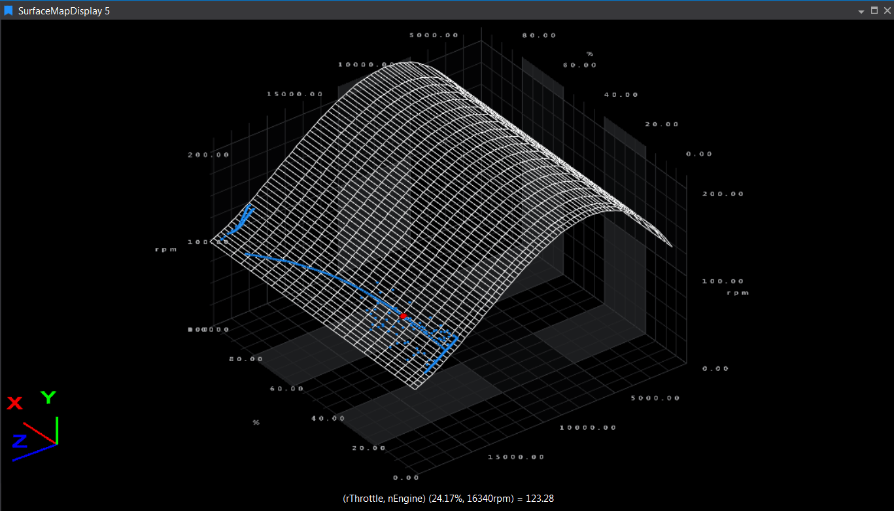

# Surface Map Display

The Surface Map Display provides an interactive 3D visualization using a `.3d` map definition. It pairs two parameters (such as throttle and engine speed) and interpolates a third value. The display shows the mesh from the `.3d` file, data points colored by the X‑axis parameter, and highlights the current cursor point. You can rotate the map with the mouse, zoom with the mouse wheel, and double‑click to reset the view.

## Adding a Surface Map Display

To add a Surface Map Display to a page, use one of the following methods:

- Click the **Surface Map Display** button on the Display Toolbar.
- Go to **File > New > Display** and select **Surface Map Display**.
- Press **Ctrl + Q** twice to open the Quick Access Assistant and select **New Surface Map Display**.

## Setting Up the Display

After adding the display, specify the location of the `.3d` file:

1. Press **D** to open the Display Properties tool window.
2. Enter the file location in the **Map Definition** option.

Next, use the **Parameter Browser** to add the two parameters for which the map file is configured.

## Display Features

- The map (grid and mesh) appears once parameters are set.
- The mesh (from the `.3d` file) is shown in white by default.
- Data points are colored according to the X-axis parameter (blue in the example).
- The current cursor point is highlighted as an enlarged point (red in the example).
- All display properties can be adjusted in the Display Properties tool window.

You can interact with the map by rotating it with the mouse, zooming in or out with the mouse wheel, and resetting its position by double-clicking the display.