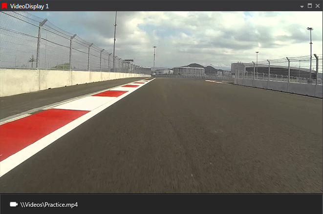

!!! danger "Preview Functionality"
    Video display is currently a preview feature. As such, the content in this page is subject to change based on feedback and roadmap changes.

# Video Display

Related video (e.g., in‑car camera) played alongside session data.

## Adding a Video Display

!!! note
    You must enable preview features in Tools > Options > General > Preview Features to use the Video Display.

To add a Video Display to a page, use one of the following methods:

- **Display Toolbar:** Click the **Video Display** button.
- **Menu:** Go to **File > New > Display** and select **Video Display**.
- **Quick Access Assistant:** Press `Ctrl + Q` twice, then select **New Video Display**.

## Synchronising Video with a Session

To synchronise a video with session data:

- **Play Video:** Click **Play** on the video. The waveform cursor will automatically synchronise to the current video frame.
- **Navigate by Cursor:** If the video is stopped, click on the waveform cursor. The video will display the frame corresponding to the timestamp under the cursor.
