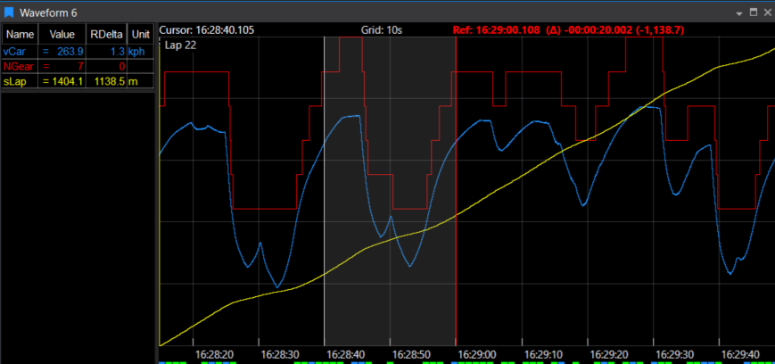

# Waveform Display

!!! abstract "At a Glance"
    **Parameters**: Unlimited  
    **X-Axis**: Time or Distance  
    **Key Features**: Multiple cursors, statistics, events, zoom  
    **Best For**: Time-series analysis, multi-session comparison

The Waveform Display plots multiple parameters as traces against time or distance. It's the most versatile display in ATLAS, supporting live telemetry and historical sessions, fast zooming, and rich formatting. Use it for:

- Braking/throttle application vs. speed, per corner or lap
- Multi-session comparisons with Time Difference (TDiff) in Distance mode
- Event-driven triage (ECU events/errors) aligned to timestamps or distances

## When to Use Waveform Display

:racing_car: **Driver analysis**: Brake/throttle application vs. speed per corner

:bar_chart: **Multi-session comparison**: Compare different laps or sessions side-by-side

:mag: **Event investigation**: See telemetry context around ECU events

:chart_with_upwards_trend: **Trend analysis**: Identify patterns over time or distance

:satellite: **Live monitoring**: Watch real-time telemetry streams

## Adding a Waveform Display

=== "Quick Access"
    Press `Ctrl+Q` twice, type "Waveform", press `Enter`
    
    :zap: **Fastest method**

=== "Toolbar"
    Click the Waveform icon on the Display Toolbar
    
    :mouse: **One click** when you know the icon

=== "Menu"
    **File** > **New** > **Display** > **Waveform Display**
    
    :books: **Browse all options**

### Parameter Selection

- Use Parameter Browser (default max 100 parameters, configurable)
- Double-click legend items for Parameter Properties (supports single/multi-session editing)

### Compare Sets

- Load multiple sessions into a set
- Switch sets: `Shift+<n>` (selected display), `Ctrl+<n>` (whole page), or click coloured tag on title bar

## Display Anatomy

### Plot Area

- One coloured trace per parameter
- Grid (vertical/horizontal/both) with adjustable spacing (shown at top of plot)
- Cursor line showing current position
- Cursor text at top-left (shows Time, and Distance in Distance mode)
- X-axis showing time or distance
- Event markers below X-axis (coloured squares)

### Legend

- One row per parameter with cursor value and statistics
- Colour bar matches trace colour
- Click rows to select parameters
- Reposition, resize, grid, show units, toggle headers
- Select rows (`Ctrl`/`Shift`) to highlight traces and perform actions (hide/delete/distribute)

### Axes

- **X-Axis**: Time (default) or Distance (press `K` to switch)
- **Y-Axis**: Per-parameter scales (enable in Parameter Properties)

## Key Features

### Cursors

**Cursor Modes** (View menu or shortcuts):

| Mode | Key | Description |
|------|-----|-------------|
| Value | `V` | Vertical line, shows sample values (default) |
| Crosshair | `C` | Adds horizontal sight line |
| Gradient | `G` | Diagonal line with three handles; legend shows per-signal gradient |
| Hide | `N` | Turn off cursor display |

!!! tip "Reference Cursor"
    Press `R` to add a red reference line for comparison.
    
    **Features:**
    
    - Red reference line; grey window between reference and current cursor defines analysis range
    - Legend shows ΔTime/ΔDistance and computes statistics for that window
    - Drag either cursor to adjust window size

### Statistics

Enable statistics to see parameter behaviour over ranges:

!!! note "Setup Steps"
    1. Check **Show Statistics** in Display Properties
    2. Choose your **Statistics Level**
    3. Toggle metrics with keyboard shortcuts

**Statistics Levels:**

| Level | Scope | Prefix |
|-------|-------|--------|
| Display | Visible timebase | D |
| Lap | Current lap only | L |
| Session | Entire session | S |
| All | All loaded sessions | A |

Reference Cursor can have its own level or swap with the chosen level.

**Available Metrics:**

| Metric | Key | Description |
|--------|-----|-------------|
| Min | `M` | Minimum value |
| Max | `X` | Maximum value |
| Mean | `N` | Average value |
| Delta | `E` | Difference between cursors |
| Std Dev | `Q` | Standard deviation |

!!! example "Reading Statistics"
    Statistics appear in legend with prefixes: **LMin** (Lap Min), **SMax** (Session Max), etc.

### Selecting, Highlighting, Hiding Parameters

**Select Parameters**:

- Click legend row to select one parameter
- `Ctrl+Click`: Add to selection
- `Shift+Click`: Select range
- Selected traces flash (by default)

**Hide Selected Parameters**:

- Hides traces but keeps legend entries
- Names shown with strikethrough
- Values shown in italics
- Unhide by selecting and pressing Hide again

**Delete Selected Parameters**:

- Removes parameters completely from display

**Distribute**:

- Stacks selected traces into separate bands
- Useful for avoiding overlapping traces
- **Reset Distribute**: Returns to normal view

**Autoscale**:

- Fits selected parameters to available vertical space
- **Reset Auto-Scale**: Returns to original scaling

### Events and Markers

**Event Indicators:**

!!! info "Event Colours"
    Coloured squares below X-axis indicate event severity:
    
    - :red_square: **Red**: High priority events
    - :blue_square: **Blue**: Medium priority events
    - :green_square: **Green**: Low priority events

**Features:**

- Hover for event details
- Multiple events at same position show highest priority colour
- Mask/unmask events by hovering and right-clicking
- View masked events via context menu

**Other Markers:**

| Marker Type | Description | Toggle |
|-------------|-------------|--------|
| Lap Markers | Vertical dashed lines at lap boundaries | Display Properties |
| Date/Time Markers | Clock time or lap time on X-axis | Time mode only |
| Circuit Stripe | Track sectors/segments across top of plot; toggle labels; choose global/overridden Circuit Definition | Display Properties |

### Zoom and Navigation

**Zoom Box**:

- Click and drag to create zoom region
    - Top-to-bottom: Zoom X and Y axes
    - Bottom-to-top: Zoom X-axis only (zoom strip)
- Mouse wheel: Zoom X-axis (time/distance)
- Toolbar zoom buttons

**Autoscroll** (Live Sessions):

- Middle mouse button (or both buttons)
- Pointer position controls scroll speed
- Click to exit autoscroll mode

**Pause/Inspect**:

- Single-click plot to pause scrolling and position cursor
- Double-click to resume scrolling

### Time vs. Distance Mode

Press `K` to cycle between X-axis mappings:

- **Time Mode**: X-axis shows elapsed time
- **Distance Mode**: X-axis shows distance travelled

**Time Difference (TDiff)** in Distance Mode:

- Plots time difference between sessions
- Shows which session is ahead/behind at each distance
- Enable **Show Time Diff** in Display Properties
- Choose TDiff start point:
    - Start of lap
    - Current cursor position

### Sampling and Interpolation

**Sub-Sampling** (when cursor spans multiple samples):

Choose how to display data:

- **First**: Show first sample value
- **Min**: Show minimum in range
- **Max**: Show maximum in range
- **Mean**: Show average
- **Min→Max**: Draw vertical line from min to max
- **Max→Min**: Draw vertical line from max to min

Legend shows min/max values; trace shows vertical min-max line.

**Interpolation**:

- Enable **Interpolate between samples** (Parameter Properties > Post Processing) to smooth traces and generate interpolated legend values
- Makes stepped traces appear smoother

### Session Comparison

**Show Differences**:

- Displays value difference between sessions at cursor
- Enable in Parameter Properties > Post Processing
- Pause live scrolling for readability
- Not available for:
    - Boolean or Text parameters
    - Functions
    - When using Filters or Trends

### Left-to-Right Mode (Strip Chart)

For live telemetry analysis:

1. Enable **Draw left to right** in Display Properties
2. Traces overwrite from left as laps progress
3. Set **Gap %** to add gap ahead of cursor
4. Choose **Left to Right Overlay** lap for reference

Useful for comparing current lap against previous laps in real-time.

### Live Telemetry & Historical Replay

- **Live:** Waveform scrolls/updates if a live session is in the set
- **Historical Replay:** Enable **Allow Historical Replay**; double-click plot to replay

## Keyboard Shortcuts

### Cursor Modes

| Key | Action |
|-----|--------|
| `V` | Value cursor mode |
| `C` | Crosshair cursor mode |
| `G` | Gradient cursor mode |
| `N` | Hide cursor |
| `R` | Toggle reference cursor |

### Statistics

| Key | Action |
|-----|--------|
| `M` | Toggle Min statistic |
| `X` | Toggle Max statistic |
| `N` | Toggle Mean statistic |
| `E` | Toggle Delta statistic |
| `Q` | Toggle Std Dev statistic |

### Navigation

| Key | Action |
|-----|--------|
| `K` | Cycle X-axis mode (Time/Distance) |
| `D` | Display Properties |
| `←` / `→` | Move cursor |
| `Shift+←` / `Shift+→` | Move cursor faster |
| `Home` | Cursor to start |
| `End` | Cursor to end |

### Compare Sets

| Key | Action |
|-----|--------|
| `Shift+<n>` | Switch set (selected display) |
| `Ctrl+<n>` | Switch set (whole page) |

## Display Properties

Key properties you can configure:

### General

- Background colour
- Show grid (horizontal, vertical, both)
- Grid spacing
- Show title bar
- Allow historical replay

### Legend

- Position (top, bottom, left, right)
- Font size
- Show units
- Show warning indicators
- Value alignment

### Cursor & Statistics

- Cursor mode (Value, Crosshair, Gradient)
- Show statistics
- Statistics level
- Reference cursor level

### Time/Distance

- X-axis mode
- Show time difference
- TDiff start point
- Time notation format

### Events

- Show event indicators
- Show lap markers
- Show date/time markers
- Circuit stripe visibility

### Sub-Sampling

- Drawing mode (First, Min, Max, Mean, etc.)
- Interpolate between samples

## Example Configurations

=== "Driver Analysis"
    Analyse brake/throttle inputs:
    
    1. Add Waveform Display
    2. Add Brake, Throttle, Speed parameters
    3. Use **Distribute** to stack traces
    4. Switch to **Distance** mode (`K`)
    5. Add **Reference Cursor** (`R`) to compare corners
    
    :racing_car: **Perfect for**: Corner-by-corner driver analysis

=== "Multi-Session Comparison"
    Compare laps side-by-side:
    
    1. Load multiple sessions
    2. Switch to **Distance** mode (`K`)
    3. Enable **Show Time Diff**
    4. Use **Show Differences** for value deltas
    
    :bar_chart: **Perfect for**: Lap comparison and performance progression

=== "Live Monitoring"
    Real-time telemetry view:
    
    1. Connect live session
    2. Enable **Draw left to right** (strip chart mode)
    3. Set **Gap %** ahead of cursor
    4. Choose overlay lap for reference
    
    :satellite: **Perfect for**: Pit wall and live engineering

## Tips & Tricks

!!! tip "Parameter Management"
    :heavy_check_mark: **Too many parameters?** Use Distribute to stack traces vertically
    
    :mag_right: **Can't see parameter?** Use Autoscale to fit to screen

!!! tip "Analysis"
    :left_right_arrow: **Comparing laps?** Use Reference Cursor to compare two points
    
    :triangular_flag_on_post: **Analysing events?** Event markers show when things happened

!!! tip "Visualisation"
    :chart_with_upwards_trend: **Stepped signals?** Enable interpolation for smoother traces
    
    :mag: **Large dataset?** Zoom in to see detail, zoom out for overview
    
    :arrows_counterclockwise: **Multi-session comparison?** Use Time Diff in Distance mode
    
    :world_map: **Track context?** Enable Circuit Stripe to see where on track

## Troubleshooting

??? question "No Y-axis scales showing?"
    Enable per-parameter Y-Scale in Parameter Properties.

??? question "Traces overlapping and hard to read?"
    - Use Distribute function to stack traces into bands
    - Reduce number of visible parameters
    - Hide less important parameters temporarily
    - Use Autoscale to fit data to vertical space

??? question "Event markers not showing?"
    - Check **Show Event Indicators** is enabled in Display Properties
    - Verify events aren't masked in Event Filter Display
    - Check event priorities are visible

??? question "Differences not showing?"
    "Show Differences" not available with:
    
    - Filters, Trends, or Functions
    - Boolean/Text parameters
    - During live scrolling (pause to read values)

??? question "Cursor not moving?"
    - Click to focus the waveform display
    - Check keyboard focus is on the display

??? question "Stepped signals look wrong?"
    Consider enabling **Interpolate between samples** in Parameter Properties > Post Processing if interpolation is appropriate for the signal type.

??? question "Missing event markers?"
    Ensure **Show Event Indicators** is on; check Event Filters for masked priorities.
