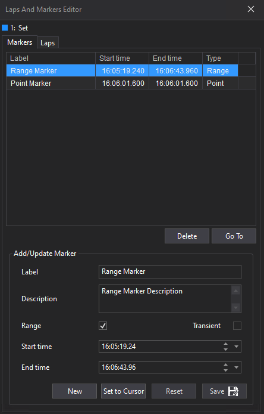

# Markers

Markers define specific points or ranges of time within a session and are fully customizable. Each marker can include annotations and labels to describe its purpose.

**Marker Properties:**
- **Type:** Group/category of the marker.
- **Label:** Short summary of the marker.
- **Description:** Detailed explanation.
- **Start Timestamp:** Optional start time (defaults to session start if omitted).
- **End Timestamp:** Optional end time (defaults to session end if omitted).



!!! tip
    To represent a single point in time, set both start and end timestamps to the same value.

**Marker Labels:**  
Markers can have multiple labels for additional information. Label properties include:
- **Name:** Computer-readable reference.
- **Label:** Human-readable summary.
- **Description:** Detailed explanation.
- **Value:** Associated value.
- **Format:** Display format (e.g., `%.3f` for three decimal places).
- **Unit:** Measurement unit.

Labels are optional and can be used in any combination.

When reviewing markers in the timeline, labels appear in tooltips on hover. Example:


## Adding Markers Programmatically

Markers can be added via code, such as in simulation models or analysis tools. Example using the SQL Race API:

```c#
var marker = new Marker(markerStartTime, markerEndTime, "High Wind", "windSpeedData",
    "A period during which the wind was sustained above 9 m/s");

marker.AddLabel(
    new MarkerLabel
    {
        Label = "Average Speed",
        Description = "An average sustained wind speed during this time period",
        Value = "9.6382834",
        Format = "%.2f",
        Unit = "m/s",
        Name = "windSpeedDataHighVelocity01"
    });    

marker.AddLabel(
    new MarkerLabel
    {
        Label = "Direction",
        Description = "The direction of the wind during this time period",
        Value = "323",
        Format = "%i",
        Unit = "deg",
        Name = "windSpeedDataHighDirection01"
    });

session.Markers.Add(marker);
```

> **Reference:** See the [Marker class documentation](https://mat-docs.github.io/Atlas.SQLRaceAPI.Documentation/api/MESL.SqlRace.Domain.Marker.html).

## Using the Markers Tab

The Markers tab in the Laps And Markers Editor displays markers for the active session. Users can:

1. **Add** a new marker
2. **Delete** the selected marker
3. **Go To** the selected marker
4. **Edit** the selected marker

!!! note
    In LIVE mode, markers cannot be added, deleted, or edited. Editing is enabled once the session is HISTORICAL.

### Marker Types

- **Point Marker:** Represents a single time point (only Start time set).
- **Range Marker:** Represents a time range (both Start and End times set).

### Adding a Marker

- Click **New** to enable editing.
- By default, the Range checkbox is unticked (point marker).
- Start time defaults to the current cursor time.
- Edit the following fields:
  - **Label:** Marker name
  - **Description:** Optional
  - **Range:** Tick for range marker
  - **Start time:** Set as needed
  - **End time:** Enabled for range markers

Edit times by typing, using arrows, or dropdown controls.  
Use the cursor button to set times to the cursor position.  
Reset button restores default/previous values.

Click **Save** to add the marker to the list.

### Marker Selection and Management

- **Delete:** Select a marker and press Delete to remove it.
- **Go To:** Select a marker and press Go To to move the cursor (to the time point for point markers, or midpoint for range markers).
- **Edit:** Select a marker, update details, and press Save to apply changes.

Markers are also available in the Laps dropdown.  
Point markers show label and time; range markers show label and duration.

!!! tip
    Transient markers can be added via Alarms (see Alarm Set Marker).

