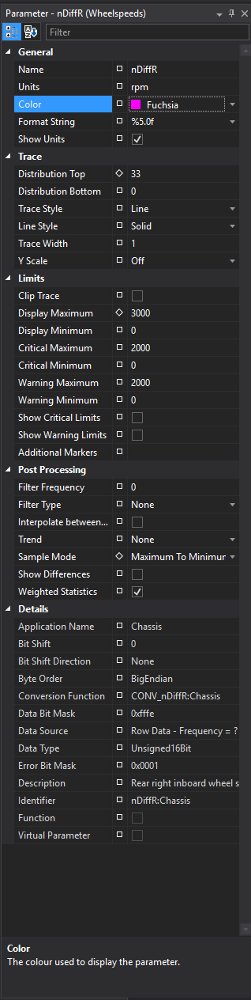

# Interacting with Parameters

## Parameter Browser

The Parameter Browser allows you to select and manage Parameters for the currently selected Display. The available Parameters depend on those recorded in the loaded Session.

**Opening the Parameter Browser**

- Click the Parameter Browser icon on the Browser Toolbar.
- Select **View > Parameter Browser** from the Menu Bar.
- Use the keyboard shortcut **P** with a display selected.
- Right-click anywhere on a Display and choose **Parameter Selection** from the context menu.

**Parameter Browser Layout**


1. **Application Groups Panel (Left)**
    - Browse and select Application groups to view their Parameters.
    - Expand/collapse groups using arrows or double-click.
    - Use "All Groups" if unsure where a Parameter is located.

2. **Search Criteria and Parameters List (Center)**
    - Search for Parameters by name or description.
    - Restrict search to Slow Row, Virtual Parameters, or Functions.
    - Add Parameters to the Display by double-clicking or dragging.
    - Select multiple Parameters with Ctrl/Shift + Click.
    - When comparing sessions, expand Parameters to see applicable sessions.

3. **Selected Parameters (Right)**
    - Shows Parameters added to the current Display.
    - Parameters with data are white; those without are greyed out.
    - Select a Parameter to highlight it on the Display.
    - Press **Delete** to remove a selected Parameter

## Changing Parameter Colour

1. Double-click the Parameter name on a Display to open the Parameter Properties window.
2. In the Appearance section, type a colour name or select from the dropdown.
3. Press **Return** or click to confirm the colour.


## Parameter Aliasing (Changing Parameter Name)

Parameter Aliasing lets you assign custom names to Parameters.

- **Replace Mode:** Substitute original names with a new name in the same group.

```
  <AliasingConfiguration>
      <Aliases>
        <Alias mode="Replace">
            <OriginalNames>
              <Name>vCar:Chassis</Name>
            </OriginalNames>
            <NewName>Speed</NewName>
        </Alias>
      </Aliases>
  </AliasingConfiguration>
```

- **Pick Mode:** Link a new name to one of several source names, with priority order.

```
  <AliasingConfiguration>
      <Aliases>
        <Alias mode="Pick">
            <OriginalNames>
              <Name>Speed:Chassis</Name>
              <Name>CoverageSq:ATLAS</Name>
            </OriginalNames>
            <NewName>GForce</NewName>
        </Alias>
      </Aliases>
  </AliasingConfiguration>
```

Configure aliasing in `aliasing.config` saved at `%userprofile%\documents\McLaren Applied Technologies\`.

!!! warning   
  After making changes to `aliasing.config`, you must restart ATLAS for the new aliases to take effect.

If a parameter (e.g., `pBrake`) is already present in your workbook and you create an alias (e.g., `BrakePressure`), `pBrake` will remain in the workbook but will no longer be searchable in the Parameter Browser. Only the alias name (`BrakePressure`) will be available for searching. To remove the old parameter name from your workbook, you need to delete it manually.

## Application Groups

Applications organize Parameters into groups (e.g., Bios, Chassis, Engine) for easier navigation. Groups are shown in a tree format in the Parameter Browser.

## Number Formats

Customize how Parameter values are displayed using format strings (similar to C language):

- `[text]%[control][total digits].[decimal digits][format code]`
- Control characters: `+` (show sign), `-` (left justify), `0` (leading zeros)
- Format codes: `f` (float), `d` (integer), `x` (hex lower), `X` (hex upper)

Set formats in the Appearance frame of the Parameter Properties panel.

## Parameter Properties Tool Window

Manage Parameter appearance and behavior:

- **Default:** Core properties from data acquisition.
- **Changed:** Overrides for the current Display.
- **Global:** Applies property value to all instances of the display type in the workbook.



**Editing Properties**

- Open the Parameter Properties tool window.
- Click a property value to edit.
- Right-click the icon next to a value for options:

    - Copy Name/Value
    - Paste Value
    - Show/Hide Description
    - Make Global
    - Clear Global Value
    - Reset to Default

!!! tip
    Use the Parameter Browser and Properties tool window to fully customize how Parameters are displayed and behave in ATLAS.
 