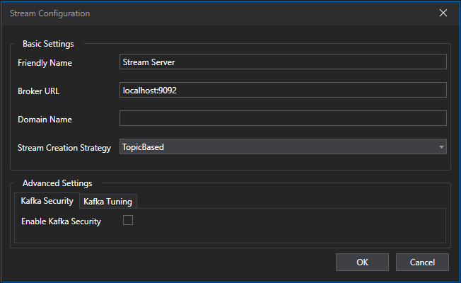

# Stream Recorder

## Purpose
Connects to a Kafka broker to record live telemetry via the [Open Data Streaming Architecture](https://atlas.motionapplied.com/developer-resources/secu4/docs/).

## Prerequisites
Stream Server Configuration must be set up in Tools|Options|Recorders|Stream Recorder.

## Stream Server Configuration
Before any recording can be done, the Stream Server Configuration must be set. This tells the Stream Recorder important things about the Kafka broker it is recording from.

{: style="width:75%;"}

# First time Setup
1. Click on Tools|Options|Recorders|Stream Recorder 
2. Click on Add to create new Stream Server Configuration.
3. Configure (Basic Settings):
    - **Friendly Name** - The name at which the configuration will be referred to (This should be unique).
    - **Broker URL** - The URL of the Kafka Broker.
    - **Domain Name** - The Domain Name of the Stream API which was setup for the broker. This is only needed if the Producer's Stream API has a domain name defined.
    - **Stream Creation Strategy** - The strategy at which new streams are made in Kafka. This needs to match the producer's Stream API settings. There are two modes:
        - **Topic Based** - Streams are divided into Kafka Topics.
        - **Partition Based** - Streams are divided into Partitions in a single Kafka topic.
    - **Partition Mapping** - Only required if Partition based Stream Creation Strategy was selected. Maps which stream goes to which parition number. This needs to match the producer's Stream API settings.
4. Click OK and the Stream Server Configuration is now available for all Stream Recorders in that ATLAS to use.

# Advanced Settings (Available on ATLAS versions 11.5.2.972-W28 and later)
There are Advanced Settings available for the Stream Server Configuration. This is used to setup Kafka Security and enable Kafka Tuning. 

## Kafka Security
Kafka Security is only needed if Kafka is setup with security enabled.

For more info, look at [Kafka Security](https://atlas.motionapplied.com/developer-resources/secu4/stream_api/reference_docs/configuration/kafka-security/#overview).

## Kafka Tuning

Kafka Tuning is available to fine tune how Stream Recorder consumes from Kafka. The file path are for the Kafka Tuning json. For more info, click [Kafka Tuning](https://atlas.motionapplied.com/developer-resources/secu4/stream_api/reference_docs/configuration/kafka-broker-tuning/).

## Recording Modes
The Stream Recorder supports two operational modes for consuming OSAP data from Kafka. These modes determine where in the stream the Recorder begins reading data and how it handles historical backlog.

1.**Live Mode:** Live mode begins consuming data only from the moment the Recorder starts. The Recorder attaches to the Kafka topic at the current offset and continues forward.

2.**Live with Catchup Mode:** The Recorder starts at the live edge, ensuring it processes new data immediately. Simultaneously, it begins consuming all data from the start of the session. Catch‑up happens in the background, at a controlled rate, without disrupting live processing. Priority is always given to leading‑edge, real‑time data.

## Setup Instructions

1. Open Session Browser.
2. Add a Stream Recorder.
3. Configure:
    - **Recorder Name**
    - **Database Engine:** SQLite or SQL Race.
    - **Database Path** / **Connection String**.
    - **Delete Recorded Session on Close**
    - **Auto Export to SSN2** (If recording to SQLite)
    - **Export Folder**
    - **Stream Server** / **Data Source**
    - **Session Identifier Pattern** / **Source**
- **Session Details Source** / **Details**
4. Choose between:
    - **Start:** Waits for a live session and records it.
    - **Auto Record:** Continuously records new sessions as they appear.

