# Toolbar

Toolbars provide quick access to various ATLAS commands. By default, they are docked along the top edge of the Main Window.

Toolbar buttons are duplicates of Menu commands or other controls. Each item is described by its ToolTip text.

Any command that is unavailable in a given context is greyed out but remains on the toolbar.

Toolbars can be moved and rearranged by dragging the toolbar handle, found on the left-hand end of each toolbar:

| Action | Icon | Description | Toolbar |
|--------|------|-------------|---------|
| New Workbook | 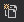 | Create a brand‑new workbook. | Main Toolbar |
| Open Workbook |  | Open an existing workbook file. | Main Toolbar |
| Save Workbook | 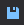 | Save changes to the current workbook; prompts for a name if it hasn’t been saved before. | Main Toolbar |
| Save Workbook As |  | Save a copy of the current workbook under a different name. | Main Toolbar |
| Add New Page |  | Insert a new page into the active workbook. | Main Toolbar |
| Bar Display | 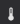 | Insert a Bar Display into the active workbook. | Display Toolbar |
| Bing Map Display |  | Add a Bing Map‑based display to the workbook. | Display Toolbar |
| Bit Display |  | Add a Bit Display for showing bit/boolean states. | Display Toolbar |
| Block Bar Display | 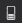 | Add a Block Bar Display for block‑style bar visuals. | Display Toolbar |
| Circuit Display | 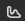 | Add a circuit/track visualization display. | Display Toolbar |
| Countdown Timer Display | 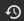 | Add a display that counts down from a set time. | Display Toolbar |
| Error Display | 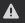 | Add a panel to show errors/alerts. | Display Toolbar |
| Events Display | 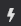 | Add a display that lists or plots events. | Display Toolbar |
| Histogram Display | 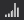 | Add a histogram to visualize distributions. | Display Toolbar |
| Loadmap Display | 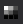 | Add a load‑map style visualization. | Display Toolbar |
| Notepad Display |  | Add a simple notes/notepad panel. | Display Toolbar |
| Numeric Display | 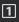 | Add a numeric readout for key values. | Display Toolbar |
| PCU‑Dash Display | 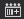 | Add a PCU dashboard‑style display. | Display Toolbar |
| Scatterplot Display |  | Add a scatter plot visualization. | Display Toolbar |
| Summary Display |  | Add a summary panel aggregating key metrics. | Display Toolbar |
| Surface Map Display | 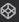 | Add a surface‑map view. | Display Toolbar |
| Video Display | 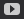 | Add a player panel for video content. | Display Toolbar |
| Waveform Display |  | Add a waveform/trace plot area. | Display Toolbar |
| Web Browser Display | 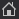 | Embed a web browser view inside the workbook. | Display Toolbar |
| Alarm Editor | 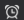 | Open the Alarm Editor tool. | Browser Toolbar |
| Session Browser |  | Open the Session Browser. | Browser Toolbar |
| Parameter Browser |  | Open the Parameter Browser. | Browser Toolbar |
| Function Editor |  | Launch the Function Editor. | Browser Toolbar |
| Value Cursor |  | Show a vertical cursor to read values at a chosen point. | Cursor Toolbar |
| Cross Hair Cursor |  | Show intersecting vertical and horizontal guides for precise value reads. | Cursor Toolbar |
| Gradient Cursor | 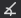 | Display a cursor that reports the gradient/slope at the selected point. | Cursor Toolbar |
| Hide Cursor |  | Turn off the cursor overlay on the display. | Cursor Toolbar |
| Create Zoom Box | 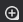 | Drag to zoom into a region on Waveform or Scatterplot displays. | Display View Toolbar |
| Undo All Zooms |  | Reset all zoom levels back to the default view. | Display View Toolbar |
| Auto‑scale | 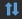 | Automatically fit data to the available plotting area. | Display View Toolbar |
| Reset Auto‑scale | 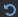 | Exit auto‑scale and return to manual/normal scaling. | Display View Toolbar |
| Distribute Parameters |  | Arrange selected parameters in equally sized rows (Waveform). | Display View Toolbar |
| Reset Distribute Parameters |  | Revert to the standard parameter layout (Waveform). | Display View Toolbar |
| Toggle Display Title Bar |  | Show or hide the title bar for the selected display. | Display Titles Toolbar |
| Move to Previous Lap | 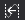 | Move the cursor back to the prior lap. | Laps Toolbar |
| Move to Current Lap | 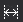 | Zoom so only the currently selected lap is visible. | Laps Toolbar |
| Move to Next Lap | 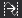 | Advance the cursor to the next lap. | Laps Toolbar |
| Laps & Markers Editor | 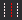 | Open the editor to view or modify laps and markers in the primary session. | Laps Toolbar |
| Move to Next Gearshift |  | Navigate to the adjacent gear‑shift event (next). | Laps Toolbar |
| Move to Previous Gearshift | 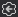 | Navigate to the adjacent gear‑shift event (previous). | Laps Toolbar |
| Quick Access Assistant |  | Launch the assistant to quickly add parameters, functions, displays, or pages. | Quick Access Toolbar |
| Go To | 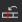 | Launch the Go To plugin to jump to a specific lap or marker in the primary session. | Go To Feature Toolbar |
| Refresh Calculated Parameters |  | Recompute all calculated parameters across the entire workbook. | Refresh Toolbar |
| Reset Parameter Properties |  | Resets the settings for all parameters to their default settings. | Refresh Toolbar |