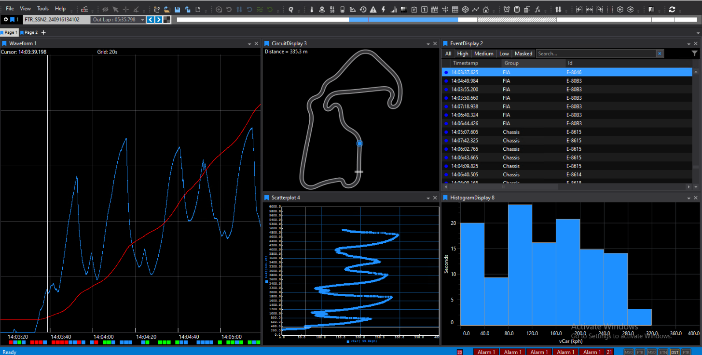
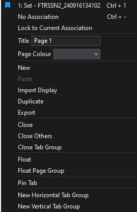

# Workbooks and Pages

Workbooks in ATLAS define your workspace layout and the arrangement of elements on the screen. Every ATLAS session contains at least one Workbook, which can hold multiple Pages, and each Page can display several [Displays](../displays/index.md).

## Saving and Opening Workbooks

- **Save your workspace:** Workbooks are saved as `.wbkx` files, preserving the formatting, size, and position of each Display and Page.
- **Open existing workspaces:** Use the File menu to open a Workbook. This replaces your current workspace. If you have unsaved changes, ATLAS will prompt you before proceeding.
- **Save As:** To rename a Workbook, use the Save As command. The default name is assigned when first opened (e.g., Workbook1).

!!! note
    Compare Sets, Session data, Bit Config Files, Functions files, Alarm Files, Circuit Display Definitions, SurfaceMap Display Definitions, and PCU Dash Display RAW CAN files are not stored in `.wbkx` files but are automatically opened by the Workbook. If these files are missing, Displays will be empty.

## Working with Pages

- **Default setup:** When ATLAS starts or a new Workbook is opened, it includes one Page.
- **Multiple Pages:** You can add, float, and arrange multiple Pages within a Workbook. Only one Page is selected at a time, but you can view several by floating them.
- **Page Bar:** Located at the top of the Main Window, it displays tabs for each Page. Use horizontal scroll arrows if tabs exceed available space.

### Page Management Options

Right-clicking a Page tab opens a menu with options to:

- **Set:** Switch or remove Compare Sets associated with the Page.
- **No Association:** Remove the current Compare Set link.
- **Lock to Current Association:** Lock the Page to its current Compare Set.
- **Title:** Edit the Page name.
- **Page Colour:** Underline the tab with a chosen colour.
- **New:** Add a new Page.
- **Paste/Import Display:** Add copied or saved Displays.
- **Duplicate:** Copy the Page and its Displays.
- **Export:** Save the Page for use in other Workbooks.
- **Close/Close Others/Close Tab Group:** Manage Page tabs.
- **Float/Float Page Group:** Move Pages into separate windows.
- **Pin Tab:** Toggle pin status.
- **New Horizontal/Vertical Tab Group:** Organize tabs in groups.

## Selecting Pages

- Click the desired tab on the Page Bar.
- Or, press **Page Up** or **Page Down**.

## Adding Pages

To add a new Page:

- Select **New** from the File menu, then **Page**.
- Click the **+** on the Page Bar.
- Click the **New Page** icon on the Main Toolbar.
- Right-click a Page tab and choose **New Page**.
- Press **Ctrl + Q**, then select **New Page**.

New Pages are named sequentially (e.g., Page2, Page3).

## Closing Pages

To close a Page:

- Click the **X** next to the Page name on the Page Bar.
- Or, right-click the Page Bar and select **Close**.

## Status Bar

The Status Bar appears at the bottom of the ATLAS Main Window and provides real-time feedback on system activity:

- **Last Action:** Displays a brief description of the most recent significant event, such as "Recording started" or error notifications.
- **Recorder Status:** Shows a symbol for each connected recorder, with initials indicating the recorder type. Status is highlighted by colour—yellow for idle, red for active recording.

- **Error Count:** Indicates the number of error messages. Click to view details; right-click and select **Clear** to remove the messages.
- **Alarms Warnings:** Shows the count of active alarms with warning status and lists the five most recent alarms. Refer to [Alarm Warnings](../alarms/index.md) for more information.

