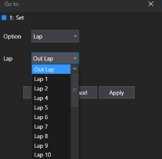
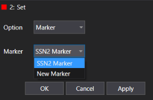
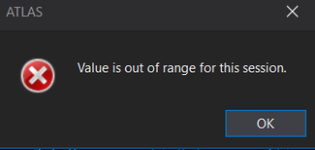

The **Go To** feature in ATLAS 10 allows users to quickly navigate to specific laps, markers, or exact positions (by time or distance) within a session. This feature streamlines data exploration and analysis, making it easier to locate and review key moments.

### How to Open the Go To Window

You can access the Go To window in any of the following ways:

- Click the Go To icon on the ATLAS toolbar.
- Select **View > Go to** from the Menu Bar.
- Use the keyboard shortcut **Ctrl + G**.

### Navigation Options

The Go To dialog provides three main navigation options, selectable via a drop-down list:

1. **Laps** – Jump to a specific lap in the session.
2. **Markers** – Move to a defined marker (point or range) within the session.
3. **Exact Setting** – Position the cursor at a precise time or distance.

#### 1. Go To Feature - [Laps](../handling-data/laps-markers/laps.md)

- The default option is **Laps**.
- Select a lap from the drop-down list and click **Apply** to move the cursor to that lap.
- **OK** applies the selection and closes the window; **Cancel** closes the window without changes.
- For live or replay sessions, playback will pause and jump to the selected lap.

#### 2. Go To Feature - [Markers](../handling-data/laps-markers/markers.md)

- Select **Marker** in the options drop-down to navigate to a session marker.
- Choose a marker from the list:
    - **Range Marker**: Cursor moves to the center of the range and waveform zooms to the marker's time base.
    - **Point Marker**: Cursor moves to the marker point without changing zoom.
- For live or replay sessions, playback will pause and jump to the selected marker.

#### 3. Go To Feature - Exact Setting

Use the **Exact Setting** option to move the cursor to a specific time or distance.

**Time Mode:**

- Definitions available:

    - **Exact Time**: Enter a time value to move the cursor directly to that point.
    - **Time from start of lap**: Enter a time offset from the start of a selected lap.
    - **Time from end of lap**: Enter a time offset from the end of a selected lap.

- If the session spans multiple days, a **Day** drop-down appears for selecting the day.
- If the entered time is out of session range, an error dialog will prompt for a valid value.

**Distance Mode:**

- Definitions available:

    - **Exact Value**: Enter a distance value to move the cursor directly to that point.
    - **Value from start of lap**: Enter a distance offset from the start of a selected lap.
    - **Value from end of lap**: Enter a distance offset from the end of a selected lap.

- If the entered distance is out of session range, an error dialog will prompt for a valid value.

