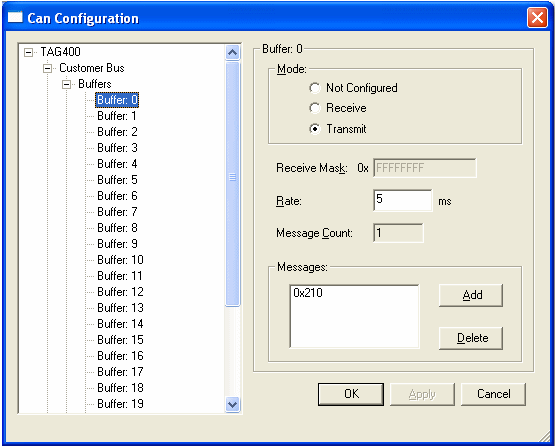
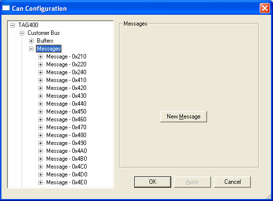
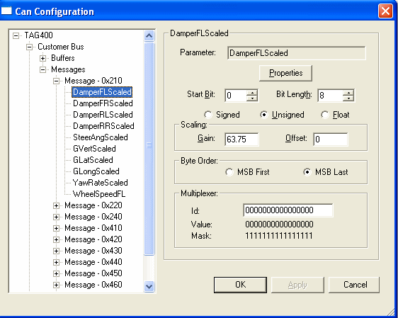
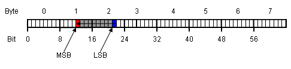

## CAN Bus

With Customer Bus selected in the explorer, the configurable options available affect all Buffers and their associated CAN messages.

Expanding the Bus node displays the Buffers and CAN messages configured for the Bus.


**Customer Bus Panel**

| Option | Description |
|--------|-------------|
| **Buffer Count** | The number of Buffers available for configuration on the selected Bus. |
| **Global Mask** | The receive mask for all Buffers that do not have a configurable Receive Mask. *Note: Not all control units support a configurable global mask.* |
| **Link Speed** | Select a speed in kbits for the selected Bus from the drop-down list. |

**Parameter Block Panel**

Received Measurement Parameters for the CAN bus are stored in a single contiguous block of memory.

| Parameter | Description |
|-----------|-------------|
| **Ctrl Id** | The Control Id of the memory block. |
| **Parameter Address** | The start address of the memory block. |
| **Block Size** | The size of the memory block in number of blocks. |

## Buffers

With a Buffer selected, the configurable options available apply to that Buffer only.



!!! note
    The CAN messages associated with this buffer are listed in the Messages node for this CAN Bus.

**Add a CAN Message to an Empty Buffer**

1. Select a Buffer
2. Click **Add**
3. In the Add MessageId dialog box, select a Message Id from the drop-down list and click **OK**

The CAN message is assigned to the selected Buffer. When a specific Message is selected in the explorer, the Buffer to which it is assigned is shown in the Message Details. A CAN message can only be assigned to one Buffer.

!!! note
    Buffers can be configured individually as described above, or existing Buffer configurations can be Imported. See [Import/Export Buffers and Messages](#importexport-buffers-and-messages).

**Mode Panel**

Define the mode of the CAN messages configured for this buffer.

| Mode | Description |
|------|-------------|
| **Not Configured** | Any messages configured for this buffer will not be included in the logging. |
| **Receive** | CAN messages are in receive mode. |
| **Transmit** | CAN messages are in transmit mode. |

**Buffer Panel**

| Option | Description |
|--------|-------------|
| **Receive Mask** | Any bits that are zero in the Receive Mask are ignored when comparing a received dataframe's ID against the acceptance ID of the buffer. For example, if the receive mask is set to `0xFFFFFFF0` and ID of the first message is `0x210`, then the buffer will receive all messages in the range `0x210` to `0x21F`. *Note: Not all buffers have a configurable receive mask.* |
| **Rate** | The time between each message being transmitted in ms. |
| **Message Count** | The number of CAN messages configured for the selected Buffer. |

**Messages Panel**

The Messages Window lists the IDs of CAN messages currently configured for this buffer.

| Action | Description |
|--------|-------------|
| **Add** | Click to add a CAN message to the selected buffer. |
| **Delete** | Click to delete the selected Message Id. |



## CAN Messages

With the Messages node selected, the **New Message** button is displayed to allow new CAN messages to be added to the Configuration.

To add a CAN message, click **New Message** and enter a Message ID in the Add Message ID dialog box. The new message is added to the list.

!!! note
    CAN messages can be added and configured individually as described above, or existing CAN Message configurations can be Imported. See [Import/Export Buffers and Messages](#importexport-buffers-and-messages).

To view the CAN messages configured for the CAN Bus, expand the Messages Node. With an individual CAN message selected, the configurable options apply to that message only. Use these commands to configure the CAN message and to add new Parameters as required.

**Message Panel**

| Option | Description |
|--------|-------------|
| **Message Id** | The unique CAN identifier for the selected CAN message. |
| **Description** | Enter a short description of the CAN message. |
| **Message Length** | Enter the length of the CAN message. For CAN messages with multiplexed data, the length must be the same for all multiplexer values. |
| **Buffer** | The Buffer to which the selected CAN message is assigned. (Read only) |
| **Parameter Count** | The number of Parameters associated with the selected CAN message. |
| **Mode** | TRANSMIT / RECEIVE / NOT CONFIGURED - The Mode of the selected CAN message (the same for all messages in that Buffer). |
| **New Parameter** | Opens the Add Parameter dialog box. |

**Multiplexed Panel**

Multiplexed CAN messages allow more measurement parameters to be received by a CAN buffer than can be packed into a single CAN message.

| Option | Description |
|--------|-------------|
| **Multiplexed** | Select this checkbox to multiplex some or all of the CAN message data. |
| **ByteOrder** | Select the byte order of the multiplexer: MSB First or MSB Last. |
| **StartBit** | Select the position within the CAN message data where the multiplexer value starts. |
| **BitLength** | The length, in bits, of the multiplexer value. Maximum length is 16. |
| **MultiplexerValues** | When transmitting this message, multiplexed messages in the range of 0 to Multiplexer Values - 1 will be sent. |

## Parameter Details

With a specific Parameter selected, the configurable options available apply to that Parameter only.



**Parameter Panel**

| Option | Description |
|--------|-------------|
| **Parameter** | The name of the Parameter. For received Parameters, this is the name displayed by System Monitor and ATLAS. For transmitted Parameters, this is the name of the parameter to be transmitted. |
| **Properties** | Open the Parameter Properties dialog box to edit the Parameter Properties. |
| **Start Bit** | Select the position within the CAN message data where the Measurement Parameter starts. *Note: When MSB Last is selected as the Byte Order, the default Start Bit shows the normalised value. For a parameter at the start of a CAN Message, the Start Bit is shown as 0, although its underlying value is 7.* |
| **Bit Length** | Select the length in bits of the Measurement Parameter. Maximum length is 32. |
| **Value** | Select whether the Measurement Parameter is Signed, Unsigned, or Floating Point. If Floating Point is selected, the Bit Length must be set at 32. |

**Scaling Panel**

| Option | Description |
|--------|-------------|
| **Gain** | Set the gain for converting a scaled value into a raw value. |
| **Offset** | Set the offset for converting a scaled value into a raw value. |

**Scaling Formula:**
```
Raw Value = GAIN × Scaled Value + OFFSET
```

**Byte Order**

Select the byte order of the Measurement Parameter:
- **MSB First**
- **MSB Last**

### Multiplexer Panel

**ID**

If the message is multiplexed, the multiplexer ID defines which multiplexed messages the parameter will be in.

A Measurement Parameter can be defined in more than one multiplexed message, since the multiplexer ID is a combined value and mask:

- `0`, `1`, or `X` can be used for each bit in the multiplexer ID, where `X` means that bit does not matter
- For example, if a measurement parameter is in all messages with an even multiplexer value, the multiplexer ID should be set to `XXXXXXXXXX0`

**Value**

The Parameter is transmitted/received if the value equals the multiplexer value for the message currently being processed, after any bits in the mask are ignored.

**Mask**

Calculated from the entered multiplexer ID and defines which bits of the multiplexer value should be ignored when determining whether to include this parameter in the message.

## CAN Bit Definitions

For each Measurement Parameter and multiplexer value, the start bit, length, and byte order must be defined. Bits and bytes within a CAN message are numbered sequentially from left to right.

### MSB First Format Values

When a Measurement Parameter or multiplexer value is defined as **MSB_FIRST**, the start bit defines the location of the most significant bit. The progression of bits and bytes is to the right.



### MSB Last Format Values

When a Measurement Parameter or multiplexer value is defined as **MSB_LAST**, the start bit defines the location of the least significant bit. The progression of bits is to the left and the progression of bytes is to the right.


!!! note
    - In an MSB Last word, the Start Bit is the last bit of the first byte. Whilst the Start Bit for the word at the start of a CAN message is bit 0, the Start Bit in terms of MSB is bit 7. When a Parameter is added to the CAN Message, the CAN Configure dialog automatically displays normalised values for the Start Bit. For example, if the Parameter appears at the start of a CAN Message, the value 0 is shown, although its underlying value is 7. The Start Bit of a 2nd Parameter is shown as 8, although its underlying value is 15, and so on.
    - When a CAN message is exported, the saved Start Bit values are the actual values and not the normalised values shown in the dialog box. These can be seen in the Start Bit column of the .csv Export files.

## CAN Parameters

When a CAN Configuration file is added to the project, a CAN Parameters folder is added to the System Monitor Explorer. This folder contains CAN Parameters configured in the ECU, which can be associated with CAN Receive messages.

!!! note
    Parameters associated with Transmit CAN messages are not listed in the CAN Parameters folder. However, for a Parameter to be associated with a CAN Transmit message, it must exist in the ECU Measurement Parameters folder.

**Add a CAN Parameter**

To associate a new Parameter with a CAN message:

1. Select a message and click **New Parameter** to open the Add Parameter dialog box
2. **Name** - Enter the name of a Parameter to associate with the selected CAN message
    - *Note: For a Parameter to be selected for a Transmit message, it must be listed in the ECU Measurement Parameters folder in the System Monitor Explorer.*
    - Click to browse for a Parameter in the Select Parameter dialog box
3. Click **OK** to associate the Parameter with the selected CAN message

## Import/Export Buffers and Messages

Existing Buffer Configuration (.csv) files and Message Configuration files can be imported into the CAN configuration. Buffer and Message configurations can be exported from the CAN Configuration as .csv files.

!!! note
    When importing Buffer Configuration files or Message Configuration files, all Buffer/Message configurations are overwritten by the imported file.

### Import/Export Buffer Configuration Files

1. Select **Logging > CAN Configuration** to open the CAN Configuration dialog box
2. Expand the CAN Bus and select **Buffers**
3. Right-click and select **Import Buffer** or **Export Buffer**

### Import/Export Message Configuration Files

1. Select **Logging > CAN Configuration** to open the CAN Configuration dialog box
2. Expand the CAN Bus and select **Messages**
3. Right-click and select **Import Messages** or **Export Messages**

## CSV File Formats

Buffer and CAN message CSV import files must be formatted as described below.

**Buffer CSV File Format**

| Col | Name | Description |
|-----|------|-------------|
| 1 | Buffer | The number of the buffers in the CAN Bus. |
| 2 | Direction | Mode of the CAN messages configured for this buffer. TX = Transmit, RX = Receive, Blank = not configured. |
| 3 | RX Mask | The Receive Mask value, if one is configured for the buffer. Blank = not configured. |
| 4 | Rate[ms] | The time (ms) between each CAN message being transmitted. |
| 5 | Messages | The CAN message ID configured for the buffer. If more than one CAN message is configured, they must be comma-separated. |

**CAN Message CSV File Format**

Following a change in the representation of the Parameter Start Bit, v2 of the CAN Message CSV format is now in use. When parameters are set as MSB Last, the value in the .csv is now represented by the logical bit position.

v2 files are identified by the text `v2` as the first value in the header row. All exported files now conform to the new format; both formats can be imported.

| Col | Name | Description |
|-----|------|-------------|
| 1 | CAN ID | The CAN message ID. 11-bit IDs: 0 to 0x7FF. 29-bit IDs: 0 to 0x1FFFFFFF |
| 2 | Message Length | The CAN message length. |
| 3 | Start Bit | Multiplexer messages - the position within the CAN message data where the multiplexer value starts. |
| 4 | Length | Multiplexer messages - the length, in bits, of the multiplexer value. Maximum length is 16. |
| 5 | Byte Order | Multiplexer messages - the byte order of the multiplexer: MSB First or MSB Last. *Note: If the Message is not multiplexed, columns 3, 4, and 5 are blank.* |
| 6 | Parameter Name | The name of the Parameter associated with the CAN message. If more than one, subsequent parameters are listed on a new line. |
| 7 | Start Bit | The position within the CAN message data where the Measurement Parameter starts. |
| 8 | Length | The length in bits of the Measurement Parameter. Maximum length is 32. |
| 9 | Multiplexer ID | The multiplexer ID defines which multiplexed messages the parameter will be in. |
| 10 | Signed | Whether the Measurement Parameter is signed: YES or NO. If Floating Point, this column must be NO. |
| 11 | Floating Point | Whether the Measurement Parameter is Floating Point. |
| 12 | Byte Order | The byte order of the Measurement Parameter: MSB First or MSB Last. |
| 13 | Scaling Gain | Parameter property. The Gain set for converting a scaled value into a raw value. |
| 14 | Scaling Offset | Parameter property. The Offset set for converting a scaled value into a raw value. |
| 15 | Description | Parameter property - Description. |
| 16 | Display Format | Display format. |
| 17 | Units | Display units. |
| 18 | Lower Limit | Lower value limit. |
| 19 | Upper Limit | Upper value limit. |
| 20 | Identifier | CAN Parameter unique identifier. |
| 21 | Display Limit Low | Lower display limit. |
| 22 | Display Limit High | Higher display limit. |
