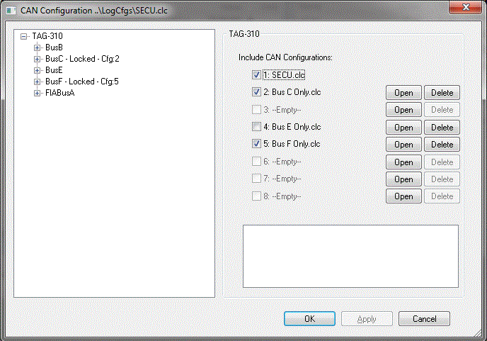

# CAN Configuration Overview

System Monitor includes tools to configure Controller Area Network (CAN) messages for data logging. These messages can be transmitted to external units or received and logged internally using CAN buffers.

## Configuration Dialog Box

The CAN Configuration dialog box is used to configure:

- Transmit CAN messages for logging by an external unit
- Receive CAN messages for logging internally using the CAN buffers

To open the dialog box, select: **Logging > CAN configuration**.

!!! note
    - If the CAN Configuration menu option is not enabled, a new CAN Configuration file must be created or an existing CAN Configuration file opened. See **Creating New Files**, **Opening Files**.
    - When a new CAN Configuration file is added to the project, there are no CAN messages configured initially. Messages can be configured manually or imported from existing files. See **Import/Export Buffers and Messages**.
    - Creating or adding a CAN Configuration file to the project adds a **CAN Parameters** folder to the System Monitor Explorer. This folder contains CAN Parameters configured in the ECU, which can be associated with CAN Receive Messages. See **CAN Parameters**.

The CAN configuration dialog supports the use of up to 8 configurations. These can be loaded and unloaded as required and will be merged to create a single configuration.

- A main configuration must exist in the project, but any additional configurations can be loaded, deleted, or set active in the dialog.
- Any errors from merging the selected configurations are displayed below the file list.

Depending on the project, the FIA can sanction the use of an FIA supplied CAN configuration. In this case, a list of radio buttons allows the FIA configuration to be selected. This results in the defined CAN configuration being included in the logging configuration as a separate entity.

## CAN Configuration Explorer

The CAN Configuration explorer shows the CAN Buses configured for the connected unit:

- The ECU type is shown at the top with the available CAN Buses listed below it.
- The nodes available are defined within the ASAP file.
- With a CAN bus node selected, the configurable options available affect all Buffers and their associated CAN messages.
