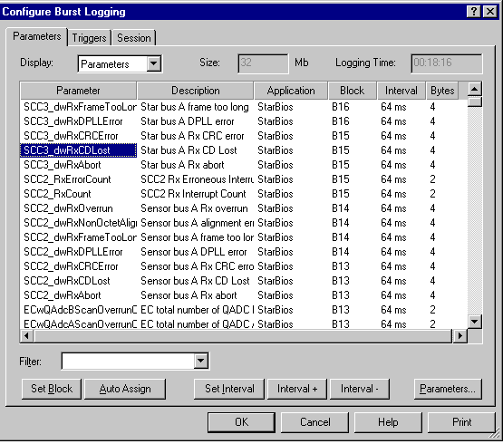
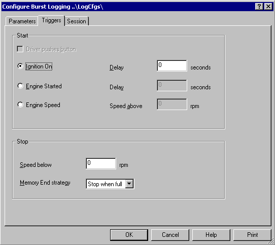

# Burst Logging

Burst Logging is the process by which an ECU stores data in Burst Memory while not connected to System Monitor. In some types of ECU, the content of the Burst Memory can be transmitted at intervals using Wide Band Telemetry. Logging menu options enable Burst Logging Configuration in the ECU.

In order to change the logging configuration in the ECU, it is necessary to download it from System Monitor. Similarly, to modify an existing logging configuration in the ECU, that configuration must first be uploaded to System Monitor. 

When ATLAS reads the data supplied by the ECU, it needs information about the Burst Logging Configuration. This information is supplied by System Monitor in a special export format that can be read by ATLAS.

To open the Burst Logging Configuration select: **Logging > Burst Configuration**.

!!! note
    If this menu item is not available, a new Burst Logging Configuration File must be created. Burst Logging Configuration is only available if the relevant Customer Base has permission, as set in **Advanced Settings**.

The dialog box consists of the following tabs:

- **Parameters** - Select the parameters to be included in the Session that is created when the contents of the Burst Memory are uploaded to ATLAS.
- **Triggers** - Set the trigger conditions to start and stop data logging.
- **Session** - Edit the characteristics of the Session that is created when the contents of the Burst Memory are uploaded to ATLAS.

## Export

When ATLAS reads the data supplied by the ECU, it needs information about the Burst Logging Configuration. This information is supplied by System Monitor in a special export format that can be read by ATLAS.

A Burst Configuration Export file is created automatically every time a Burst Logging Configuration is downloaded to an ECU. The file name is generated from the timestamp in the ECU. The file name is used by ATLAS to link the session to the configuration file so it must not be changed. The path is defined in the **Advanced Settings** dialog box - select: **Tools > Advanced Settings**.

To create a Burst Configuration Export file at any time select: **Logging > Burst Export**.

## Parameters 

Use the Parameters tab of the Configure Burst Logging Dialog to edit the characteristics of the Session that is created when the contents of the Burst Memory are uploaded to ATLAS. 

**Display Control**

The Display drop-down list determines how the Parameter List is displayed. The options are:

- **Parameters** - Shows all the selected parameters with a row for each one.
- **A Blocks** - Shows all the available A blocks with a row for each one.
- **B Blocks** - Shows all the available B blocks with a row for each one.

**Size and Logging Time Display**

The following information is displayed:

- **Size** - The size of the Logging Memory in the ECU. Taken from the ASAP file.
- **Logging Time** - The duration (in hours:minutes:seconds) of logging that will fill the memory. Calculated from the Logging Intervals and the Size of the memory.
    - When **Parameters** is selected in the Display drop-down list, logging time is calculated from the Parameter intervals.
    - When **A Blocks** or **B Blocks** is selected in the Display drop-down list, logging time is calculated from the block intervals even if the blocks do not have any parameters assigned to them.

**Parameters List**

| Column | Description |
|---|---|
| Parameter | Parameter name. Only shown when "Parameters" is selected in the Display drop-down list. This column can be hidden using the context menu. |
| Description | Parameter description. Only shown when "Parameters" is selected in the Display drop-down list. This column can be hidden. |
| Application | The Application associated with the Parameter. Only shown when "Parameters" is selected in the Display drop-down list. This column can be hidden. |
| Block | The block to which the Parameter has been assigned. '---' indicates the Parameter is not assigned to a block. |
| Interval | The sampling interval for the Parameter. When a Parameter is assigned to an empty block, the interval is set to the lowest available value. '---' indicates logging is disabled for the Parameter. |
| Bytes | The size of the Parameter in bytes. Only shown when "Parameters" is selected in the Display drop-down list. |
| Bytes Available | The space available in bytes for assigning Parameters. Only shown when "A Blocks" or "B Blocks" is selected in the Display drop-down list. |

**Adding Parameters**

Click **Parameters** to open the **Select Multiple Parameters** dialog box. Use this to add and remove Parameters. The number of Parameters that you can add depends on their type and how they are assigned to blocks.

If the list is empty when parameters are added, use **Auto Assign** to place all the Parameters in B blocks. If the list is not empty, the new Parameters are added using the following rules of precedence as the available space is filled up:

1. Same block as currently selected Parameter
2. New block of the same type (A or B) at the same interval
3. Other type of block at the same interval
4. Same type of block at higher interval
5. Other type of block at higher interval
6. Not assigned

If **A Blocks** or **B Blocks** is selected in the Display drop-down list, and one or more blocks are selected, the Parameters are assigned to the selected blocks.

**Set Block**

Opens the **Select Burst Block** dialog box. Only available if **Parameters** is selected in the Display drop-down list.

The drop-down list shows all the blocks which have sufficient space to accept the selected Parameter(s). Click OK to assign the selected Parameters to the selected block.

If “---“ is selected, the Parameter assignments are deleted and the list shows in the Block column. The Parameter is not logged.

**Auto Assign**

Opens the **Assign Burst Blocks** dialog box. Only available if **Parameters** is selected in the Display drop-down list.

The selected Parameters are assigned (in the order that they appear in the list) to the selected type of block, in numerical order of blocks.

**Set Interval**

Features:

- The interval applies to a complete Block. The intervals of Parameters that share a block with the selected Parameters are also changed.
- The interval can be set to “---“, which prevents the Parameter from being logged while retaining its block assignment.
- Set Interval only operates on Parameters that are assigned to blocks.
- If **A Blocks** or **B Blocks** is selected in the Display drop-down list, the interval is applied to the selected block or blocks. The blocks do not have to have any parameters assigned to them.
- If **A Blocks** or **B Blocks** is selected in the Display drop-down list, the interval is applied to the selected block or blocks. If multiple blocks are selected, the intervals are increased sequentially in each block in the list. The blocks do not have to have any Parameters assigned to them.

**Interval +/-**

Increases/decreases the interval of the selected Parameters to the next valid interval. This feature only operates on Parameters that are assigned to blocks and do not have an interval set to “---“.

You can also use the plus and minus keyboard equivalent keys.

## Triggers tab

Use the Triggers tab to set the trigger conditions to start and stop data logging. 

**Start Panel**

- **Driver pushes button** - When selected, logging starts when the driver presses the control button that is configured for use with data logging. The default is selected.

When **Driver pushes button** checkbox is cleared, the following options are available. Select one of the options.

- **Ignition on** - When selected, logging starts when the ignition is switched on. A delay of up to 120 seconds can be entered, to a resolution of 0.1 seconds. The default is 0.
- **Engine started** - When selected, logging starts when the engine is started. A delay of up to 120 seconds can be entered, to a resolution of 0.1 seconds. The default is 0.
- **Engine speed** - When selected, logging starts when both Engine Speed and Throttle Position have exceeded the specified thresholds. This is the default.

Enter Speed as an integer, between 0 to 20000 rpm, and Throttle position as a percentage to a resolution of 0.01%. The default for both of these is 0.

**Stop Panel**

- **Speed below** - When selected logging will stop when the engine speed has fallen below the specified threshold. Enter Speed as an integer from 0 to 20000 rpm. The default is 0.
- **Memory end strategy** - Two strategies are available:
    - **Stop when full** - Data is logged from the start trigger until either the stop trigger occurs or the ECU memory is full. This is the default.
    - **Wrap** - Data is logged from the start trigger until the stop trigger occurs. If the available memory is exceeded, new data overwrites the oldest data in the memory, so the memory always contains the most recent logged data. Use this strategy if you want to analyze data leading up to a specific event.

## Session tab

Use the Session tab to edit the characteristics of the Session that is created when the contents of the Burst Memory are uploaded or transmitted to ATLAS.

For ECUs that utilize Burst memory for Wide Band Telemetry, the following controls are available:

- **Car ID** - The car is given an ID number to distinguish it from other cars (For example, cars in the same team using the same telemetry system). The number entered here must match the ID of the car. The value is an integer from 1 to 4.
- **Transmitter** - When selected, the transmission of data via telemetry is enabled.
- **Frequency** - The value in this text box is used to set the radio frequency of the transmitter if the transmitter is software configurable. Ensure that the value is within the operating range of the transmitter.
- **Multi-Burst File** - Some versions of ATLAS can configure the retransmission of data in multi-burst telemetry. If your version of ATLAS has this facility, it will generate a Multi-Burst Coverage File (*.mbc). The coverage data is downloaded to the ECU with the Logging Configuration.

If you do not have a Multi-Burst Coverage File this field is empty.

## Blocks

The Burst Logging blocks are set up in the Parameters tab of the Burst Logging dialog box.

The hardware design imposes restrictions on the way the Logging Memory is used and on the speed of logging. System Monitor is configured to automatically apply rules regarding such restrictions. Blocks are automatically filled and any attempts to select more than the maximum number of parameters are prohibited.

The following describes the way calculations are performed.

There are two types of Parameter:

- **WORD** - Single WORD parameter: The parameter value is coded as one WORD.
- **DWORD** - Double WORD parameter: The parameter value is coded as two WORDs.

A DWORD parameter uses exactly twice as much memory as a WORD parameter, so that a given amount of memory can only accept half as many DWORD parameters as WORD parameters.

Memory is arranged in Blocks. There are two sizes of Block:

- **A Blocks** - Each A Block can contain 4 WORD size parameters, 2 DWORD parameters or a mixture of both.
- **B Blocks** - Each B Block can contain 8 WORD size parameters, 4 DWORD parameters or a mixture of both.

The number of Blocks is restricted as follows:

| Max No. of Blocks | Max No. of WORD Parameters |
|--------------------|----------------------------|
| A Blocks           | 64                         | 256 |
| B Blocks           | 64                         | 512 |

Each DWORD Parameter takes up two WORD parameter places.

The memory is ordered on data type. It is filled first with DWORD parameters then WORD parameters. For example, if 7 DWORD parameters and 5 WORD parameters are assigned to B blocks, the blocks would be filled as follows:

| DWORDS | WORDS | Empty | Total WORD Equivalent |
|--------|-------|-------|-----------------------|
| 1st Block | 4 | - | - | 8 |
| 2nd B Block | 3 | 2 | - | 8 |
| 3rd B Block | - | 3 | 5 | 8 |
| Total | 7 | 5 | | |

## Intervals

The Logging Interval for each Burst Logging block is set up in the Parameters tab of the Burst Logging dialog box.

The hardware design imposes restrictions on the way the Logging Memory is used and on the speed of logging. System Monitor is configured to automatically apply rules regarding such restrictions and automatically calculates the minimum interval.

There is a minimum logging interval (fastest logging rate) for each Block. Parameters can only be logged in complete blocks even if a block is not full. Logging is ECU time synchronous.

Each block takes 1ms to log therefore:

**Minimum interval (ms) = number of blocks with parameters assigned**

A blocks and B blocks are independent and have different minimum intervals.

If higher rate sampling is required (reduced interval) for selected parameters, the minimum interval can be increased by doing one or more of the following:

- Increase the interval of some other parameters
- Move parameters from A blocks to B blocks or from B blocks to A blocks
- Set the interval of some other parameters to “---“
- Set the block assignment of some other parameters to “---“
- Remove some other parameters

