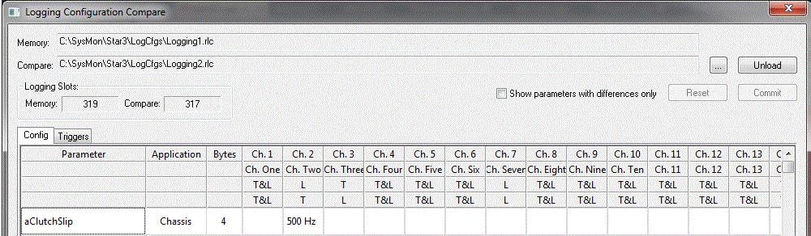
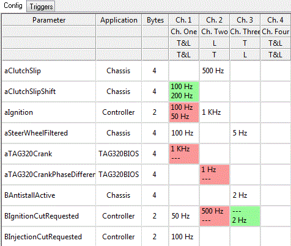
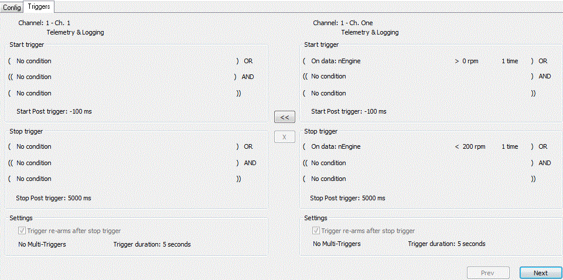

# Remote Configuration Compare

Remote Configuration Compare is the process that allows the comparison of the existing project remote logging configuration to an additional existing configuration file.

The configuration details can be compared and merged as required.

## Remote Configuration Compare Dialog

Remote Logging Compare is done in the Logging Configuration Compare dialog box. To open the dialog box, select: **Logging > Remote Configuration Compare**.

On opening, the existing project logging configuration file is displayed. To compare with an additional configuration, click the **Load** button and select the required configuration. Both files will then be displayed for comparison and merging.

### Options

- **Load**: Loads a configuration to enable comparison and merging.
- **Unload**: Unloads the compare configuration.
- **Logging Slots**: Displays the logging slots used in both the current configuration and, if loaded, the compare configuration.
- **Show parameters with differences only**: When selected, only differences between the configurations are displayed.
- **Commit**: When selected, any outstanding merging will be committed into the existing project remote logging configuration.
- **Reset**: When selected, any outstanding merging will be undone. Once committed, a merge cannot be undone.

## Config Tab

The config tab displays the differences between the parameter logging rates for the two configurations, with a color scheme used to highlight any differing rates.

The grid consists of the following columns:

- **Parameter**: The parameter name. (Can be toggled on and off via the context menu.)
- **Description**: The parameter description. (Can be toggled on and off via the context menu.)
- **Application**: The application associated with the parameter. (Can be toggled on and off via the context menu.)
- **Bytes**: The size of the parameter in bytes. (Can be toggled on and off via the context menu.)
- **Prime**: A parameter defined as a Prime Parameter in the ASAP file. Prime Parameters are logged continually in Channel 1 and cannot be disabled in that channel. An asterisk in the Prime column indicates a Prime Parameter. (Can be toggled on and off via the context menu.)
- **Channels**: The sampling frequency for the parameters on that channel.

The header displays the channel title and type for each of the configurations.

### Logging Rate Indicators

- Logging rate in secondary configuration higher than in master.
- Logging rate in secondary configuration lower than in master.
- Logging rate in secondary configuration same as in master.
- Logging rate exists in master only.
- Logging rate exists in secondary only.
- Logging rate merged from secondary into master.

To merge a value from the secondary configuration, select the appropriate cell or cells and right-click to display the merge option. The merge option is only available if there are differences between the values selected. If items within the selection are already merged, an undo option will be available.

### Merge / Undo Selections

- **Channel Title Merge**: Right-click in the first two header rows and from the menu select 'Merge Channel title into Master'. This will set the master channel title to the same as the secondary.
- **Channel Type Merge**: Right-click in the lower two header rows and from the menu select 'Merge Channel type into Master'. This will set the master channel type to the same as the secondary.
- **Row Merge**: Right-click in any header row and from the menu select 'Merge into Master'. Set the logging rates of all channels for the parameter selected to the same as the secondary.
- **Channel Merge**: Right-click in any header row and from the menu select 'Merge Channel into Master'. Set the logging rates of all parameters in the channel to the same as the secondary.
- **Cell Merge**: Select one or more cells in the grid and from the menu select 'Merge into Master'. Set the logging rates of all cells selected to the same as the secondary.

## Triggers Tab

The triggers tab displays the differences between the triggers for the two configurations.

### Merging Triggers

- **<<**: Selecting the '<<' option will merge the secondary trigger into the master. Can only be selected if a difference between the triggers exists.
- **X**: Selecting the 'X' option will undo any merge of the trigger. Can only be selected if the trigger has been merged.
- **Next**: Selecting 'Next' will cycle to the next trigger.
- **Prev**: Selecting 'Prev' will cycle to the previous trigger.

