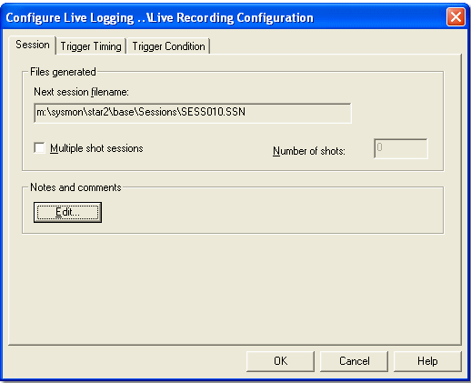
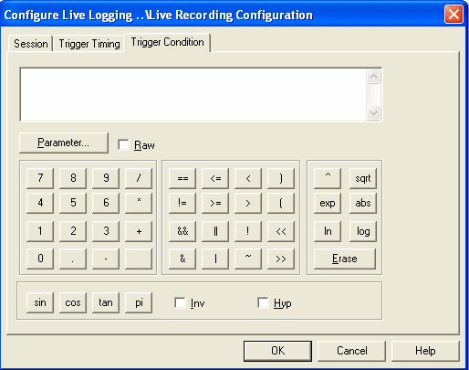

Live Logging is the process by which System Monitor obtains data from a connected ECU. The Live Logging Configuration serves two purposes in System Monitor:

- Obtains data for display in the current Desktop so it must include all the parameters that have been selected for display. If there is no Live Logging Configuration File in the Project, all the parameters are available for display.
- Selects the parameters to be included in a Session.

The live logging functionality in System Monitor captures slow row data. Therefore, to view it in ATLAS, ATLAS must be configured to display slow row parameters.

To configure Live Logging select `Logging > Live Configuration`.

### Session Tab

Use the Session tab of the Configure Live Logging dialog box to edit the characteristics of the Session that is created by System Monitor.

- **Files Generated Panel**:
  - **Next Session Filename**: Displays the name and path of the file to be created for the Session. The default filename format is `SESSnnn.SSN` (where `nnn` starts at `000` and increments with each recorded session). Files are stored in the `\Sessions\` subdirectory under the Customer Base directory, which is automatically created when you create a new project.
  - **Multiple Shot Sessions**: When enabled, records the number of sessions specified in the **Number of Shots** field. Each session is recorded automatically when trigger conditions are met, with unique filenames generated by incrementing the last three digits. When disabled, only one session is recorded when trigger conditions are met. This option has no effect if triggering is set to Manual on the Trigger Timing tab.

### Trigger Timing Tab

Use the Trigger Timing tab of the Configure Live Logging dialog box to set the size of the Session and the point in time that the trigger occurs in the data.

#### Logging Time
- The **Logging Time** is the length of time taken to log the session and is shown as Hours:Minutes:Seconds.  
- Default Logging Time: 10:00 (ten minutes).

#### Mode panel
Select where the trigger appears in the recorded session data:

- **Manual** — The trigger is not used.
- **Start Logging** — The session starts when the Trigger Condition is TRUE and ends when the Logging Time has elapsed.
- **Stop Logging** — The session ends when the Trigger Condition is TRUE; the session length is defined by the Logging Time.
- **Pre and Post** — Partition the Logging Time into a Pre-trigger period and a Post-trigger period:
  - Use the **Pre trigger time** and **Post trigger time** text boxes to set the durations, or adjust the slider between them to automatically partition the Logging Time.
  - If editing the text boxes directly, ensure Pre + Post = Logging Time.
  - The slider provides a quick visual partition; the text boxes allow precise control.

#### Disk Space in bytes panel
The panel displays read-only information about storage for the session:

- **Required** — Amount of disk space required to store the session, calculated from Logging Time, enabled parameters and their sampling intervals.
- **Free** — Amount of free space available at the session storage location.

!!! note
    To capture data before the trigger condition is met, System Monitor continuously acquires data into a buffer sized to hold all data for the entire Logging Time so that pre-trigger data can be written when the trigger occurs.

### Trigger Condition Tab

Use the Trigger Condition tab of the Configure Live Logging dialog box to define the condition that acts as a trigger for the recording of the Session. A session is recorded according to the settings in the Trigger Timing tab. The trigger condition is a logical formula created from one or more Measurement Parameters combined by Mathematical Operators.

Live Logging can record a Session in two ways:

- Manual — Manual is selected as the Mode in the Trigger Timing tab.
- Automatic — A Trigger is selected as the Mode in the Trigger Timing tab.

The Status Bar indicates the status of recording as follows:

- **Recording OFF** — The Session is not being recorded.
- **Recording ON** — The Session is being recorded.
- **Trigger Pending** — Waiting for the trigger condition to become TRUE.

Make an Automatic Recording:

1. Select a Trigger as the Mode in the `Trigger Timing` tab.
2. Close the Live Logging Configuration dialog box.
3. Select `Logging > Trigger Enable`.
4. Select `ECU > On Line` to put the ECU On-Line.
5. Recording starts and stops automatically according to the settings in the `Trigger Timing` tab.

Recording can also be stopped by selecting `Logging > Recording` or by taking the ECU Off-Line.