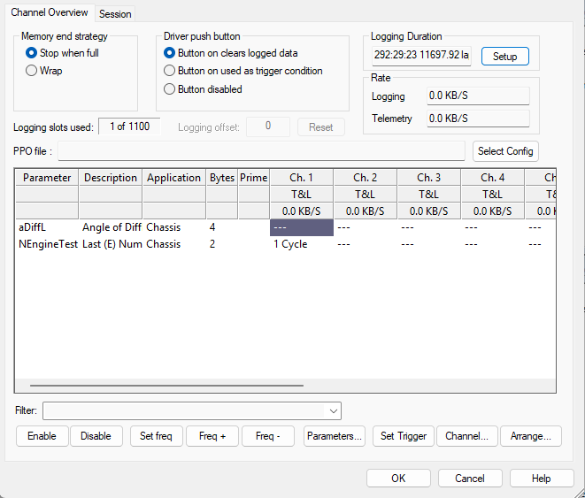
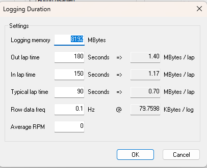
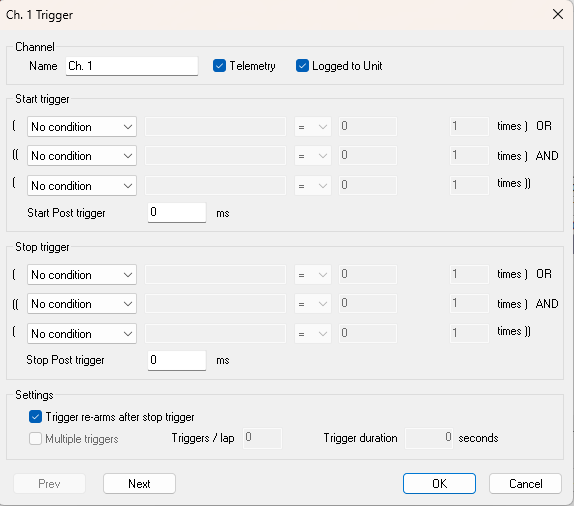
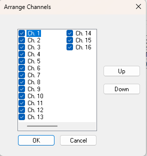
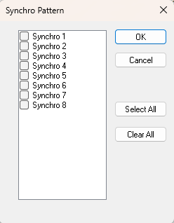

Remote Logging is the process by which an ECU, stores data in DATALab Memory while not connected to System Monitor.

System Monitor can be used to edit the logging configuration in the ECU. To do this it is necessary to download the logging configuration from System Monitor. Similarly, to modify an existing logging configuration in the ECU, that configuration must first be uploaded to System Monitor.

Remote Logging Configuration is done in the Configure Remote Logging dialog box. To open the dialog box, select: `Logging > Remote Configuration`.

### Configure Remote Logging Dialog

Use the Configure Remote Logging dialog box to define the characteristics of the channels used to store data in the ECU. Click the information icons for context-sensitive help on the various elements of the dialog.



#### Memory end strategy panel
The Memory end strategy applies to all channels. Two strategies are available:

- **Stop when full** — Data is logged from the start trigger until either the stop trigger occurs or the ECU memory is full.
- **Wrap** — Data is logged from the start trigger until the stop trigger occurs. If the available memory is exceeded, new data overwrites the oldest data in memory so the memory always contains the most recent logged data. Use this strategy to analyse data leading up to a specific event.

#### Driver push button panel
Driver push buttons (dash or steering-wheel mounted) can be configured as either a trigger condition or to clear the ECU data logging memory. Options:

- **Button on clears logged data** — Pressing the driver push button clears the ECU data logging memory. If this option is used on the Channel Trigger dialog for any channel, that portion of the trigger condition will not operate.
- **Button on used as a trigger condition** — The driver push button is available as a trigger input for Channel Trigger conditions.
- **Button disabled** — The driver push button has no effect. If this option is used on the Channel Trigger dialog for any channel, that portion of the trigger condition will not operate.

#### Logging duration and rate
- The remote logging session duration is displayed on the Logging Duration panel as Hours:Minutes:Seconds and as a number of laps. The calculation is based on the sample rates of all enabled parameters across all channels and the settings in the Logging Duration dialog. Click `Setup` to open the Logging Duration dialog.
- The Logging and Telemetry displays indicate the required update rate for all channels. These values are calculated from the number of enabled parameters across all channels and their individual update frequencies.

#### Channel properties and configuration
- Remote Logging Configuration targets the DATALab logging system. DATALab provides eight channels that can be configured independently.
- Add parameters using `Parameters` to open the Select Parameters dialog. Maximum parameters allowed: 512. The number currently loaded is shown by the Logging slots used value.
- Each parameter is available on all eight channels. When a parameter is added it is disabled by default; to log it you must set a sampling frequency.
- The same parameter can be logged at different frequencies on different channels so it can be sampled at different rates under different conditions (each channel may have a different trigger). In ATLAS, parameter data from different channels can be combined to achieve better resolution.

| Column | Description |
|--------|-------------|
| **Parameter** | The parameter name. |
| **Description** | The parameter description. |
| **Application** | The application associated with the parameter. |
| **Bytes** | Size of the parameter in bytes. |
| **Prime** | Prime parameters are defined in the ASAP file. Prime parameters are logged continually in Channel 1 and cannot be disabled in that channel. An asterisk in the Prime column indicates a Prime parameter. Note: The Parameter, Description, Application and Prime columns can be toggled on and off using context menu commands. |
| **Channels** | Sampling frequency for the parameter on that channel. `---` indicates logging is disabled for the parameter in that channel. Note: If a cell background is red, the selected frequency is higher than the maximum refresh rate of the parameter. |

#### Context menu commands
With one or more cells selected, these context menu commands are available:

- **Frequency** — Sub-menu to select a logging frequency for the selected parameter cells.
- **Cycle** — Log the selected parameter once per engine cycle. Cells affected display `1 Cycle`.
- **Engine Segment** — Opens the Synchro Pattern dialog to select which engine segments to log the selected parameter. Cells affected display `<Seg>`.

#### Controls
Control buttons apply to the currently selected cell(s). With multiple cells selected you can apply a command to:

- **Row** — e.g., enable a parameter in all 8 channels.
- **Column** — e.g., set the same frequency for all parameters in a channel.
- **Block** — e.g., enable parameters in a subset of channels.

Selection:

- Select multiple cells by click-and-drag or with keyboard arrow keys.
- To select all channels for a parameter, click the parameter name in the Parameter column.

| Button          | Behavior                                                                                                           |
|-----------------|--------------------------------------------------------------------------------------------------------------------|
| **Enable**      | Enables the selected parameters in the selected channels. If a frequency was previously set it is reinstated; if the parameter was previously disabled the frequency is set to 100 Hz. |
| **Disable**     | Disables the selected parameters in the selected channels. The DELETE key has the same effect.                     |
| **Set freq**    | Opens the Set Uniform Frequency dialog. Set the sampling frequency for the selected parameters in the selected channels. |
| **Freq +/-**    | Increases/decreases the frequency of selected parameters in the selected channels to the next valid frequency. If the parameter is disabled in that channel the previous value is recalled and increased/decreased. If no prior value was set, the default of 100 Hz is assumed and adjusted. Keyboard shortcuts: `+` and `-`. |
| **Set Trigger** | Opens the Channel Trigger dialog where start and stop triggers for the selected channel are defined.               |
| **Channel**     | Opens the Channel dialog for the selected channel. Use this to edit the channel name and select whether the channel is used for Telemetry, logging to the unit, or both. |
| **Arrange**     | Opens the Arrange Channels dialog. Use this to select which channels are logged and change the channel order in the grid. |
| **Row example** | Enable a parameter in all 8 channels.                                                                              |
| **Column example** | Set the same frequency for all parameters in one channel.                                                        |
| **Block example** | Enable parameters in a contiguous subset of channels.                                                            |

### Remote Logging - Duration

System Monitor calculates the duration of the Remote Logging session and displays it on the Channel Overview tab in hours:minutes:seconds and number of laps. The calculation is based on the sample rates of all enabled parameters in all channels and information set in the Logging Duration dialog.



To open the Logging Duration dialog, click `Setup` in the Configure Remote Logging dialog.

!!! note
    These settings are only used for calculating the Logging Duration display; they do not affect the logging configuration.

#### Logging Duration Settings

- **Logging Memory** — Size of the memory available for logging.
- **Out Lap time** — Estimated duration of the out lap in seconds. One out lap is included in the Duration display. The right-hand value shows the volume of memory required to log data for that time period.
- **In lap time** — Estimated duration of the in lap in seconds. One in lap is included in the Duration display. The right-hand value shows the volume of memory required to log data for that time period.
- **Typical lap time** — Estimated typical duration of a flying lap in seconds. This value is used to calculate the number of laps shown in the Duration display.
- **Row data freq** — Average sample rate of Row data. The right-hand value shows the volume of memory required to log Row data for the entire session. This value is subtracted from the memory available for configured logging.
- **Average RPM** — Estimated average RPM.

The Duration calculation can allow for channels in which sampling is not continuous. 

### Remote Logging - Channel Trigger

Use the Channel Trigger dialog to define the start and stop triggers for a channel. To open the dialog, click `Set Trigger` on the Channel Overview tab of the Configure Remote Logging dialog.



#### Start and Stop Trigger Panels

The Start and Stop triggers both have the same format, consisting of three conditions with the following relationship:

```
Condition 1 OR (Condition 2 AND Condition 3)
```

#### Condition Options

Each condition is defined by a row. The left-hand drop-down list has the following condition options:

- **On data** — When selected, the Select Trigger Parameter dialog opens to enable parameter selection. Only parameters included in the current Remote Logging Configuration are available for selection. Selecting On data enables the other fields in the row.
- **Driver push button** — The condition is TRUE when the driver presses the button. For this condition to work, the Driver push button option on the Remote Logging - Channel Overview tab must be set to **Button on used as a trigger condition**.
- **Ignition on** — The condition is TRUE when the engine ignition is switched on.
- **Lap trigger** — The condition is TRUE when the ECU receives a signal from the Lap Trigger.
- **No condition** — Fixed at FALSE for Condition 1 and TRUE for Condition 2 and Condition 3. This ensures that selecting No Condition does not override the other conditions.

#### On Data Settings

When **On Data** is selected as a condition, all fields are enabled:

- **Name** — The name of the selected parameter.
- **Comparison Operator** — Select the operator from the drop-down list:
  - `=` — The condition is TRUE when the parameter value exactly equals the test value.
  - `<` — The condition is TRUE when the parameter value is less than the test value.
  - `>` — The condition is TRUE when the parameter value is greater than the test value.
- **Test Value** — Enter the test value. Parameter units are shown next to this field where appropriate.
- **Condition repeat** — This field is enabled for all condition types. Enter the number of times the condition must occur before it is considered TRUE. The default is 1.

#### Start/Stop Post Trigger

The effect of the trigger is delayed by the time (in milliseconds) set in the Start/Stop Post Trigger text boxes. The default is 0. Entering a negative value enables a pre-trigger delay.

#### Settings Panel

- **Trigger re-arms after stop trigger** — When enabled, a set of data will be logged every time the trigger conditions are met. When disabled, only one set of data will be logged.
- **Multiple triggers** — Calculates the Duration shown on the Channel Overview tab. This setting does not affect the logging configuration. When enabled, the **Triggers/lap** and **Trigger duration** settings are used to estimate the time required to log the data. When disabled, the duration is calculated assuming continuous parameter logging.
- **Triggers/lap** — Estimate of the expected number of times the trigger will be activated in each lap.
- **Trigger duration** — Estimate of the average length of time that data will be logged each time the trigger is activated.

### Arrange Channels

The Arrange Channels dialog controls which channels are used for logging and the order in which they are displayed in the Configure Remote Logging dialog.



To disable a logging channel, select the check box adjacent to the channel name and click `OK`. The channel column is removed from the Configure Remote Logging dialog.

To change the order in which channels are displayed, select a channel and click `Up` or `Down` to move it up or down the channel list. Click `OK`. The channel columns are rearranged in the Configure Remote Logging dialog accordingly.

### Synchro Pattern

The Synchro Pattern dialog determines which engine segments a parameter is logged in.



To open the Synchro Pattern dialog, select `Engine Segment` from the Configure Remote Logging dialog.

The selections apply to the parameters selected in the Configure Remote Logging dialog. Select which segments to log by selecting the appropriate check boxes.
