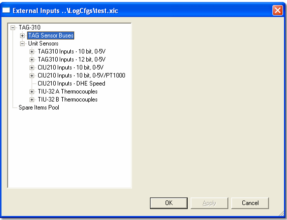
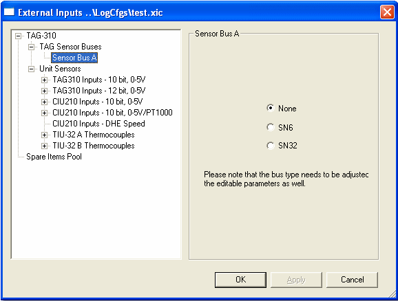
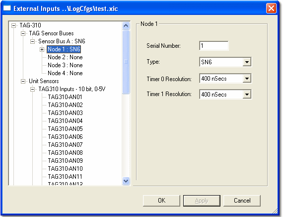
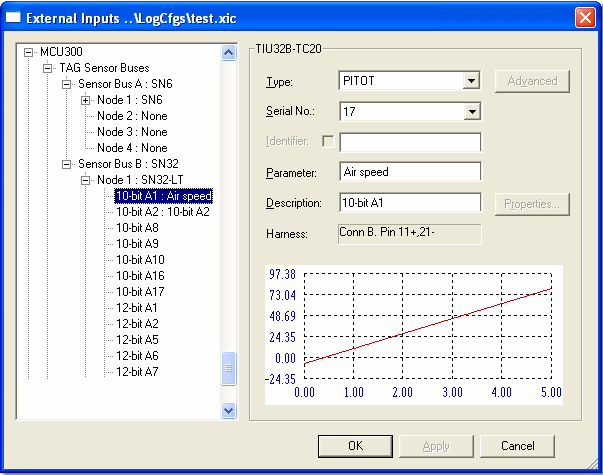
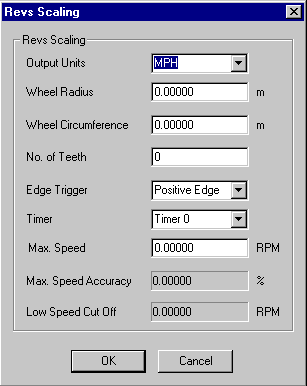
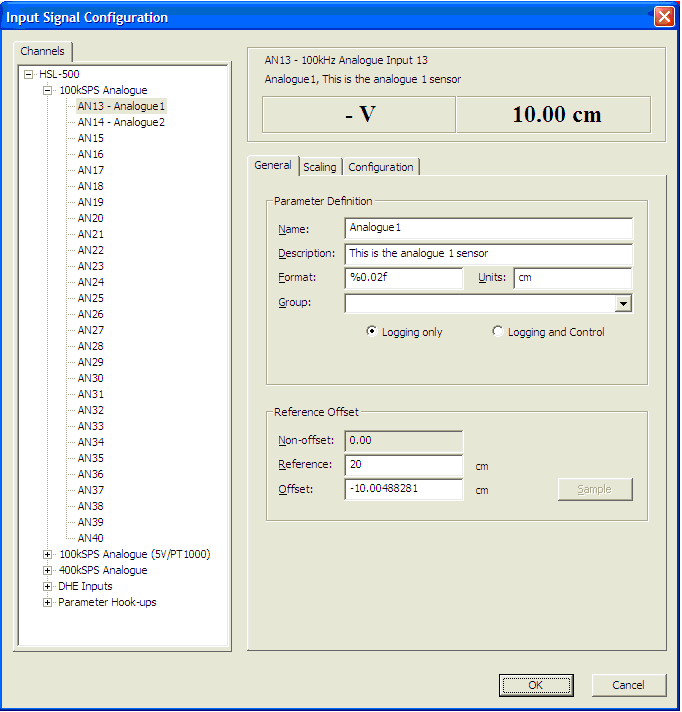

# External Inputs Configuration

The External Inputs Configuration Tool allows sensor inputs to be configured and calibration data to be applied to sensors connected to the ECU.

External Inputs Configuration operates on sensors that are not defined in the Program Version. Use Sensors & Actuators Tool for sensors and actuators that are defined in the Program Version. It is also used to configure systems using communication links such as TAG Sensor Bus or CAN.

To open the External Inputs Configuration Tool, select: **Sensors > External Inputs Configuration**.

!!! note
    If this menu item is not available, select: **File > New** and then select **External Inputs Config** from the list of documents in the File New dialog box. External Inputs Configuration is only available if the relevant Customer Base has permission, as set in Customer Base Advanced Settings.

## Prerequisites

To change the External Inputs configuration in the ECU, you must download it from System Monitor. To modify an existing External Inputs configuration in the ECU, that configuration must first be uploaded to System Monitor. 

The External Inputs parameters are shown in the Parameter Explorer. The **Parameter Properties - Sensor** tab shows information about the external inputs configuration for the selected sensor.

## Configuration Steps

To configure a DATALab system repeat these steps as required until the system is fully configured. The configuration can then be sent to the ECU and/or saved as a file.

### Select An Input Source

The left-hand side of the dialog box displays the sensor inputs to the unit. The type of unit is shown at the top with the input sources listed below it. System Monitor only shows the input sources that are available for the unit.

TAGtronic data loggers and ECUs can accept input from the following sources:

- **TAG Sensor Bus** - The communication link in the DATALab system.
- **CAN Link** - A serial data communication protocol. 
- **Unit Sensors** - Sensors which are connected directly to the unit. 

### Select a Bus

To select a bus:

1. Expand the **TAG Sensor Bus** item by clicking the expand icon.
2. Click on the **Bus** (or Loom) to configure.
3. Select the type of Sensor Node to configure by selecting **None**, **SN-6**, or **SN-32**.
4. Click **Apply** to accept the configuration.
5. The tree structure expands to allow you to select a Node.

### Select a Node

After you have selected a Bus, the tree structure expands to allow a Node to be selected.

To select a node:

1. Select the **Node** that you want to configure in the left-hand pane.
2. Enter the address of the Node in the **Serial Number** text box in the Node panel. The address is set by hardware and is printed on a label on the case of the sensor node.

    > **Caution:** An address of 0 means that the node is not connected and cannot be configured. If you change the address of a configured node to 0, all its settings are lost without warning.

3. Select the type of Sensor Node from the **Type** drop-down list. There is only one type of SN-6. 
4. Click **Apply** to accept the configuration.

The node in the tree structure expands and the **Timer Resolution** boxes appear.

5. Select the **Timer Resolution** from the drop-down lists. Timer resolution is used for pulsed speed sensors. Two timer resolutions are available. The range is from 400 nSecs to 51.2 µSecs, doubling with each step. The default is 400 nSecs.

### Add a Sensor

After you have selected a Node, sensors can be added to it.

The tree structure shows the configuration of sensor inputs to the unit.

To add a sensor to the system:

1. Expand the **Node** where you want to add the sensor by clicking the expand icon. If you want to connect directly to the unit, expand **Unit Sensors**.
2. Select the sensor location by clicking on it. 
3. Select the **Type** of sensor from the **Type** drop-down list. The list is taken from the Sensors.ini file. Some locations are only suitable for particular types of sensor. The list only shows those sensors which are suitable for the location. The **Harness** text box shows the pin and socket to which the sensor must be connected.

    > **Note:** Speed sensors (Hall effect or Inductive) require further scaling. For these sensors, the **Advanced** button is enabled. Click this to open the **Revs Scaling** dialog box.

4. Select the serial number of the sensor from the **Serial No.** list. For Software Calibrated Sensors, this associates the appropriate calibration data with the sensor. The calibration data is shown graphically. For other sensors, select zero. If no serial numbers are available, the box is grey and a serial number of zero is assumed.

    > **Note:** A serial number can also be assigned to a sensor by Sensors & Actuators. This is not linked to the External Inputs Configuration, so you will not be prevented from using the serial number more than once.

5. Enter the **Name** to be used for the Measurement Parameter generated by the sensor in the **Parameter** text box. The **Identifier** is fixed by the location of the sensor in the DATALab configuration and cannot be edited.
6. Enter the **Description** to be used for the Measurement Parameter generated by the sensor in the **Description** text box.
7. Click **Properties** to open the **Parameter Properties** dialog box. The Parameter Properties are the same as for a Measurement Parameter but more attributes can be edited.
8. To add another sensor, click on the appropriate location on the tree diagram and repeat from step 3.

    > **Note:** To select a different Node or Bus to configure, click on the appropriate location on the tree diagram.

9. When you have finished adding and configuring sensors, click **OK**.

The changes made are accepted and a Measurement Parameter is added to the External Inputs Parameters Group for each newly added sensor (the Group is created if it doesn't already exist).

A message box opens asking whether to download the configuration. If you select **No**, the configuration is retained in the project and may be saved or downloaded at another time using the **External Inputs Download** command on the Logging Menu.

## Speed Sensor Scaling

The **Revs Scaling** dialog box is opened for Inductive and Hall Effect sensor types by clicking **Advanced** on the **External Inputs Configuration** dialog box when a Sensor is being added.

Speed sensors provide a pulse signal when they sense the movement of a piece of ferrous metal. This signal is usually caused by the rotation of a toothed wheel, and the output of the sensor is converted to a road speed or revolution value.

Use the **Revs Scaling** dialog box to configure the conversion of the sensor output to give the desired parameter.

### Configuration Options

**Output Units** - Select the units that you want the sensor output scaled to:

- **MPH** - Road speed in miles per hour (default)
- **KPH** - Road speed in kilometres per hour
- **RPM** - Engine speed in revolutions per minute
- **Hz** - Frequency in hertz (cycles per second)
- **µSecs** - Time interval in microseconds

**Wheel Radius/Circumference** - For MPH and KPH scaling only. Enter the size of the wheel in metres. Entering a value in one field automatically recalculates the other. For example, the circumference value is updated if a value for a radius is entered. The Radius value must be non-zero.

**No. of Teeth** - Enter the number of teeth on the wheel. Automatically set to 1 if the Output Units are Hz and 0 if the units are µSecs. For MPH, KPH, or RPM, the value must be non-zero.

**Edge Trigger** - Choose which edge of the sensor signal will trigger the timing pulse:

- **Positive Edge** - The trigger detects a rising voltage (default)
- **Negative Edge** - The trigger detects a falling voltage

**Timer** - Select the Timer from the drop-down list. The default is Timer 0. The Timer Resolution is set when you [Select a Node](#).

**Max. Speed** - A nominal maximum speed can be entered. This is optional.

**Max. Speed Accuracy / Low Speed Cut Off** - If a Max. Speed has been entered, System Monitor calculates the Max. Speed Accuracy and Low Speed Cut Off from the Timer Resolution and the Number of Teeth. These are read-only items.

## Input Signal Configuration Tool

To open the Input Signal Configuration Tool, select: **Logging > Input Signal Configuration**.

The Input Signal Configuration Tool provides the ability to configure analogue and digital input signals from MESL units. This tool enables you to:

- Manually configure analogue and digital input signals
- Sample the signal/sensor's transfer function
- Export an input configuration to file
- Import an input configuration from file
- Recalculate the offset
- Obtain an overview of how all inputs are configured
- Manage the Input Scaling regime
- Manage the Hardware and Filter configuration

**Scaling Methods**

The tool supports the following scaling methods:

- Interpolation Table
- Look-up Table
- Gain and Offset
- High and Low Sample Points
- Extrapolation
- Rotational
- Wheel Speed (Metric)
- Wheel Speed (US)

When you click the **OK** button in the dialog, all modifications are accepted and written to the data version file, which must be downloaded to the unit for the modifications to be applied.

If you have re-sampled one or more signals, the logging configuration file containing these modifications must also be downloaded to the unit. The status of both files (data version and remote logging configuration) can be viewed in the ECU Bar Display.

Within the System Monitor Parameter Explorer, all scaled measurement parameters are grouped in a new top-level menu called **Input Signals**. These parameters also appear in an **Input Signals** group within ATLAS logged data.

**Context Menu**

By right-clicking the explorer tree on either a group node or an individual input signal, you are given the following options:

- **Import Signal** - Exports the selected signal properties to a CSV file.
- **Export Signal** - Imports the selected signal properties from a CSV file.
- **Clear Signal** - Clears the selected signal, resetting all values to 0.

If you right-click the group header node (for example, **AN01-AN12(400kSPS)**), the same context menu appears; however, the selected action will be performed for all signals in that group.