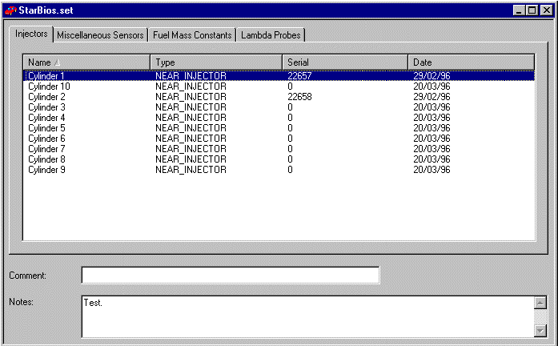
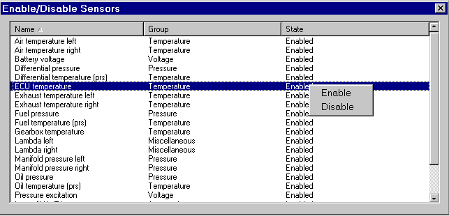

# Sensors & Actuators

Sensors & Actuators allows you to apply calibration data to sensors, enable and disable individual sensors, and enter values for sensor constants. It operates on sensors and actuators defined in the Program Version.

!!! note
    - Sensors & Actuators is available only if the relevant Customer Base has permission (set in Customer Base Advanced Settings).
    - Use External Inputs Configuration for sensors that are not defined in the Program Version.

## Sensor Sets

Sensor sets are files containing the sensor and actuator data. They are stored in the `\SenSets\` sub-directory of the Multi-Application Base.

When a Sensor Set is opened (File > Open) the Sensors & Actuators dialog box for the Sensor set is opened and the set is associated with the Project.

### Creating new Sensor Sets

- To create a new sensor set select: File > New.  
    The Sensor Set Upload command automatically creates a new sensor set file if there is not already one associated with the Project.

!!! note
    The new file only contains sensor data for the Active Applications. Ensure that you make the appropriate applications active before creating a new sensor set file.

Default name for a new sensor set:

- `XXXXXnnn.set`, where:
    - `XXXXX` — first five characters of the Application Name, or `Calib` if more than one application is active.
    - `nnn` — a three-digit hex number, starting with `001`, incremented whenever a new sensor set file is saved.

### Saving Sensor Sets

- If changes are made to the sensor data (including uploading from the ECU), you will be prompted to save the sensor set when you close the Sensors & Actuators dialog box.
- To save under a different name: File > Save As.

!!! note
    To see which Sensor Set files are in use and to upload or download files, use the Unit Status command in the Tools menu.

## Sensors & Actuators dialog box

The dialog box is opened by one of the following actions:

- Opening an existing Sensor Set (File > Open or Sensors > Open Sensor Set).
- Uploading an existing Sensor Set (Sensors > Sensor Set Upload).
- Creating a new Sensor.Set file (File > New).

The dialog box is opened for a single Sensor set. The Sensor.Set file name is shown in the title bar.

A Sensor set links each sensor and actuator connected to an ECU to its calibration data. The `Sensors.ini` file lists the sensors and actuators connected to the ECU and defines on which tab they are placed in the Sensors & Actuators dialog box. Tab allocation is arbitrary and is not linked to the Groups described in Names, Descriptions & Groups.

Each tab has the following columns:

- Name — allocated to the sensor by the `Sensors.ini` file.  
    Note: This name is not linked to the Name or Description of the Measurement Parameter that the sensor generates.
- Type — allocated to the sensor by the `Sensors.ini` file. More than one sensor can be of the same Type.  
    Note: This Type is not the same as the Type described in Names, Descriptions & Groups.
- Serial — each TAGtronic sensor is unique and individually calibrated. To ensure correct calibration data is used, the serial number in this column must match the serial number of the device.
    - If the serial number is shown as `0`, a default set of calibration data is used.
    - If the serial number is shown as `<none>`, System Monitor was unable to find a default set of calibration data. If there are also no numbers in the drop-down list, the `.dat` file was most likely not found.
- Date — the date that the sensor type was calibrated as defined in the `.dat` file.
- Status — general comment about the sensor (for example, “Passed Inspection”).

!!! tip
    - The Notes text area allows up to 238 characters to be entered, which are stored in the ECU. (If Unicode ASCII format is used, only 119 characters may be entered.)
    - To print the information in the dialog box: File > Print while the box has focus.

## Sensors & Actuators — Serial Numbers

Assign calibration data to sensors or actuators:

1. Open the Sensors & Actuators dialog box.
2. Select the tab on which the device is listed.
3. Select the row for the device. If you select more than one row (using CTRL or SHIFT), you can automatically assign sequential serial numbers.
4. Click the cell in the Serial column for that row to open a text box. To open the text box with the keyboard, type any number. To assign sequential serial numbers to multiple devices, type any number to open a text box for the top row of the selection.
5. Select a serial number from the drop-down list. It is recommended to use the drop-down list rather than entering a serial number manually, as it only includes valid numbers for calibrated sensors. Uncalibrated sensors may be given any serial number.
    - When the text box is open, use the UP and DOWN cursor keys to select a number.
6. Accept the selected serial number by pressing ENTER or double-clicking the number. To leave the row without changing the value, press ESC or click another row.
    - If more than one row is selected: the first item is assigned the chosen serial number and each subsequent item receives a number one higher (if available). If a serial number is not available, `0` is assigned to that device. If `0` is entered for the first device, all selected devices are assigned `0`.
    - A serial number can only be assigned to one sensor of a given Type. If you choose a serial number that is already assigned to another sensor, the following warning is displayed:
        - `image\S_A_Serial_Warning.gif`
        - Select YES to assign the serial number to the newly selected sensor; the previously assigned sensor will be assigned a serial number of `0`.
        - Select NO to assign a serial number of `0` to the newly selected sensor; the previously assigned sensor retains its number.
> **Note:**
>    - A serial number can also be assigned by the External Inputs Configuration. This is not linked to Sensors & Actuators, so you will not be prevented from using the serial number more than once.
>    - Injectors have a further Class characteristic. The Class is associated with the serial number. System Monitor ensures that injectors of the same Type also have the same Class.

7. Repeat from step 1 until all allocations are complete.
8. Save the file.
9. Use Download on the Sensors & Actuators sub-menu of the Tools menu to send the changes to the ECU.

## Sensor and Actuator Constants

Some sensor types require one or more constant values to be entered to complete their calibration. Constants can be placed on any tab in the Sensors & Actuators dialog box and may be mixed with sensor descriptions. For clarity, constants are usually placed on a separate tab.

Assign a value to a constant:

1. Select the row for the constant.
2. Enter the value. A text box opens automatically. The Edit Context Menu becomes available.
3. To accept the value, click another row or press ENTER. To leave the row without changing the value, press ESC.

The data on the Constants tab is part of the Sensor set data. It is sent to, and obtained from, the ECU with the sensor set data.

## Enabling and Disabling Sensors and Actuators

The Enable/Disable Sensors dialog box lists all Sensors and Actuators which can be enabled and disabled by System Monitor. The `Sensor Enable/Disable.ini` file defines these sensors and actuators; they do not have to be the same as those listed in the Sensors file.

To open the dialog box: Sensors > Enable/Disable.

- The list can be sorted by Name or Group. Names and Groups are taken from the Enable/Disable file and are not the same as the names and groups in the Sensors & Actuators dialog box.
- Enable/Disable Sensors only operates on a connected ECU and its settings are not saved in the Sensor Set files. When an ECU is connected, the State column shows whether each sensor or actuator is enabled or disabled.

Change the state of a sensor:

1. Select the row for the device by clicking or by using the UP and DOWN cursor keys. To select multiple rows, use CTRL or SHIFT in conjunction with the mouse or the Space Bar.
2. Right-click and select Enable or Disable from the Context menu.

- A message is sent to the ECU to enable or disable the sensor. When the change has been made, the State column updates to confirm the new status.

!!! note
    Pressing ENTER toggles the status of the selected sensors between Enable and Disable without using the Context menu.

- Disabling a sensor makes a change in the ECU memory that prevents the output of the sensor from being used in any way. The logging of a sensor can be switched off without disabling it if required.
