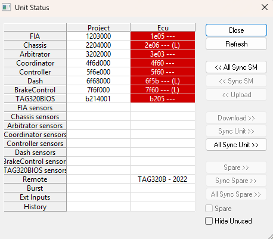
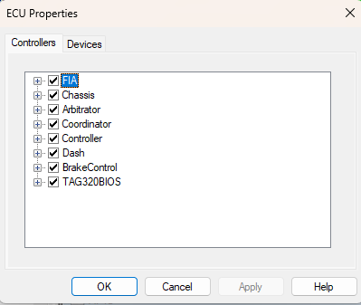
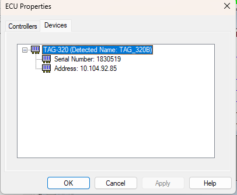
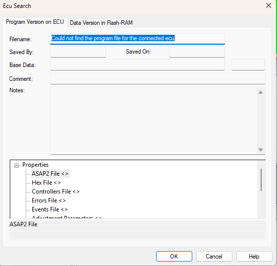
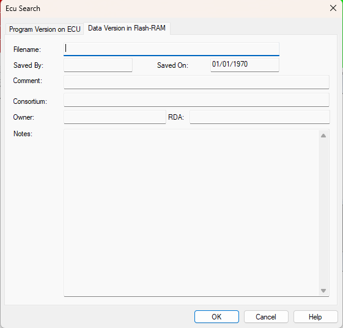

# Diagnostics & Status

This section covers tools and views that help users inspect ECU status, synchronize files, and verify program and data versions.

## Unit Status

The Unit Status dialog box indicates which files have been loaded into the Edit Buffer and the unit, and is used to synchronize the two. The dialog box is resizable and the column widths are editable.

To open the dialog box, select: **Tools > Unit Status**. To select more than one cell, use the SHIFT and CTRL keys.



### Columns

| Column   | Description                                                                 |
|----------|-----------------------------------------------------------------------------|
| **Project** | Information about the files currently loaded into System Monitor.         |
| **ECU**     | Information about the files currently loaded into the Main unit.          |
| **Spare**   | Information about the files currently loaded into the Spare unit. This column is only shown if the Spare check box is selected. |

### Rows

| Row            | Description                                                                                                           |
|--------------------|-----------------------------------------------------------------------------------------------------------------------|
| **Data Versions**   | For each Application.                                                                                                 |
| **Sensor Sets**     | Allows you to apply calibration data to sensors, enable and disable individual sensors, and enter values for sensor constants. |
| **Configurations**  | The Remote logging, Burst logging, and External Inputs configurations are stored in and used by an ECU when it is working independently of System Monitor. |
| **History**         | During its operation, the ECU generates various statistics about the operation of the vehicle that it is controlling.  |

### Cell Colours

The background colours of the cells indicate the following:

- **White** - Unit contains the same information as in System Monitor.
- **Red** - Unit contains a different program or data version from the one in System Monitor.
- **Orange** - Unit contains the same program and data version but different Live Tunes.
- **Blue** - Unit contains a different configuration (sensor set, remote logging, burst logging, external inputs, history report).
- **Yellow** - Selected cell. A summary of the file history is displayed at the bottom of the dialog box for the selected cell.

### Other Symbols

The following symbols may also appear:

- `(*)` - The data has been modified and not yet saved.
- `?` - System Monitor is unable to obtain the information from the ECU.
- `(L)` - DTV has been locked with standard RDA.
- `(L2)` - DTV has been locked with enhanced RDA2.

### Controls

With a cell or cells selected, the following commands are available:

- **Refresh** - Updates the display.
- **<<All Sync SM** - Synchronize System Monitor files to match all files in the ECU or Spare columns. This command is the same as selecting all cells in the ECU or Spare columns and clicking <<Sync SM.
- **<<Sync SM** - Synchronize System Monitor files to match those specified for cells selected in the ECU or Spare column. The specified files are opened in System Monitor, replacing those that are already open. If a file cannot be found, a new file is created using the filename and modification information taken from the unit. Uploads data and places it in the Edit Buffer. Files and data that are the same as already in System Monitor are not uploaded.
- **<<Upload** - Upload information for cells selected in the ECU or Spare column and place it in the Edit Buffer. If the Program or Data versions are different, the upload is aborted.
- **Download>>** - Download the information for cells selected in the Project column to the main unit. Only downloads data that is not the same as already in System Monitor. For Data Versions, runs Force Complete Reprogram before downloading data.
- **Sync Unit>>** - Synchronize the information in the main unit with the data in the Edit Buffer. This command only applies to cells selected in the Project column. If the Program or Data versions are different, runs Reprogram Unit then Download Data Changes. Configuration files that are the same as already in System Monitor are not downloaded.
- **All Sync Unit>>** - Synchronize all files in the main unit with the data in the Edit Buffer. This command is the same as selecting all cells in the Project column and clicking Sync Unit.
- **Spare>>** - As Download>> but sends information to the Spare unit. Only available when the Spare column is displayed.
- **Sync Spare>>** - As Sync Unit>> but sends information to the Spare unit. Only available when the Spare column is displayed.
- **All Sync Spare>>** - As All Sync Unit>> but sends information to the Spare unit.
- **Spare** - When this check box is selected, the Spare column is displayed. Only available if a Spare Unit has been configured.

## ECU Properties - Controllers

The Controllers tab of the ECU Properties dialog box allows controllers within the ECU to be viewed and enabled/disabled.



All the Applications are shown in a list. Click the expand icon to see the controllers connected to an Application. The check box beside the controller indicates its status. When selected, the controller is connected to the application and responds to reprogramming, tuning, and monitoring. When cleared, the controller is disconnected from the application and does not respond.

Controllers are connected or disconnected by selecting or clearing the check box for the Application. If an Application is connected to some, but not all, of the controllers, its check box is greyed out.

## ECU Properties – Devices

The Devices tab of the ECU Properties dialog box displays information about the ECU hardware.



Each unit is shown in the following format:

```
aaaaa (Detected Name: bbbbb)
```

Where `aaaaa` is the type of ECU as specified in the Program Version, and `bbbbb` is the type of ECU as detected by interrogating the unit (should be the same as `aaaaa`).

Click the expand icon to see the following:

- **Serial Number** - The serial number of the ECU as detected by interrogating the unit.
- **Address** - The IP Address of the ECU as defined in Unit Definition.

## ECU Search

The ECU Bar displays Data Version information for all Applications. ECU Search provides more detail about the Program and Data Version Files loaded into the ECU.

To initiate an ECU search, select: **ECU > Search for Versions**.

Following Application selection in the **Select an Application** dialog box, the ECU Search dialog box opens. The ECU Search dialog box consists of the following tabs:

### Program Version on ECU

The Program Version tab of the ECU Search dialog box displays the Filename, Saved By, Saved On, Comment, and Notes information for the Program version on the ECU. The files used to create the Program version are shown in the Properties list. The file name of the original Data version, generated when the Program Version was created, is shown as **Base Data**.



All the information on this tab is read-only.

### Data Version in Flash-RAM

This tab shows information about the Data Version being used by the ECU.



When an ECU is connected, System Monitor locates the files that were used to program it. The ECU does not hold the file name but stores an ID which System Monitor can use to identify the file.

System Monitor searches for files when:

- A new project is loaded.
- The ECU memory is changed.
- The ECU is reconnected after the link has been lost.

A search can also be forced by the **Query Versions** command on the ECU Menu.

The Program Version ID is taken from the Reference Controller. If that controller is faulty or not connected, System Monitor cannot locate the Program Version and `???` is shown in the ECU Bar. Ensure that the Reference Controller is enabled in **ECU Properties - Controllers**.

Data Version file locations are searched in the following order:

1. The directory that contains the data version currently loaded into the project.
2. The directory and sub-directories that were created to contain the same program version as detected in the ECU.
3. The entire Customer Base directory and sub-directories.

Once the Data Version file is located, its contents are compared with the settings of all the controllers in turn. If the data in any controller is different from the version in the file, `(*)` is shown in the ECU Bar.

The status of the search is indicated by the background colour of the ECU Bar.

The search can take some time. To speed up the response of the ECU Bar, System Monitor can be prevented from searching the entire Customer Base directory. To do this, set **Search base for versions** to `N` in **Advanced Settings**.
