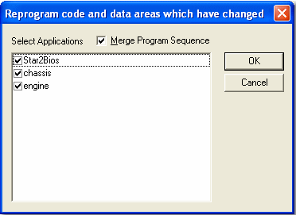
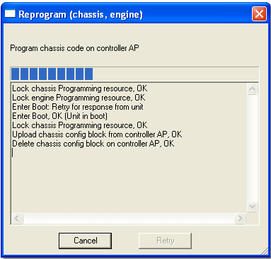
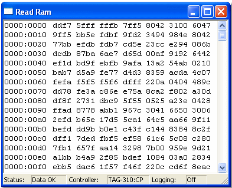

Electronic Control Units (ECUs) used in motorsport contain one or more controllers with access to two types of memory

**RAM (Random Access Memory)**

- Volatile: requires power to maintain contents.
- Fast, byte/word level modification possible.
- System Monitor can modify RAM while the ECU is On‑Line and running a test.
- The RAM that System Monitor can modify is called Application RAM; it contains the Data Version.

RAM can be changed by:

- Copying ROM to RAM
- Resetting ROM
- Downloading data to the ECU
- Live Tune

**ROM (Read Only Memory)**

- Implemented by programmable non‑volatile devices (EEPROM, Flash‑RAM).
- Programmable only when the ECU is Off‑Line.
- For each controller, ROM is divided into areas: Program, Data and Configurations.
- A whole memory area must be reprogrammed at once; individual memory locations cannot be modified.

ROM can only be changed by reprogramming the ECU.

Most ECUs can operate from either RAM or ROM. To choose, use the Run from ROM or Run from RAM commands. The ECU Bar indicates how each application is running.

## Reprogramming the ECU

The ROM in ECU memory contains:

- Program — programs for all controllers, built from the project Program Version file. System Monitor validates program versions against the Customer Base.
- Data — values of Editable Parameters held in a Data Version file. Systems are tuned by loading different Data Versions.
- Configurations — logging, sensor/actuator calibration, external inputs, etc. System Monitor can program various configurations.

To reprogram the ECU:

1. Select: `ECU > Reprogram Unit`.  
    - The Select Applications dialog opens. The ROM contents in the ECU are compared with the currently open project; any changed item is downloaded.
    - The command is available only if the relevant Customer Base has permission.
    
2. Optionally select the **Merged program sequences** check box.  
    - Note: when programming selected applications you may merge programming sequences. When programming sensor sets that cover more than one application, sequences are always merged.
3. Click **OK**.  
    - A progress message window appears.

    
!!!warning
    Clicking **Cancel** stops reprogramming but does not reset items already reprogrammed. This may leave the ECU in an inconsistent state and could prevent correct operation. If the reprogram sequence does not complete, proper function cannot be guaranteed.

The `ECU > Reprogram All` option reprograms all code and data areas for all applications and downloads the logging configuration — a one‑stop reprogram facility.

!!! note
    - Controllers are placed in Boot mode (Zone 0) for programming; successful reprogramming exits Boot mode automatically.
    - Logging configurations and other non‑vehicle‑critical data can be programmed in Zone 1 while some ECU functions continue.
    - Controller status is indicated on the Comms Bar.
    - `Force Complete Reprogram` downloads all program code, data and configurations regardless of change (useful for embedded developers).
    - Transfer information to a different unit using Spare Unit procedures.
    - Update the Data Version only.

`Tools > Force Complete Reprogram` downloads all program code, data and configurations whether they changed or not. Intended as a diagnostic tool for embedded code developers; for normal updates use the Reprogramming the ECU procedure.

## Run from ROM / Run from RAM

Most ECUs default to running from RAM when connected to System Monitor.

- Select `ECU > Run from ROM` to switch active applications to ROM. The command acts only on Active Applications.
- Select `ECU > Run from RAM` to switch active applications to RAM. The command acts only on Active Applications.

The ECU Bar shows which memory type (RAM or ROM) each application is using.

## Copy ROM to RAM

`ECU > Copy ROM to RAM` sends a signal to copy the Data Version from ROM to RAM. The command acts only on Active Applications. The ECU Bar shows software versions in each application.

## Min/Max Statistics

- Measurement Parameters are typically sensor outputs or ECU calculations.
- The ECU may hold minimum and maximum values of parameters which can be read as Measurement Parameters.
- `ECU > Delete Min/Max` sends a signal to set Minimum and Maximum Measurement Parameters to zero. This command is available only if the relevant Customer Base has permission 
- The command applies to Active Applications only.

## Read RAM

The Read RAM window displays RAM contents for a particular controller in the attached ECU. Open it with `Tools > Read RAM`. Multiple Read RAM windows may be opened on the same Desktop.

The Read RAM Properties dialog (Window System Menu icon or Alt + Enter) controls content and layout. Tabs:

- Read RAM — source and format of the data (specific to Read RAM windows).
- Display — appearance controls (common to all windows).

**Status bar**

Shows information about the control unit and its connection:

- Status:
  - DataOK — ECU transmitting requested data
  - TimeOut — last request did not get a response
  - NoData — no data being received
- Controller — controller name as set in Read RAM Properties
- Logging — indicates if data is being logged to a file (set in Read RAM Properties)

**Display memory panel**

- Comms Path — select from drop‑down (needed only if more than one ECU shares an Ethernet network).
- Controller — list of controllers in the connected ECU; select the controller to display RAM contents.
  - The Applications dialog Memory Layout tab shows which controllers and locations an Application uses.
  - The ECU Properties Controllers tab allows viewing and enabling/disabling controllers.
- Start address — hex address where display starts; must be a word boundary (even).
- Addressing Size — start address of the last block of data to display.
- Format — choose display format:
  - Hexadecimal — 4 characters (default)
  - Decimal — 5 characters
  - Binary — 16 characters
  - Floating Point — 14 characters  
  Memory addresses are always shown in hexadecimal.
- Swap Bytes — when selected, each word’s byte order is reversed.
- Data Only — hide the addresses column when selected.

**Logging panel**

- Log to file — when selected, RAM contents are logged to a file updated at the same rate as the display. The display update rate is set in the Display tab. An indicator shows when logging is active. Default: unchecked.
- Filename — enter or browse for the file name (default: `test1.rrl`). No default path; the most recently opened path is used.
