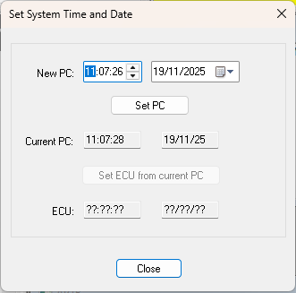
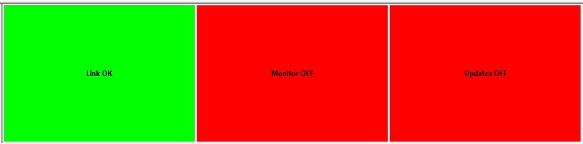
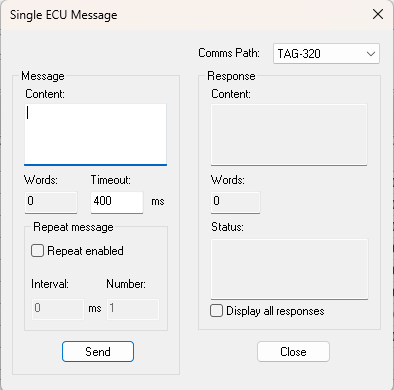

## Selecting Applications

An Application in System Monitor corresponds to a set of ECU Memory locations. Most ECU Control commands operate on the Active Applications.

Commands for Setting Time and Date, ECU Properties, and ECU Search can only operate on one Application at a time. When these commands are selected, the **Select an Application** dialog box is opened.

1. Select one Application and click **OK** to continue.

Commands for Reprogramming the ECU, Force Complete Reprogram, Program Spare Unit, and Upload Sensor Sets can operate on more than one Application. When these commands are selected, the **Select Applications** dialog box is opened.

1. Select one or more Applications by selecting the appropriate check boxes and click **OK**. By default, all the Active Applications are selected.
2. Click **OK** to continue.

## Setting Time and Date

The ECU time and date settings are used to timestamp Events and Logged Data.

**Set the Time and Date:**

1. Select: **ECU > Set System Time and Date.**  
2. Select an Application and click **OK.**
3. Configure the **Set System Time and Date** dialog box as follows:

    - **New PC:** Enter a new time and date for the computer that you are using. A Calendar is provided for easy date selection.
    - **Set PC:** Sets the Time and Date in the computer you are using to the values entered in New PC.
    - **Current PC:** Read only. Displays the Time and Date as set on the computer you are using.
    - **Set ECU:** Sets the Time and Date in the ECU to the values in the Current PC boxes.
    - **ECU:** Read only - Displays the Time and Date set on the ECU.

## ECU On-Line

The ECU must be On-Line to:

- Display or Log Measurement Parameters as defined by the Live Logging Configuration.
- Respond to changes in Editable Parameters during Live Tune.
- Operate with a Testbed.

The ECU can only be On-Line if the link to System Monitor is OK. The Link status is displayed in the Comms Bar.

Select: **ECU > On-line** to toggle the ECU between on-line and off-line modes. This command can be selected even if the Link is not OK. In that case, the ECU will be put on-line as soon as the link is detected.

The time during which System Monitor will try to send a command message is set in the Advanced Settings dialog (Timeout before link lost).

!!! note
    System Monitor can be configured to be On-Line whenever a Project is opened by setting **Go online when opening project** to “Y” in Advanced Settings.

When the ECU is On-Line:

- The Comms Bar shows “Monitor ON”.
- The program stamp is read from the ROM of each of the controllers for each Application. If the program stamp does not match the corresponding one in the current Program Version for each controller, the ECU OnLine message box opens with the options:
  - **Reprogram:** Reprograms the ECU with the current Program Version then switches the ECU On-Line.
  - **Ignore:** Leaves the Program Version in the ECU unchanged and switches the ECU On-Line. System Monitor continues with a mismatch between the Program Versions.
  - Closes the message box and the ECU remains Off-line.

!!! note
    If **Warn if Program Versions do not match** is set to N in Advanced Settings, the ECU OnLine message box does not appear and Ignore is assumed. Use this setting to allow the ECU to come on-line without user intervention.

When the ECU is Off-Line:

- The Comms Bar shows “Monitor OFF”.
- Acquisition of data is stopped and the most recent values are frozen in the Measurement windows.
- Recording of data to disk is stopped
- The Testbed Link is disabled.

## Kill Engine

The Kill Engine command stops the engine or prevents it from starting. Select: **Tools > Kill Engine** (Shortcut ALT+K).

While Kill Engine is active, System Monitor sends a message to the ECU to stop the engine. The **Sending Engine Kill** message box is displayed and the System Monitor user interface is disabled. However, measurement windows, events, etc. still update.

The engine kill message is sent to all the controllers whose application includes the system constant **ENGINE_KILL_CONTROLLER**. We recommend that you only define the constant in one application, although System Monitor does support sending the message to more than one controller if required.

If the constant is not defined in any application, the message is sent, by default, to controller AC in a TAG-300 unit.

The engine kill message is 0x01a. It is sent continuously at an interval of 200ms. If the message is acknowledged, the indicator in the message box is red; if an acknowledgement is not received for 2s, the engine kill indicator changes to yellow.

To close Kill Engine and allow the engine to start, click **Enable**, or press **ENTER** or **ESC**.

## Cursor Control and Trace

In a 1-axis or 2-axis Map, the active cell is selected by the values of the Breakpoints. The Cursor Control and Trace functions on the ECU Menu use the active cell to assist you with Tuning. They are only available when the ECU is On-Line.

- **Cursor Control:** When checked, the active cell is automatically selected for editing.
- **Trace:** When checked, each cell that has been active since Trace was switched on is outlined in grey.

## Single Message

The Single ECU Message dialog box allows a single message to be sent to the ECU and displays the response. To open the dialog box select: **Tools > Single Message**.

**Comms Path:** Select the Comms Path from the drop-down list. This is only necessary if there is more than one ECU in the vehicle sharing an Ethernet network.

**Message Panel:**

- **Content:** Enter the message that you want to send as a sequence of word-length hexadecimal values. Only valid hexadecimal values are accepted.
- **Words:** The number of words in the message calculated from the message content. Read only.
- **Timeout:** The timeout interval in milliseconds.
- **Send:** Sends the message.

**Repeat Message Panel:**

- **Repeat enabled:** When selected, the message is sent repeatedly when Send is clicked, according to the Interval and Number settings.
- **Interval:** The time, in milliseconds, between repetitions of the message. Only available when Repeat enabled is selected.
- **Number:** The number of times the message is repeated. Only available if Repeat enabled is selected.

**Response panel:**

- **Content:** A read-only hexadecimal display of the response sent by the ECU.
- **Words:** A read-only integer displaying the number of words in the response.
- **Status:** A read-only display of the current response status.
  - **OK:** indicates that a response was received from the ECU.
  - **Link NOK:** indicates that the ECU is not connected.
  - **Timeout:** indicates that a Timeout occurred while waiting for a response.
- **Display all responses:** When selected, all response messages are displayed. When cleared, only responses intended for System Monitor are displayed.
