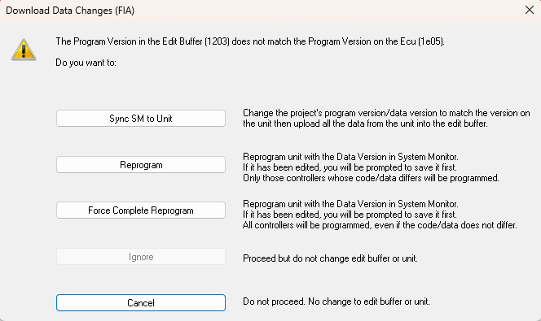

The changes made during Tuning are stored as a Data Version in the Edit Buffer.

Only the Active Applications can be Tuned.

## Live Tune modes

The Data Version may be transferred to the ECU in one of two ways:

- **Live Tune On**  
    As soon as an Editable Parameter is changed, the new value is loaded into RAM.

- **Live Tune Off**  

!!! note
    The data changes only affect the ECU RAM. To apply the changes to the vehicle systems, the ECU must be operating from RAM.

## Downloading Data to the ECU

The difference between the data in the Edit Buffer and the RAM are detected and loaded into RAM to make the contents of the RAM match the Edit Buffer when the **Download Data Changes** command is selected.

The command only acts on the Active Applications.

### Download Data Changes

Select: **ECU > Download Data Changes.**

If either the Program Version or the Data Version in the Edit Buffer do not match those in the ECU, a message is displayed with the following options:

- **Sync SM to Unit**  
    Synchronises the files in System Monitor to match those in the Unit. The specified files are opened in System Monitor, replacing those that are already open. If a file cannot be found, a new file is created using the filename and modification information taken from the unit. Uploads data and places it in the Edit Buffer. Files and data which are the same as already in System Monitor are not uploaded.

- **Reprogram**  
    Reprograms the ECU then downloads the data changes in the Edit Buffer to the ECU.

- **Force Complete Reprogram**  
    Forces a Complete Reprogram then downloads the data changes in the Edit Buffer to the ECU.

- **Ignore**  
    Closes the message box. No changes are made. The download process continues with the next Application.

- **Cancel**  
    Closes the message box. No changes are made.

## Uploading Data from the ECU

Select: **ECU > Upload Data** to load the Data Version in the ECU into the System Monitor Edit Buffer. You are prompted to save the contents of the Edit Buffer as a new Data Version File.

The command only acts on the Active Applications.

## Undo Data Changes

Data changes can be undone using the following ECU menu options:

- **Undo Data Changes in the Unit**  
    Undo data changes that have been downloaded to the ECU but do not undo the changes in the Edit Buffer.

- **Undo Data Changes in the Unit and Edit Buffer**  
    Undo data changes downloaded to the ECU and undo changes in the Edit Buffer.

- **Undo Data Changes in the Edit Buffer**  
    Undo data changes in the Edit Buffer. Changes downloaded to the ECU will not be undone.

!!! note
    The Undo Data Changes commands can only undo changes made since the Data Version was last saved.

## Reset ROM

The **Reset Data to ROM** command in the ECU menu does the following:

1. Overwrites the contents of the Edit Buffer with the Data Version that was used to open the Project. This is equivalent to restoring all values.  
2. Reprograms the ECU with the contents of the Edit Buffer.  
3. Sends a signal to the ECU to copy the Data Version from the ROM to the RAM.

The command only acts on the Active Applications.
