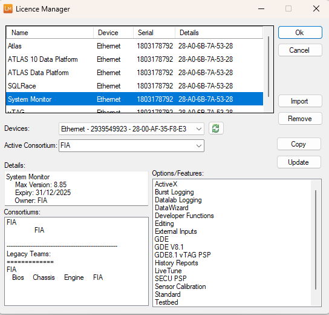

# Getting Started

This guide helps you install and start using System Monitor. Below are the minimum and recommended system requirements:

| Component         | Minimum                        | Recommended                   |
|-------------------|-------------------------------|-------------------------------|
| **Processor**     | Intel Core Duo 2 GHz           | Intel Core i7 Processor       |
| **Memory**        | 1 GB                           | 8 GB or higher                |
| **Disk Space**    | HDD with 200 GB free space     | High capacity SSD 512 GB+     |
| **Operating System** | Windows 10                  | Windows 10                    |
| **Installation/Data Transfer** | CD-ROM drive, FTP site | CD-ROM drive, FTP site    |
| **Power Supply**  | Rapid battery recharge recommended (not trickle charge) while applications are running | Rapid battery recharge recommended (not trickle charge) while applications are running |

## 1. Install System Monitor

Download the System Monitor installer from the [Motion Applied Portal](https://portal.mclarenapplied.com/portal/Downloads/Software#System%20Monitor) and run the .msi file to begin the installation. 

Three installation types are available:

- **Typical:** Installs all files for supported ECUs.
- **Custom:** Choose which components to install.
- **Complete:** Installs all files.

System requirements are checked during installation (memory, disk space, processor). Default install directory:  
`C:\Program Files\McLaren Electronic Systems\System Monitor 8`

System Monitor icons are added to the default program folder: `\System Monitor\`

You may be prompted to restart your computer after installation.

### Custom Installation

Custom Installation lets you select components to install. Default settings match Typical Installation for first-time installs. Changed settings are remembered for future installations.

Available options:

- **Program Files:** System Monitor, CA-Card embedded code, TAGASAP conversion utility, SaxBasic.
- **Help Files:** Install help system.
- **Registry:** Modify Windows® Registry for licences and bases.
- **Device Drivers:** Install drivers for hardware devices (e.g., CA-Card).
- **DESKey Dongle Drivers:** Install drivers for DK2 USB, Parallel, and Network dongles.
- **VE-82 Drivers:** Install drivers for VE-82 Pot Board (run `USBDriverInstaller.exe` manually after installation).

## 2. Insert Your CA-Card or Licence Dongle

System Monitor can be licensed by:

- Communications adapter card (CA-card)
- Dongle
- Network card address

### Adding a Licence

Open the Add Licence dialog via **Help > Add Licence** or **Add Licence** in the Licence Required dialog.

!!! note
    Later versions use a Licence File stored locally, defining teams and options. Licences are managed online at [Motion Applied Portal](https://portal.motionapplied.com/).

The window lists added devices (type and serial number). Select a device to view its licence profile.

- **Add New:** Browse for Licence Files.
- **Remove:** Remove selected licence.
- **Export:** Export the licence file.
- **Devices:** List connected devices.
- **Detect:** Search for accessible devices.
- **Active Team:** Select from the drop-down list.
- **Licence Details:** View licence profile summary.

Applications listed under a team are unrestricted for that team.

## 5. Start System Monitor

## 6. Select a Multi-Application Base or Configure a Unit.Def File

Customer bases control file access to prevent incorrect ECU programming. Associate customer bases with a project using a Multi-Application base.

- Select **File > Select Base**.
- Choose a Multi-Application Base and click **OK**.

## 7. [Create a New Program Version for Each Customer Base](../projects/program-data-versions.md)

Define Program and Data Version files for each Application in the Multi-Application Base.

- Select **File > New**.
- In the dialog, select **Program Version** and click **OK**.
- Choose files to include in the Program Version.

## 8. [Create a Project](../projects/file-operations.md)

A Project links all files needed to work on an ECU.

- Select **File > New**.
- Choose **Project** and click **OK**.
- Complete the sequence of dialog boxes to define the Project, connection method, Desktop filename, and Program Version for each Customer Base.

## 9. [Connect to the ECU](../projects/ecu-communication.md)

Manage the ECU connection the project uses.

- Select **ECU > Connect**.
- Choose the connection method (IP, HDLC, CAN).
- Click **Connect**.