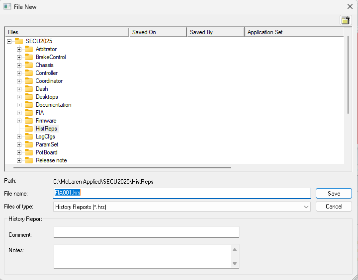
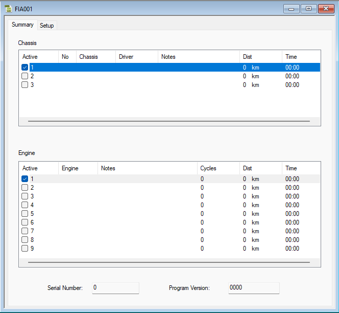
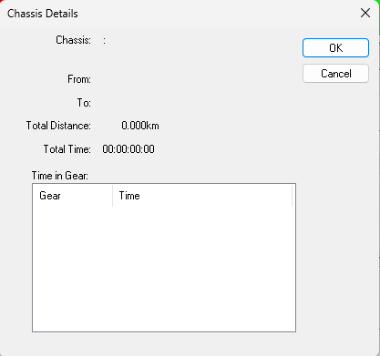
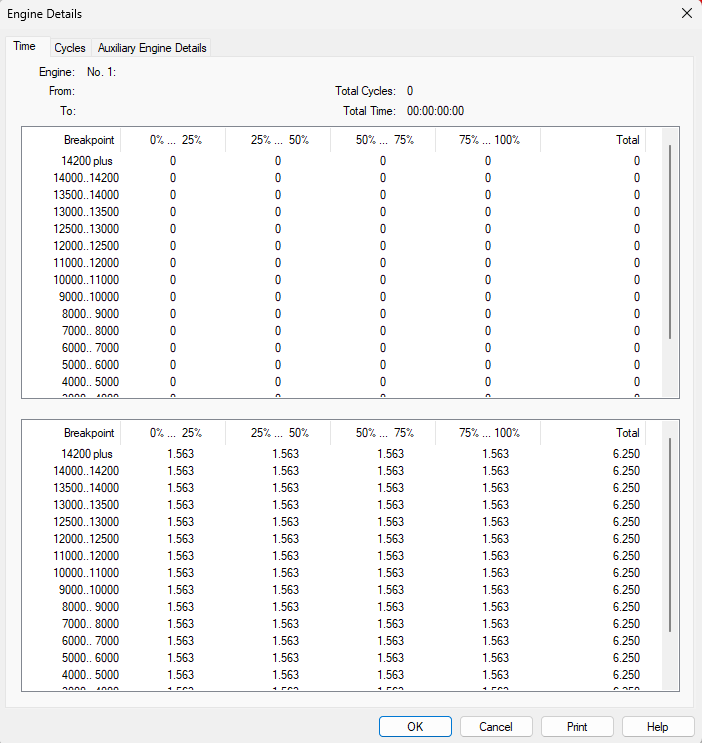
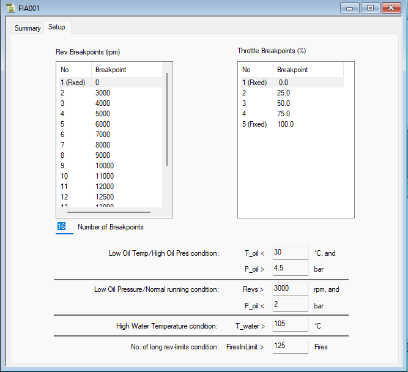

## Files

The History Report files are stored in the `\HistReps\` sub-directory of the Multi-Application Base. The default name for the History Report is `XXXXXnnn.hrs`, where:

- **XXXXX**: The first five characters of the first Application Name in the project.
- **nnn**: A three-digit hex number, starting with 001, which is incremented whenever a new History file is saved.

The History Report File name is displayed in the Titlebar. When **Tools > History Report > Upload** is selected, the new History Report is given a file name with the next sequential number for the Active Application.

History Report Files can be saved. If you make any changes to the history data, including uploading from the ECU, you will be prompted to save the History Report file when you close the History Report Dialog Box. Use **Save As** on the File Menu if you want to save a History report file under a different name.

The History Report dialog box is opened when:

- An existing History Report File is opened using the **File > Open** command.
- **Tools > History Report > Upload** is selected.
- A new History Report File is created using the **File > New** command.

The dialog box has two tabs:

- **Summary**: Shows totals of statistics for all the Chassis and Engines for which history data has been obtained and gives access to detailed reports.
- **Setup**: Allows modification of how history data is collected.

## Summary

The Summary tab shows totals of statistics for all the Chassis and Engines for which history data has been obtained. The ASAP file defines the number of variants of Chassis and Engine for which history data is analyzed. Each Chassis variant has a row in the Chassis panel, and each Engine variant has a row in the Engine panel. The check box in the Active column indicates which data set is currently being collected by the ECU.

### Chassis Panel

The No, Chassis, Driver, and Notes columns contain text boxes to annotate the history data.

### Engine Panel

In the Engine panel, the text boxes are in the Engine and Notes columns. Click on a text box to open it for editing. The Dist, Time, and Cycles (Engine panel only) columns show the total distance, time, and number of cycles run by the Engine or Chassis since the History Report was last reset.

To see the Chassis Details, select a row in the Chassis panel and press ENTER or double-click in the Active column. To see the Engine Details, select a row in the Engine panel and press ENTER or double-click in the Active column.

To send changes to the ECU, select: **Tools Menu > History Report > Download**.

## Chassis Details

To open the Chassis Details dialog box for the selected chassis data set, click on a row in the Chassis panel in the Summary Sheet of the History Report. The dialog box displays read-only statistics for the selected Chassis.

- **Chassis**: Text information from the row for that Chassis in the History Report - Summary.
- **From**: The date that the Chassis data was last reset.
- **To**: The date that the history data was uploaded.
- **Total Distance**: The distance accumulated by the chassis between the From and To dates.
- **Total Time**: The time accumulated by the chassis while history data was being recorded.
- **Time in Gear**: A breakdown of the time the chassis was in each gear.

## Engine Details

To open the Engine Details dialog box for the selected engine data set, click on a row in the Engine panel in the Summary Sheet of the History Report. The dialog box has the following tabs:

- **Time**: Shows a breakdown of the amount of time that the selected engine was in selected combinations of engine speed and throttle opening.
- **Cycles**: Shows a breakdown of the number of cycles during which the selected engine was in selected combinations of engine speed and throttle opening.
- **Auxiliary**: Shows diagnostic data for the selected engine.

Some aspects of the data shown in the Engine Details dialog box can be modified in the Setup tab of the History Report Dialog Box. Click **Print** to print a text version of the information on the selected tab.

### Time

The Time tab shows a breakdown of the amount of time that the selected engine was in selected combinations of engine speed and throttle opening. The dialog box displays read-only statistics for the selected Engine.

- **Engine**: Shows the text information from the row for that Engine in the History Report - Summary.
- **From**: The date that the Engine data was last reset.
- **To**: The date that the history data was uploaded.
- **Total Cycles**: The number of cycles accumulated by the engine while history data was being recorded.
- **Total Time**: The time accumulated by the chassis while history data was being recorded.

**Features**:
- The upper pane shows a breakdown of the time spent by the selected engine in each combination of engine speed and throttle opening.
- The lower pane shows the same data as a percentage of the total time.
- The Breakpoint values can be modified in the Setup tab of the History Report dialog box.

### Cycles

The Cycles tab shows a breakdown of the number of cycles during which the selected engine was in selected combinations of engine speed and throttle opening. The dialog box displays read-only statistics for the selected Engine.

- **Engine**: Shows the text information from the row for that Engine in the History Report - Summary.
- **From**: The date that the Engine data was last reset.
- **To**: The date that the history data was uploaded.
- **Total Cycles**: The number of cycles accumulated by the engine while history data was being recorded.
- **Total Time**: The time accumulated by the chassis while history data was being recorded.

**Features**:

- The upper pane shows a breakdown of the number of cycles during which the selected engine was in each combination of engine speed and throttle opening.
- The lower pane shows the same data as a percentage of the total time.
- The Breakpoint values can be modified in the Setup tab of the History Report dialog box.

### Auxiliary

The Auxiliary tab shows diagnostic data for the selected engine. The dialog box displays read-only statistics for the selected Engine.

- **Engine**: Shows the text information from the row for that Engine in the History Report - Summary.
- **From**: The date that the Engine data was last reset.
- **To**: The date that the history data was uploaded.
- **Total Cycles**: The number of cycles accumulated by the engine while history data was being recorded.
- **Total Time**: The time accumulated by the chassis while history data was being recorded.

The list shows a breakdown of the Battery Voltage and Alternator Current against engine speed. Note: The Breakpoint and Condition values can be modified in the Setup tab of the History Report dialog box.

### Conditions Panel

The Conditions panel shows the Total Time and the Longest individual period that the engine was in the following states:

- Oil temperature (T_Oil) is lower than condition while Oil pressure (P_Oil) is greater than condition.
- Oil pressure (P_Oil) is lower than condition while Engine Speed (Revs) is greater than condition.
- Water Temperature (T_Water) is greater than condition.

### Statistics

- **Max Revs seen**: The highest engine speed reached while the history data was being recorded.
- **Soft Rev-limit**: The number of occurrences of Soft rev limits (i.e., engine speed high enough for the ECU to retard the ignition). Also shown as a percentage of the Total Cycles.
- **Hard Rev-limit**: The number of occurrences of Hard rev limits (i.e., engine speed high enough for the ECU to cut the ignition). Also shown as a percentage of the Total Cycles.
- **Num Rev-limits**: The number of times that the number of consecutive Rev-limit incidents exceeded condition. The maximum number of consecutive Rev-limit incidents is also shown.

## Setup

The Setup tab allows you to modify how history data is collected.

### Rev Breakpoints

Edit the breakpoints to modify the ranges of engine speed used to display statistics in the Chassis Details and Engine Details dialog boxes. The default for Number of Breakpoints is 16, which can be edited to a lower value (must be a positive integer). The breakpoints between the new number and 16 are labeled "Unset". All breakpoint values, except the first, can be edited.

### Throttle Breakpoints

Edit the breakpoints to modify the ranges of throttle opening used to display statistics in the Engine Details dialog box. The Number of Breakpoints is fixed at 5. Each breakpoint value, except the first and the last, can be edited.

### Conditions

Edit the values used for conditions in the Auxiliary Engine Details dialog box:

- **Low Oil Temp/High Oil Pres Condition**: Oil temperature is lower than T_Oil ºC and Oil pressure is greater than P_Oil bar.
- **Low Oil Pressure/Normal Running Condition**: Oil pressure is lower than P_Oil bar and Engine Speed is greater than Revs rpm.
- **High Water Temperature condition**: Water Temperature is greater than T_Water ºC.
- **No. of long rev-limits condition**: The number of times that the number of consecutive Rev-limit incidents exceeds FiresInLimit.

To send changes made on this dialog box to the ECU, select: **Tools > History Report > Download**.
