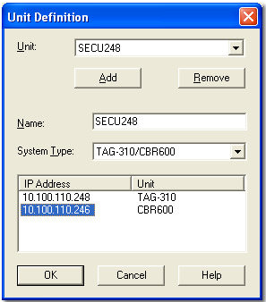

# ECU Connection

The Connections tab is used to view and modify the way System Monitor is connected to the ECU. To open the Connections tab select: **File > Properties > Connections** or use the ECU Menu.

## Connection Methods
- **IP (Ethernet)** – TCP/IP connection
- **HDLC (CA-Card or PCMCIA)** – Serial connection
- **CAN (VECTOR card)** – Uses VECTOR XL Driver Library

### IP via Ethernet
1. Select `IP via Ethernet` in the Connections dialog.
2. Choose a Unit Definition for the main unit.
3. Choose a Unit Definition for the spare unit.
4. Edit Unit Definitions if required.
5. Select an ATLAS data server.
6. Click `Next` to continue to Desktop setup.

## Unit Definition
Defines ECU identity and IP configuration.

### Adding a Unit Definition
1. Click `Add`.
2. Enter a name.
3. Select ECU type.
4. Enter IP address(es).
5. Click `OK`.

### Editing or Removing

- Select the Unit Definition from the list.
- Modify name, type, or IP address.
- Click `Remove` to delete.

## Spare Unit

Typically, development and Tuning is done using one unit and it may be necessary to transfer the settings (Program and Data versions) to another unit. If the ECUs communicate over an Ethernet network, each unit has an unique IP Address so that the unit(s) designated as the spare will have different address(es) from the unit(s) designated as main.

The Unit Definition for the Spare unit is defined for the Project in the New Project - Connections dialog box or the Project Properties dialog box, Connections tab.

### Programming the Spare Unit

1. `Tools > Program Spare Unit`
2. Select applications to program.
3. Enable merged programming sequences if needed.
4. Select components to download.
5. Click `OK`.

### Checking Unit Status

- `Tools > Unit Status` opens the Unit Status dialog.
- Allows upload/download of files and inspection of current ECU contents.